# Gateway 新一代路由网关

## 概述简介

### 官网

#### 上一代 Zuul 1.x

https://github.com/Netflix/zuul/wiki

#### 当前 Gateway

https://cloud.spring.io/spring-cloud-gateway/2.2.x/reference/html/

### 是什么

#### 概述

Gateway 是在 Spring 生态系统上构建的 API 网关服务，基于 Spring 5、Spring Boot 2 和 Project Reactor 等技术。

Gateway 旨在提供一种简单有效的方式来对 API 进行路由，以及提供一些强大的过滤器功能，例如：熔断、限流、重试等。

SpringCloud Gateway 是 SpringCloud 的一个全新项目，基于 Spring 5.0 + Spring Boot 2.0 + 和 Project Reactor 等技术开发的网关，它旨在为微服务架构简单有效的统一的 API 路由管理方式。

SpringCloud Gateway 作为 Spring Cloud 生态系统中的网关、目标是替代 Zuul、在 Spring Cloud 2.0 以上版本中，没有对新版本的 Zuul 2.0 以上最新高性能版本进行集成，仍然还是使用的 Zuul 1.x 非 Reactor 模式的老版本。而为了提升网关性能，SpringCloud Gateway 是基于 WebFlux 框架实现的，而 WebFlux 框架底层则使用了高性能的 Reactor 模式通信框架 Netty。

SpringCloud Gateway 提供了统一的路由方式且基于 Filter 链的方式提供了网关基本的功能，例如：安全，监控/指标，和限流。

#### 一句话

SpringCloud Gateway 使用的 WebFlux 中的 Reactor-Netty 响应式编程组件，底层使用了 Netty 通讯框架

### 能干嘛

1. 反向代理
2. 鉴权
3. 流量监控
4. 熔断
5. 日志监控
6. ........

### 微服务架构中网关的位置

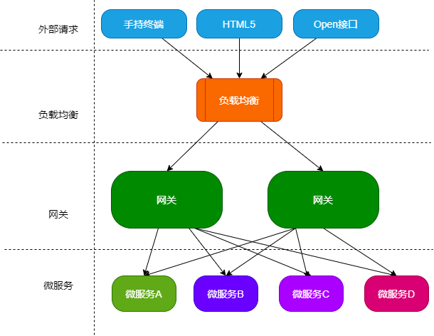

### 为什么会有 Gateway

#### 为什么选择 Gateway

##### Netflix 的 Zuul2.0 一直跳票，迟迟不发布

- 一方面因为 Zuul 1.0 已经进入了维护阶段，而且 Gateway 是 SpringCloud 团队研发的，是亲儿子产品，用起来简单便捷，值得信赖。而且很多功能 Zuul 都没有。

- Gateway 是基于 `异步非阻塞模型` 开发的，性能方面无需担心。虽然 Netflix 早就发布了最新的 Zuul 2.x，

  但 Spring Cloud 目前没有整合计划，而且 Netflix 相关部件都宣布进入维护期，不知前景如何。

- 多方面综合考虑 Gateway 是很理想的网关选择。

##### SpringCloud Gateway 具有如下特性

- 基于 Spring Framework 5，Project Reactor 和 Spring Boot 2.0 构建
- 动态路由：能够匹配任何请求属性
- 可以对路由指定 Predicate（断言）和 Filter（过滤器）
- 集成 Hystrix 的断路器功能
- 集成 Spring Cloud 服务发现功能
- 易于编写的 Predicate（断言）和 Filter（过滤器）
- 请求限流
- 支持路径重写

##### SpringCloud Gateway 与 Zuul 的区别

在 SpringCloud Finchley 正式版之前，SpringCloud 推荐的网关是 Netflix 提供的 Zuul。

- Zuul 1.x 是一个基于阻塞 I/O 的 API Gateway
- Zuul 1.x 基于 Servlet 2.5 使用阻塞架构它不支持任何长连接（如 WebSocket）。Zuul 的设计模式和 Nginx 较像，每次 I/O 操作都是从工作线程中选择一个执行，请求线程被阻塞到工作线程完成，但是差别是 Nginx 用 C++ 实现，Zuul 用 Java 实现，而 JVM 本身会有第一次加载较慢的情况，使得 Zuul 的性能相对较差。
- Zuul 2.x 的理念更为先进，想基于 Netty 非阻塞和支持长连接，但 SpringCloud 目前还没有整合。
- Spring Cloud Gateway 使用非阻塞 API，支持 WebSocket，与 Spring 紧密集成开发体验更好。

#### Zuul 1.x 模型

SpringCloud 中所集成的 Zuul 版本，采用的是 Tomcat 容器，使用的是传统的 Servlet IO 处理模型。

Servlet 由 Servlet Container 进行生命周期管理，Container 启动时构造 Servlet 对象并调用 servlet init() 进行初始化，Container 运行时接受请求，并为每个请求分配一个线程（一般从线程池中获取空闲线程）然后调用 service()，Container 关闭时调用 servlet destroy() 销毁 servlet；

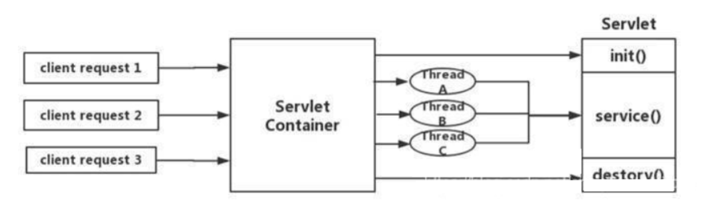

上述模式的缺点

Servlet 是一个简单的网络 IO 模型，当请求进入 Servlet Container 时，Servlet Container 就会为其绑定一个线程，在`并发不高的场景下`这种模型是适用的。但是一旦高并发，线程数量就会大幅上涨，而线程资源代价是昂贵的（上下文切换，内存消耗大）严重影响请求的处理时间。在一些简单的业务场景下，不希望为每个 request 分配一个线程，只需要 1 个或几个线程就能应对极大的并发请求，这种业务场景下 Servlet 没有优势。

因此 Zuul 1.x 是基于 Servlet 之上的一个阻塞式处理模型，即 Spring 实现了处理所有 request 请求的一个 Servlet（DispatcherServlet）并由该 Servlet 阻塞式处理，Zuul 1.x 无法摆脱 Servlet 模型的弊端。

#### Gateway 是什么

##### WebFlux

官网：https://docs.spring.io/spring/docs/current/spring-framework-reference/web-reactive.html#spring-webflux

传统的 Web 框架，比如说：struts 2，springmvc 等都是基于 Servlet API 与 Servlet 容器基础之上运行的。

但是在 Servlet 3.1 之后有了异步非阻塞支持。而 WebFlux 是一个典型的非阻塞异步的框架，它的核心是基于 Reactor 的相关 API 实现的。相对于传统 Web 框架来说，它可以运行在诸如 Netty，Undertow 及支持 Servlet3.1 的容器上。非阻塞式 + 函数式编程（Spring 5必须让你使用 Java8）

Spring WebFlux 是 Spring 5.0 引入的新的响应式框架，区别于 SpingMVC，它不需要依赖 Servlet API，它完全是异步非阻塞的，并且基于 Reactor 来实现响应式流规范。

## 三大核心概念

### Route（路由）

路由是构建网关的基本模块，它由 ID，目标 URI，一系列的断言和过滤器组成，如断言为 true 则匹配该路由

### Predicate（断言）

参考的是 Java8 的 java.util.function.Predicate

开发人员可以匹配 HTTP 请求中的所有内容（例如请求头或请求参数），如果请求与断言相匹配则进行路由。

### Filter（过滤）

总结

指的是 Spring 框架中 Gateway Filter 的实例，使用过滤器，可以在请求被路由前或者路由后对请求进行修改。

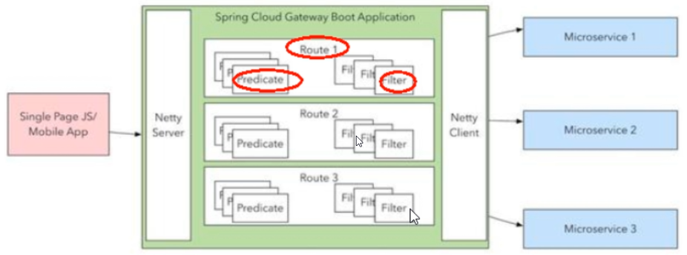

web 请求，通过一些匹配条件，定位到真正的服务节点，并在这个转发过程的前后，进行一些精细化控制。

Predicate 就是我们的匹配条件；而 Filter，就可以理解为一个无所不能的拦截器，有了这两个元素，再加上目标 url，就可以实现一个具体的路由了。

## Gateway工作流程

### 官网介绍

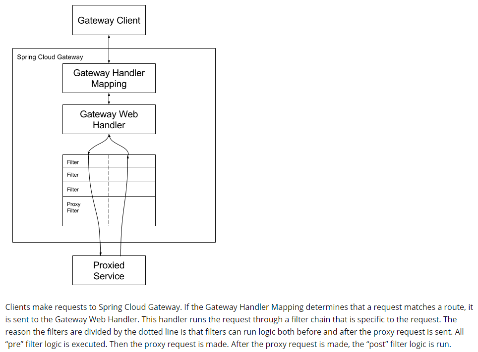

客户端向 Spring Cloud Gateway 发出请求，然后在 Gateway Handler Mapping 中找到与请求相匹配的路由，将其发送到 Web Handler。

Handler 再通过指定的过滤器来将请求发送到我们实际的服务执行业务逻辑，然后返回。过滤器之间用虚线分开是因为过滤器可能会在发送代理请求之前（"pre"）或之后（"post"）执行业务逻辑。

Filter 在 "pre" 类型的过滤器可以做参数校验、权限校验、流量监控、日志输出、协议转换等。在 "post" 类型的过滤器中可以做响应内容、响应头的修改、日志的输出、流量监控等有着非常重要的作用。

### 核心逻辑

`路由转发 + 执行过滤器链`

## 入门配置

### 新建 cloud-gateway-9527

### pom.xml

```xml
<dependencies>
    <!-- gateway -->
    <dependency>
        <groupId>org.springframework.cloud</groupId>
        <artifactId>spring-cloud-starter-gateway</artifactId>
    </dependency>

    <!-- eureka-client -->
    <dependency>
        <groupId>org.springframework.cloud</groupId>
        <artifactId>spring-cloud-starter-netflix-eureka-client</artifactId>
    </dependency>

    <dependency>
        <groupId>org.springframework.boot</groupId>
        <artifactId>spring-boot-starter-actuator</artifactId>
    </dependency>
    
    <dependency>
        <groupId>org.springframework.boot</groupId>
        <artifactId>spring-boot-starter-test</artifactId>
        <scope>test</scope>
    </dependency>

    <dependency>
        <groupId>org.springframework.boot</groupId>
        <artifactId>spring-boot-devtools</artifactId>
        <scope>runtime</scope>
        <optional>true</optional>
    </dependency>
</dependencies>
```

#### 注意

以下依赖禁止引入

```xml
<dependency>
    <groupId>org.springframework.boot</groupId>
    <artifactId>spring-boot-starter-web</artifactId>
</dependency>
```
### application.yaml

```yaml
server:
  port: 9527

spring:
  application:
    name: cloud-gateway

eureka:
  client:
    service-url:
      #defaultZone: http://eureka7001.com:7001/eureka
      defaultZone: http://eureka7001.com:7001/eureka,http://eureka7002.com:7002/eureka
  instance:
    # 自定义服务名称信息
    instance-id: gateway-9527

    # 心跳时间，即服务续约间隔时间（缺省为30s）
    lease-renewal-interval-in-seconds: 1
    # 发呆时间，即服务续约到期时间（缺省为90s）
    lease-expiration-duration-in-seconds: 2
    prefer-ip-address: true

info:
  app.name: spring-cloud-study-v2
  company.name: www.lichangping.top
  build.artifactId: $project.artifactId$
  build.version: $project.version$
```

### YAML 添加网关映射

映射 8001 的两个地址

- /payment/get/**
- /payment/lb/**

```yaml
spring:
  application:
    name: cloud-gateway
  cloud:
    gateway:
      routes:
        # 路由的id，没有固定规则但要求唯一，建议配合服务名
        - id: payment_routh1
          # 匹配后提供服务的路由地址
          uri: http://localhost:8001
          predicates:
            # 断言，路径相匹配的进行路由
            - Path=/payment/get/**

        - id: payment_routh2
          uri: http://localhost:8001
          predicates:
            - Path=/payment/lb/**
```

### GatewayApp9527.java

```java
@SpringBootApplication
@EnableEurekaClient
public class GatewayApp9527 {
    public static void main(String[] args) {
        SpringApplication.run(GatewayApp9527.class,args);
    }
}
```

### 测试

1. 启动 7001，7002，9527，8001

2. 访问

   - http://192.168.1.10:8001/payment/get/1

   - http://192.168.1.10:9527/payment/get/1

   均能访问成功

## 网关路由配置的两种方式

### yaml 中配置

见上面的步骤

### 代码中注入 RouteLocator 的 Bean

#### 官网案例

The following example shows how to achieve the same configuration with Java:

GatewayConfig.java

```java
RemoteAddressResolver resolver = XForwardedRemoteAddressResolver
    .maxTrustedIndex(1);

...

.route("direct-route",
    r -> r.remoteAddr("10.1.1.1", "10.10.1.1/24")
        .uri("https://downstream1")
.route("proxied-route",
    r -> r.remoteAddr(resolver, "10.10.1.1", "10.10.1.1/24")
        .uri("https://downstream2")
)
```

#### 编写案例

通过 9527 网关访问到百度的新闻网址：http://news.baidu.com/guonei

##### GatewayConfig.java

```java
package com.lcp.springcloud.config;

import org.springframework.cloud.gateway.route.RouteLocator;
import org.springframework.cloud.gateway.route.builder.RouteLocatorBuilder;
import org.springframework.context.annotation.Bean;
import org.springframework.context.annotation.Configuration;

/**
 * @author lcp
 * @date 2020/6/5 20:27
 */
@Configuration
public class GatewayConfig {
    /**
     * 配置了一个 id 为 path_route_1 的路由规则，
     * 当访问 http://192.168.1.10:9527/guonei 时会自动转发到地址 http://news.baidu.com/guonei
     */
    @Bean
    public RouteLocator customRouteLocator(RouteLocatorBuilder routeLocatorBuilder) {
        // RouteLocatorBuilder.Builder routes = routeLocatorBuilder.routes();
        // routes.route("path_route_1",
        //         predicateSpec -> predicateSpec.path("/guonei").uri("http://news.baidu.com/guonei")).build();
        // return routes.build();

        return routeLocatorBuilder
                .routes()
                .route("path_route_1",
                        predicateSpec -> predicateSpec.path("/guonei")
                                .uri("http://news.baidu.com/guonei"))
                .build();
    }
}
```

##### 测试

访问：http://192.168.1.10:9527/guonei

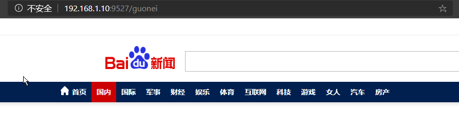

## 通过微服务名实现动态路由

默认情况下，Gateway 会根据注册中心注册的服务列表，以注册中心上的微服务名为路径创建`动态路由进行转发，从而实现动态路由的功能`。

### YAML

> 需要注意的是 uri 的协议 lb，表示启用 Gateway 的负载均衡功能
>
> lb://serviceName 是 spring cloud gateway 在微服务中自动为我们创建的负载均衡 uri

```yaml
spring:
  application:
    name: cloud-gateway
  cloud:
    gateway:
      # 开启从服务中心动态创建路由的功能，利用微服务名进行路由
      discovery:
        locator:
          enabled: true
      routes:
        # 路由的id，没有固定规则但要求唯一，建议配合服务名
        - id: payment_routh1
          # 匹配后提供服务的路由地址
          #uri: http://localhost:8001
          uri: lb://cloud-provider-payment
          predicates:
            # 断言，路径相匹配的进行路由
            - Path=/payment/get/**

        - id: payment_routh2
          #uri: http://localhost:8001
          uri: lb://cloud-provider-payment
          predicates:
            - Path=/payment/lb/**
```

### 测试

访问：http://localhost:9527/payment/lb，观察返回结果，可以发现 8001，8002 交替出现

## Predicate的使用

### 是什么

启动 9527，查看启动日志

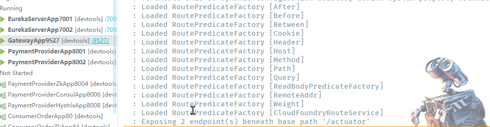

### Route Predicate Factories

https://cloud.spring.io/spring-cloud-gateway/2.2.x/reference/html/#gateway-request-predicates-factories

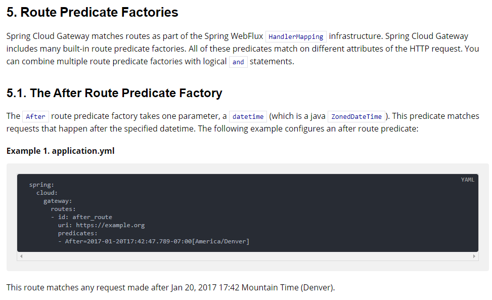

Spring Cloud Gateway 将路由匹配作为 Spring WebFlux HandlerMapping 基础架构的一部分。

Spring Cloud Gateway 包括许多内置的 Route Predicate 工厂。所有这些 Predicate 都与 HTTP 请求的不同属性相匹配。多个 Route Predicate 工厂可以组合使用。

Spring Cloud Gateway 创建 Route 对象时，使用 RoutePredicateFactory 创建 Predicate，Predicate 对象可以赋值给 Route。Spring Cloud Gateway 包含许多内置的 Route Predicate Factories。

所有的谓词都匹配 HTTP 请求的不同属性。多种谓词工厂可以组合，并通过逻辑 and。

### 常用的 Route Predicate

所有不满足条件的请求均返回 404，满足的均会被路由

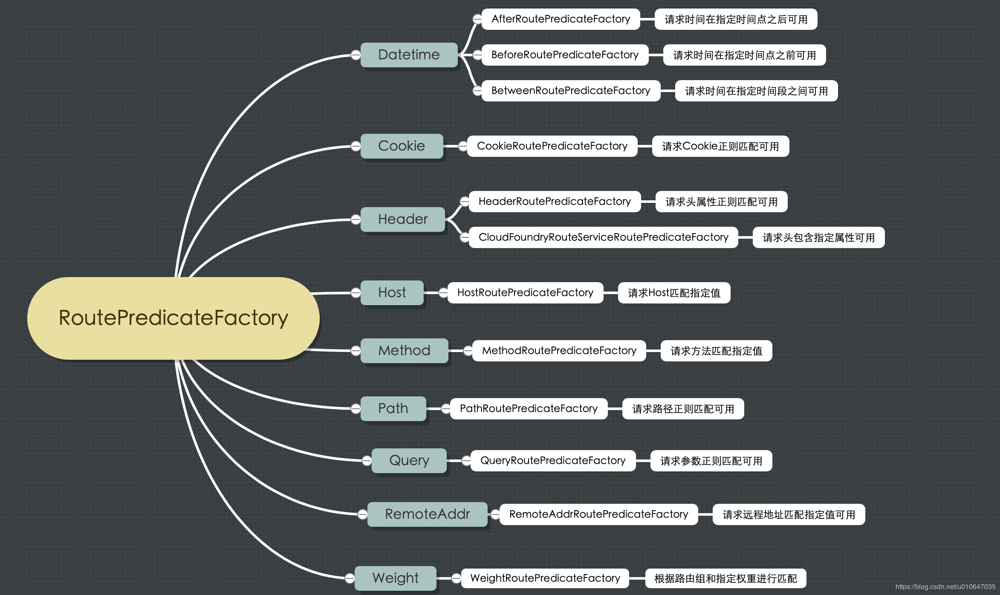

参考：https://blog.csdn.net/u012367513/article/details/86356708、https://blog.csdn.net/xuqiao2010585858/article/details/103342626

IDEA 逆向

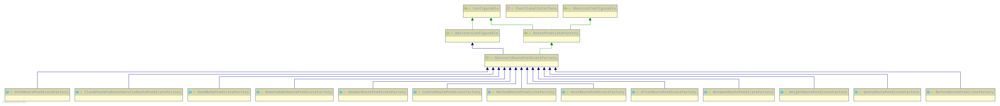

#### After Route Predicate Factory

The `After` route predicate factory takes one parameter, a `datetime` (which is a java `ZonedDateTime`). This predicate matches requests that happen after the specified datetime. The following example configures an after route predicate:

Example 1. application.yml

 ```yaml
 spring:
   cloud:
     gateway:
       routes:
       - id: after_route
         uri: https://example.org
         predicates:
         - After=2017-01-20T17:42:47.789-07:00[America/Denver]
 ```

This route matches any request made after Jan 20, 2017 17:42 Mountain Time (Denver).

> **`After`** 路由谓词工厂使用一个参数，即datetime（这是一个Java ZonedDateTime）。该谓词匹配在指定日期时间之后发生的请求。上面的官方示例中，所有在 2017/01/20 17:42:47 之后的请求会被转发。

> - 技巧：时间可使用 `System.out.println(ZonedDateTime.now());` 打印，然后即可看到时区。例如：`2020-06-06T16:43:24.740+08:00[Asia/Shanghai]`
> - 时间格式的相关逻辑：
>   - 默认时间格式：org.springframework.format.support.DefaultFormattingConversionService#addDefaultFormatters
>   - 时间格式注册：org.springframework.format.datetime.standard.DateTimeFormatterRegistrar#registerFormatters

#### Before Route Predicate Factory

官方示例

The `Before` route predicate factory takes one parameter, a `datetime` (which is a java `ZonedDateTime`). This predicate matches requests that happen before the specified `datetime`. The following example configures a before route predicate:

Example 2. application.yml

```yaml
spring:
  cloud:
    gateway:
      routes:
      - id: before_route
        uri: https://example.org
        predicates:
        - Before=2017-01-20T17:42:47.789-07:00[America/Denver]
```

This route matches any request made before Jan 20, 2017 17:42 Mountain Time (Denver).

> **`Before`** 路由谓词工厂使用一个参数，即 datetime（这是一个Java ZonedDateTime）。该谓词匹配在指定日期时间之前发生的请求。上面的官方示例中，所有在 2017-01-20 17:42:47 之前的请求会被转发。

#### Between Route Predicate Factory

The `Between` route predicate factory takes two parameters, `datetime1` and `datetime2` which are java `ZonedDateTime` objects. This predicate matches requests that happen after `datetime1` and before `datetime2`. The `datetime2` parameter must be after `datetime1`. The following example configures a between route predicate:

Example 3. application.yml

```yaml
spring:
  cloud:
    gateway:
      routes:
      - id: between_route
        uri: https://example.org
        predicates:
        - Between=2017-01-20T17:42:47.789-07:00[America/Denver], 2017-01-21T17:42:47.789-07:00[America/Denver]
```

This route matches any request made after Jan 20, 2017 17:42 Mountain Time (Denver) and before Jan 21, 2017 17:42 Mountain Time (Denver). This could be useful for maintenance windows.

> **`Between`** 路由谓词工厂使用两个参数 datetime1 和 datetime2，它们是 java ZonedDateTime 对象。该谓词匹配在 datetime1 之后和 datetime2 之前发生的请求。 datetime2 参数必须在 datetime1 之后。

#### Cookie Route Predicate Factory

The `Cookie` route predicate factory takes two parameters, the cookie `name` and a `regexp` (which is a Java regular expression). This predicate matches cookies that have the given name and whose values match the regular expression. The following example configures a cookie route predicate factory:

Example 4. application.yml

```yaml
spring:
  cloud:
    gateway:
      routes:
      - id: cookie_route
        uri: https://example.org
        predicates:
        - Cookie=chocolate, ch.p
```

This route matches requests that have a cookie named `chocolate` whose value matches the `ch.p` regular expression.

> **`Cookie`** 路由谓词工厂使用两个参数，即 cookie 名称和一个 regexp（Java正则表达式）。该谓词匹配具有给定名称且其值与正则表达式匹配的 cookie。

##### 修改 9527 的 yaml

```yaml
- id: payment_routh2
  uri: lb://cloud-provider-payment
  predicates:
    - Path=/payment/lb/**
    - Cookie=username,lcp
```

测试

不带 cookie，返回 404

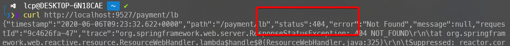

带 cookie，返回正常结果

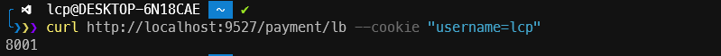

#### Header Route Predicate Factory

The `Header` route predicate factory takes two parameters, the header `name` and a `regexp` (which is a Java regular expression). This predicate matches with a header that has the given name whose value matches the regular expression. The following example configures a header route predicate:

Example 5. application.yml

```yaml
spring:
  cloud:
    gateway:
      routes:
      - id: header_route
        uri: https://example.org
        predicates:
        - Header=X-Request-Id, \d+
```

This route matches if the request has a header named `X-Request-Id` whose value matches the `\d+` regular expression (that is, it has a value of one or more digits).

> **`Header`** 路由谓词工厂使用两个参数，请求头名称和一个regexp（Java正则表达式）。该谓词匹配具有给定名称且其值与正则表达式匹配的 header。

##### 修改 9527 的 yaml

```yaml
- id: payment_routh2
  uri: lb://cloud-provider-payment
  predicates:
    - Path=/payment/lb/**
    - Header=X-Request-Id,\d+  # 请求头要有 X-Request-Id 属性，并且值为整数
```

测试

不带 header，返回 404

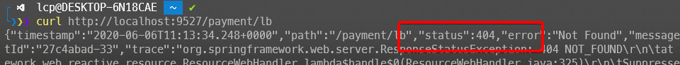

携带指定的 header，正常返回

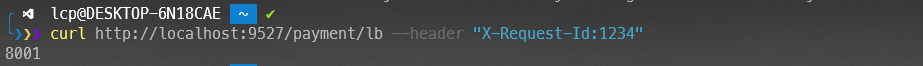

#### Host Route Predicate Factory

The `Host` route predicate factory takes one parameter: a list of host name `patterns`. The pattern is an Ant-style pattern with `.` as the separator. This predicates matches the `Host` header that matches the pattern. The following example configures a host route predicate:

Example 6. application.yml

```yaml
spring:
  cloud:
    gateway:
      routes:
      - id: host_route
        uri: https://example.org
        predicates:
        - Host=**.somehost.org,**.anotherhost.org
```

URI template variables (such as `{sub}.myhost.org`) are supported as well.

This route matches if the request has a `Host` header with a value of `www.somehost.org` or `beta.somehost.org` or `www.anotherhost.org`.

This predicate extracts the URI template variables (such as `sub`, defined in the preceding example) as a map of names and values and places it in the `ServerWebExchange.getAttributes()` with a key defined in `ServerWebExchangeUtils.URI_TEMPLATE_VARIABLES_ATTRIBUTE`. Those values are then available for use by [`GatewayFilter` factories](https://cloud.spring.io/spring-cloud-gateway/2.2.x/reference/html/#gateway-route-filters)

> **`Host`** 路由谓词工厂使用一个参数：主机名模式列表。该模式是带有的Ant样式的模式 `.` 作为分隔符。该谓词匹配符合条件的 host。

##### 修改 9527 的 yaml

```yaml
- id: payment_routh2
  uri: lb://cloud-provider-payment
  predicates:
    - Path=/payment/lb/**
    - Host=www.lcp.top
```

测试

不带指定 host，返回 404

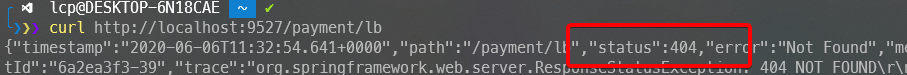

带指定 host，正常返回

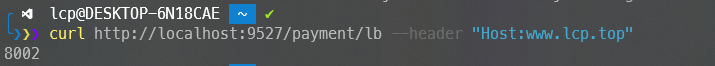

#### Method Route Predicate Factory

The `Method` Route Predicate Factory takes a `methods` argument which is one or more parameters: the HTTP methods to match. The following example configures a method route predicate:

Example 7. application.yml

```yaml
spring:
  cloud:
    gateway:
      routes:
      - id: method_route
        uri: https://example.org
        predicates:
        - Method=GET,POST
```

This route matches if the request method was a `GET` or a `POST`.

> 方法路由谓词工厂使用方法参数，该参数是一个或多个参数：要匹配的HTTP方法。

#### Path Route Predicate Factory

The `Path` Route Predicate Factory takes two parameters: a list of Spring `PathMatcher` `patterns` and an optional flag called `matchOptionalTrailingSeparator`. The following example configures a path route predicate:

Example 8. application.yml

```yaml
spring:
  cloud:
    gateway:
      routes:
      - id: path_route
        uri: https://example.org
        predicates:
        - Path=/red/{segment},/blue/{segment}
```

This route matches if the request path was, for example: `/red/1` or `/red/blue` or `/blue/green`.

This predicate extracts the URI template variables (such as `segment`, defined in the preceding example) as a map of names and values and places it in the `ServerWebExchange.getAttributes()` with a key defined in `ServerWebExchangeUtils.URI_TEMPLATE_VARIABLES_ATTRIBUTE`. Those values are then available for use by [`GatewayFilter` factories](https://cloud.spring.io/spring-cloud-gateway/2.2.x/reference/html/#gateway-route-filters)

A utility method (called `get`) is available to make access to these variables easier. The following example shows how to use the `get` method:

```java
Map<String, String> uriVariables = ServerWebExchangeUtils.getPathPredicateVariables(exchange);
String segment = uriVariables.get("segment");
```

> **`Path`** 路由谓词工厂使用两个参数：Spring PathMatcher 模式列表和一个称为matchOptionalTrailingSeparator的可选标志。

例子见最开始的入门配置

#### Query Route Predicate Factory

The `Query` route predicate factory takes two parameters: a required `param` and an optional `regexp` (which is a Java regular expression). The following example configures a query route predicate:

Example 9. application.yml

```yaml
spring:
  cloud:
    gateway:
      routes:
      - id: query_route
        uri: https://example.org
        predicates:
        - Query=green
```

The preceding route matches if the request contained a `green` query parameter.

application.yml

```yaml
spring:
  cloud:
    gateway:
      routes:
      - id: query_route
        uri: https://example.org
        predicates:
        - Query=red, gree.
```

The preceding route matches if the request contained a `red` query parameter whose value matched the `gree.` regexp, so `green` and `greet` would match.

> **`Query`** 路由谓词工厂采用两个参数：必需的参数和可选的regexp（Java正则表达式）。
>
> 说白了就是匹配请求参数。


## Filter的使用


