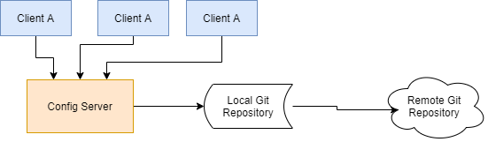

# Spring Cloud Config 分布式配置中心

## 概述

### 是什么

微服务意味着要将单体应用中的业务拆分成一个个子服务，每个服务的粒度相对较小，因此系统中会出现大量的服务。由于每个服务都需要必要的配置信息才能运行，所以需要一套集中式的、动态的配置管理设施。

我们每一个微服务自己带着一个 application.yaml，上百个配置文件的管理十分困难，Spring Cloud 提供了 Config Server 来解决这个问题。



Spring Cloud Config 为微服务架构中的微服务提供集中化的外部支持配置，配置服务器为各个不同微服务应用的所有环境提供了一个中心化的外部配置。

Spring Cloud 分为服务端与客户端两部分。

服务端也称为分布式配置中心，它是一个独立的微服务应用，用来连接配置服务器并为客户端提供获取、加密、解密配置信息的接口。

客户端则是通过指定的配置中心来管理应用资源，以及与业务相关的配置内容，并在启动的时候从配置中心获取和加载配置信息。

配置服务器默认采用 GIT 来存储配置信息，这样有助于对环境配置进行版本管理，并且可以通过 git 客户端来方便的管理和访问配置内容。

### 作用

1. 集中管理配置文件

2. 不同环境不同配置，动态化的配置更新，分环境：dev/test/prod/beta/release

3. 运行期间动态调整配置，不再需要在每个服务部署的地方编写配置文件，服务会向配置中心拉取自己的配置

4. 当配置发生改变时，服务不需要重启即可感知到配置的变化并应用新的配置

5. 将配置信息以 REST 接口的形式暴露

   post / curl 访问刷新即可

### 与 GitHub 整合配置

由于 Spring Cloud Config 默认使用 Git 来存储配置文件（也支持 SVN 和 本地文件），但最推荐的还是 Git，而且使用的是 http/https 的形式访问。

## Config 服务端配置与测试

### 新建远程仓库

1. 在 GitHub 上新建仓库 spring-cloud-study-config-v2，获取 ssh 地址：git@github.com:li-chang-ping/spring-cloud-study-config-v2.git

2. 本地硬盘 clone 仓库，我直接 clone 在当前项目下，通过 .gitignore 排除该文件夹

3. 上传配置文件


### cloud-config-center-3344

新建 cloud-config-center-3344 配置中心

#### pom.xml

```xml
<dependencies>
    <!--添加消息总线RabbitMQ支持-->
    <dependency>
        <groupId>org.springframework.cloud</groupId>
        <artifactId>spring-cloud-starter-bus-amqp</artifactId>
    </dependency>

    <!-- springCloud Config -->
    <dependency>
        <groupId>org.springframework.cloud</groupId>
        <artifactId>spring-cloud-config-server</artifactId>
    </dependency>
    <!-- Eureka Client -->
    <dependency>
        <groupId>org.springframework.cloud</groupId>
        <artifactId>spring-cloud-starter-netflix-eureka-client</artifactId>
    </dependency>

    <!-- 以下两项应该是标配 -->
    <dependency>
        <groupId>org.springframework.boot</groupId>
        <artifactId>spring-boot-starter-web</artifactId>
    </dependency>
    <!-- 图形化监控 -->
    <dependency>
        <groupId>org.springframework.boot</groupId>
        <artifactId>spring-boot-starter-actuator</artifactId>
    </dependency>

    <dependency>
        <groupId>org.springframework.boot</groupId>
        <artifactId>spring-boot-starter-test</artifactId>
        <scope>test</scope>
    </dependency>

    <!-- 热部署 -->
    <dependency>
        <groupId>org.springframework.boot</groupId>
        <artifactId>spring-boot-devtools</artifactId>
        <scope>runtime</scope>
        <optional>true</optional>
    </dependency>
</dependencies>
```

#### application.yaml

```yaml
server:
  port: 3344
spring:
  application:
    name: cloud-config-center
  cloud:
    config:
      server:
        git:
          uri: git@github.com:li-chang-ping/spring-cloud-study-config-v2.git
          clone-on-start: true
          # 搜索目录
          search-paths: '{application}'
      # 读取分支
      label: master

eureka:
  client:
    service-url:
      #defaultZone: http://eureka7001.com:7001/eureka
      defaultZone: http://eureka7001.com:7001/eureka,http://eureka7002.com:7002/eureka
  instance:
    # 自定义服务名称信息
    instance-id: consumer-order-80

    lease-renewal-interval-in-seconds: 1
    lease-expiration-duration-in-seconds: 2
    prefer-ip-address: true

info:
  app.name: spring-cloud-study-v2
  company.name: www.lichangping.top
  build.artifactId: $project.artifactId$
  build.version: $project.version$
```

#### ConfigCenterApp3344

```java
@SpringBootApplication
@EnableEurekaClient
@EnableConfigServer
public class ConfigCenterApp3344 {
    public static void main(String[] args) {
        SpringApplication.run(ConfigCenterApp3344.class, args);
    }
}
```

#### 测试

启动 7001，7002，3344

浏览器访问：http://localhost:3344/master/config-test.yml

#### 配置文件读取规则

查看官网：https://cloud.spring.io/spring-cloud-static/spring-cloud-config/2.2.2.RELEASE/reference/html/

The HTTP service has resources in the following form:

```
/{application}/{profile}[/{label}]
/{application}-{profile}.yml
/{label}/{application}-{profile}.yml
/{application}-{profile}.properties
/{label}/{application}-{profile}.properties
```

1. /{application}/{profile}[/{label}]
   - 访问测试
     - http://localhost:3344/application/dev/master
     - http://localhost:3344/application/test/master
     - http://localhost:3344/application/xxx/master
2. /{application}-{profile}.yml
   - 访问测试
     - http://localhost:3344/application-dev.yaml
     - http://localhost:3344/application-test.yaml
     - http://localhost:3344/application-xxx.yaml
3. /{label}/{application}-{profile}.yml
   - 访问测试
     - http://localhost:3344/master/application-dev.yaml
     - http://localhost:3344/master/application-test.yaml
     - http://localhost:3344/master/application-xxx.yaml

`label：分支`

`application：服务名（配置文件名前缀）`

`profile：环境（dev/test/prod）（配置文件名后缀）`

> 注：config 客户端在没有 spring.cloud.config.name属性的时候，服务端{application} 获取的是客户端 spring.application.name的值，否则，获取的是 spring.cloud.config.name的值。
> 1）、当没有spring.cloud.config.name时，客户端获取的是spring.application.name 所对应的git库中的文件，并且只能
> 获取一个文件，
> 2）、当一个项目中有需求要获取多个文件时，就需要用到spring.cloud.config.name这个属性，以逗号分割
> 原文链接：https://blog.csdn.net/w_ya24k/java/article/details/79565269

## Config 客户端配置与测试

新建模块 cloud-config-client-3355

### pom.xml

```xml
<dependencies>
    <!--添加消息总线RabbitMQ支持-->
    <dependency>
        <groupId>org.springframework.cloud</groupId>
        <artifactId>spring-cloud-starter-bus-amqp</artifactId>
    </dependency>

    <dependency>
        <groupId>org.springframework.cloud</groupId>
        <artifactId>spring-cloud-starter-config</artifactId>
    </dependency>
    <dependency>
        <groupId>org.springframework.cloud</groupId>
        <artifactId>spring-cloud-starter-netflix-eureka-client</artifactId>
    </dependency>
    <dependency>
        <groupId>org.springframework.boot</groupId>
        <artifactId>spring-boot-starter-web</artifactId>
    </dependency>
    <dependency>
        <groupId>org.springframework.boot</groupId>
        <artifactId>spring-boot-starter-actuator</artifactId>
    </dependency>

    <dependency>
        <groupId>org.springframework.boot</groupId>
        <artifactId>spring-boot-devtools</artifactId>
        <scope>runtime</scope>
        <optional>true</optional>
    </dependency>
    <dependency>
        <groupId>org.springframework.boot</groupId>
        <artifactId>spring-boot-starter-test</artifactId>
        <scope>test</scope>
    </dependency>
</dependencies>
```

### bootstrap.yaml【介绍】

applicaiton.yaml 是用户级的资源配置项

bootstrap.yaml 是系统级的，`优先级更加高`

Spring Cloud会创建一个`Bootstrap Context`，作为 Spring 应用的`Application Context`的父上下文。初始化的时候，`Bootstrap Context`负责从外部源加载配置属性并解析配置。这两个上下文共享一个从外部获取的`Environment`。

`Bootstrap`属性有高优先级，默认情况下，它们不会被本地配置覆盖。 `Bootstrap context`和`Application Context`有着不同的约定，所以新增了一个`bootstrap.yml`文件，保证`Bootstrap Context`和`Application Context`配置的分离。

**因此要将 Client 模式下的 application.yaml 文件改为 bootstrap.yaml**

### bootstrap.yaml

```yaml
server:
  port: 3355

spring:
  application:
    name: config-client
  cloud:
    config:
      # 由于上面配置了 search-paths: '{application}',所以会去 config-client-3355 下找配置文件
      name: config-client-3355
      profile: dev
      label: master
      uri: http://localhost:3344

eureka:
  client:
    service-url:
      defaultZone: http://eureka7001.com:7001/eureka,http://eureka7002.com:7002/eureka
  instance:
    instance-id: config-client-3355

    lease-renewal-interval-in-seconds: 1
    lease-expiration-duration-in-seconds: 2
    prefer-ip-address: true
```

### ConfigClientApp3355

```java
@EnableEurekaClient
@SpringBootApplication
public class ConfigClientApp3355 {
    public static void main(String[] args) {
        SpringApplication.run(ConfigClientApp3355.class, args);
    }
}
```

### ConfigClientController

```java
@RestController
//@RefreshScope
public class ConfigClientController {
    @Value("${config.info}")
    private String configInfo;

    @GetMapping("/configInfo")
    public String getConfigInfo() {
        System.out.println("111111");
        return configInfo;
    }
}
```

### 测试

启动 7001，7002，3344

3344 启动成功


访问：http://localhost:3355/configInfo


说明读取远程配置文件成功

### 测试 search-paths 有效性

将最开始的配置文件夹 cloud-client-3355 改为 cloud-client-33，commit + push

重启 3355，会发现启动失败，报错 `Could not resolve placeholder 'config.info' in value "${config.info}"`，说明没有读取到配置文件


## Config 客户端之动态刷新


## Search Paths(实现一个模块对应一个目录)

官方文档：https://cloud.spring.io/spring-cloud-static/spring-cloud-config/2.2.2.RELEASE/reference/html/#_placeholders_in_git_search_paths


注：

config 客户端在没有 spring.cloud.config.name属性的时候，服务端{application} 获取的是客户端 spring.application.name的值，否则，获取的是 spring.cloud.config.name的值。

1. 当没有spring.cloud.config.name时，客户端获取的是spring.application.name 所对应的git库中的文件，并且只能
   获取一个文件，
2. 当一个项目中有需求要获取多个文件时，就需要用到spring.cloud.config.name这个属性，以逗号分割

> 详见 Config服务端配置与测试，Config客户端配置与测试

### 优化

上面使用的目录为 config-client-3355

config-server 的 application.yaml 相关配置为

```yaml
server:
  port: 3344
spring:
  application:
    name: cloud-config-center
  cloud:
    config:
      server:
        git:
          uri: git@github.com:li-chang-ping/spring-cloud-study-config-v2.git
          clone-on-start: true
          # 搜索目录
          search-paths: '{application}'
      # 读取分支
      label: master
```

config-client-3355 的 bootstrap.yaml 相关配置为

```yaml
server:
  port: 3355

spring:
  application:
    name: config-client
  cloud:
    config:
      name: config-client-3355
      profile: dev
      label: master
      uri: http://localhost:3344
```

这样客户端启动后最终会获取到在 config-client-3355 文件夹下的 config-client-3355-dev.yaml 配置文件