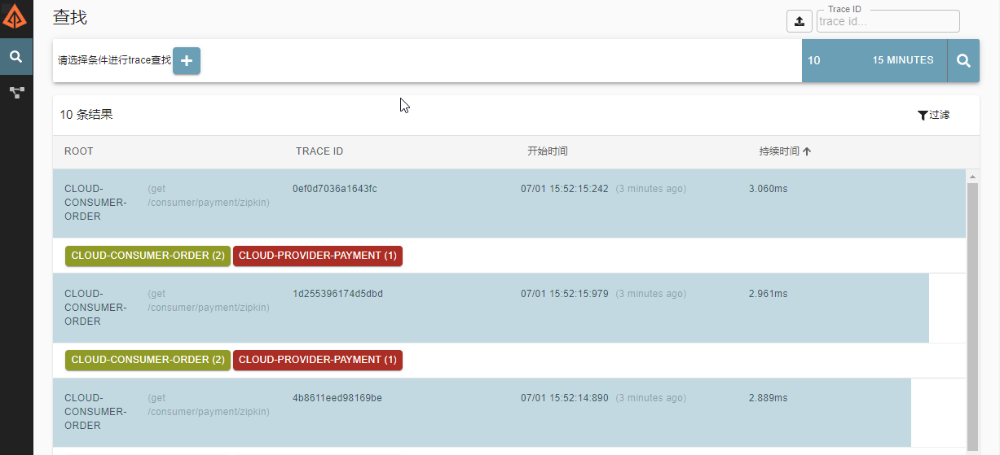
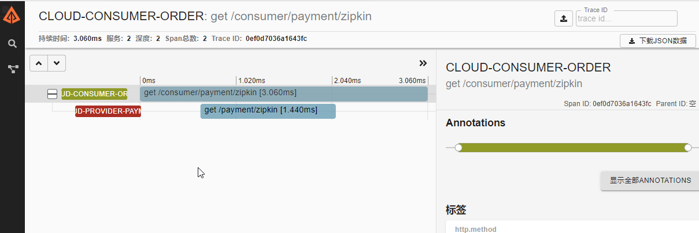
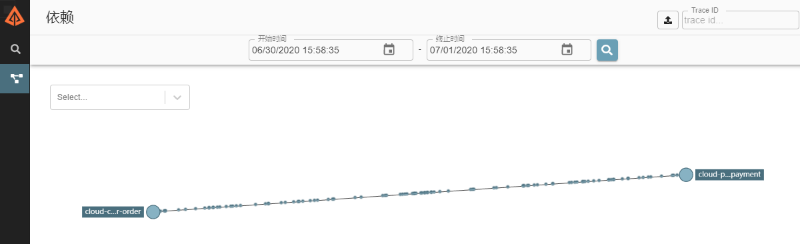

# Spring Cloud Sleuth 分布式服务链追踪

## 概述

### 出现该技术的原因和需要解决的问题

在微服务框架中，一个客户端发起的请求在后端系统中会经过多个不同的服务节点调用来协同产生最后的请求结果，每一个前端请求都会形成一条复杂的分布式服务调用链路，链路中的任何一环出现高延时或错误都会引起整个请求最后的失败。

### 是什么

官网：https://docs.spring.io/spring-cloud-sleuth/docs/2.2.x-SNAPSHOT/reference/html/

Spring Cloud Sleuth 为 Spring Cloud 提供了分布式跟踪解决方案，其兼容了 Zipkin，HTrace 和 log-based 追踪。

微服务跟踪(sleuth)其实是一个工具,它在整个分布式系统中能跟踪一个用户请求的过程(包括数据采集，数据传输，数据存储，数据分析，数据可视化)，捕获这些跟踪数据，就能构建微服务的整个调用链的视图，这是调试和监控微服务的关键工具。

SpringCloudSleuth有4个特点

| 特点                  | 说明                                                         |
| --------------------- | ------------------------------------------------------------ |
| 提供链路追踪          | 通过sleuth可以很清楚的看出一个请求经过了哪些服务，<br/>可以方便的理清服务局的调用关系 |
| 性能分析              | 通过sleuth可以很方便的看出每个采集请求的耗时，</br><br/>分析出哪些服务调用比较耗时，当服务调用的耗时<br/>随着请求量的增大而增大时，也可以对服务的扩容提<br/>供一定的提醒作用 |
| 数据分析<br/>优化链路 | 对于频繁地调用一个服务，或者并行地调用等，<br/>可以针对业务做一些优化措施 |
| 可视化                | 对于程序未捕获的异常，可以在zipkpin界面上看到                |
## 相关术语

- Span: 基本的工作单元。Span包括一个64位的唯一ID，一个64位trace码，描述信息，时间戳事件，key-value 注解(tags)，span处理者的ID（通常为IP）。

- Trace: 包含一系列的工作单元span，它们组成了一个树型结构。

- Annotation 

  用于及时记录存在的事件。常用的Annotation如下：

  - cs：客户端发送(client send) 客户端发起一个请求，表示span开始
  - sr：服务器接收(server received) 服务器接收到客户端的请求并开始处理，sr - cs 的时间为网络延迟
  - ss：服务器发送(server send)  服务器处理完请求准备返回数据给客户端。ss - sr 的时间表示服务器端处理请求花费的时间
  - cr：客户端接收(client received) 客户端接收到处理结果，表示span结束。 cr - cs 的时间表示客户端接收服务端数据的时间

如果一个服务的调用关系如下:


那么此时将 Span 和 Trace 在一个系统中使用 Zipkin 注解的过程图形化： 


## 搭建链路监控

### 搭建 Zipkin Server

Spring Cloud 从 Finchley 版开始，如果只需要默认的实现，则不需要自己构建 Zipkin Server 了，只需要下载 jar 即可，下载地址：https://dl.bintray.com/openzipkin/maven/io/zipkin/java/zipkin-server/

通过以下命令启动服务，默认INFO级别可以不设置 logging

```bash
java -jar zipkin-server-2.12.2-exec.jar --logging.level.zipkin2=INFO
```

服务启动后默认可以通过 9411 端口访问 zipkin 的监控页面

http://127.0.0.1:9411

我这里为了省事儿，直接使用 docker 一行命令完成搭建

```shell
docker run --name zipkin_server  -d -p 9411:9411 openzipkin/zipkin
```

### 服务提供方

改造 8001 模块

#### POM

```xml
<!-- 链路追踪，包含Sleuth + zipkin -->
<dependency>
    <groupId>org.springframework.cloud</groupId>
    <artifactId>spring-cloud-starter-zipkin</artifactId>
</dependency>
```

#### YML

添加以下配置

```yaml
spring:  
  zipkin:
    base-url: http://localhost:9411
  sleuth:
    sampler:
      # 采样率值介于 0 到 1 之间，1 表示全部采样
      probability: 1
```

这里的 `base-url`是 zipkin 服务端的地址，`probability` 是采样比例，设置为 1 时代表全部强求都需要采样。Sleuth 默认采样算法的实现是 Reservoir sampling，具体的实现类是 `PercentageBasedSampler`，默认的采样比例为: 0.1 (即 10%)。

#### PaymentController

```java
@GetMapping("/zipkin")
public String paymentZipkin(){
    return "hi ,i'am paymentzipkin server fall back，welcome to zipkin，O(∩_∩)O哈哈~";
}
```


### 服务消费方（调用方）

改造模块 80 

pom，yml 和上面一致

#### POM

```xml
<!-- 链路追踪，包含Sleuth + zipkin -->
<dependency>
    <groupId>org.springframework.cloud</groupId>
    <artifactId>spring-cloud-starter-zipkin</artifactId>
</dependency>
```

#### YAML

```yaml
spring:  
  zipkin:
    base-url: http://localhost:9411
  sleuth:
    sampler:
      # 采样率值介于 0 到 1 之间，1 表示全部采样
      probability: 1
```

#### OrderController

```java
@GetMapping("/zipkin")
public String paymentZipkin() {
    return restTemplate.getForObject(PAYMENT_URL + "/payment/zipkin", String.class);
}
```

### 测试

启动 7001，7002，8001，80

浏览器访问：http://localhost:9411/，会出现以下界面



单击其中一条记录



### 查看依赖关系

