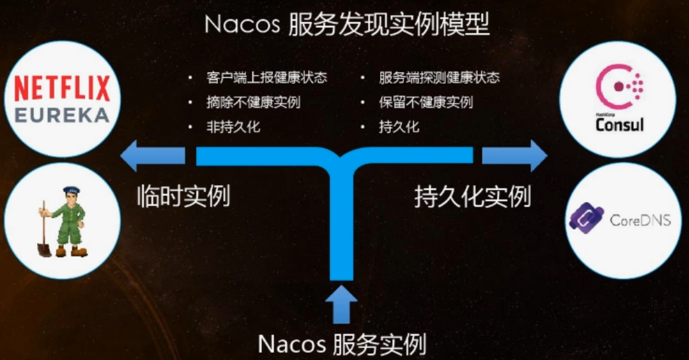
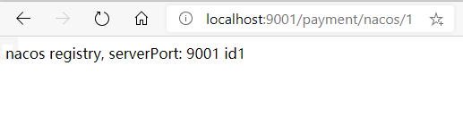
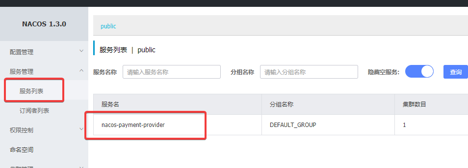
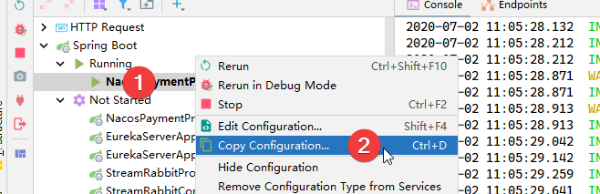
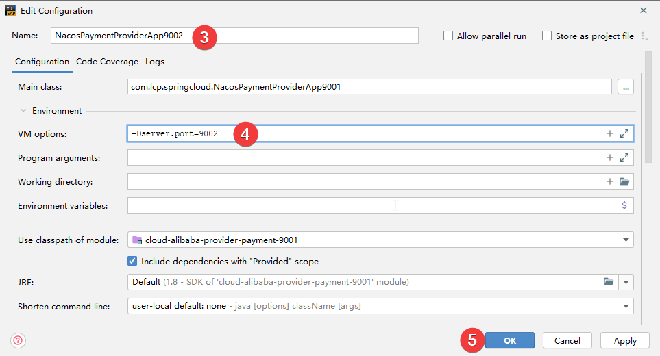
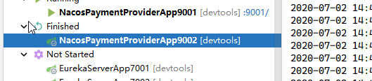
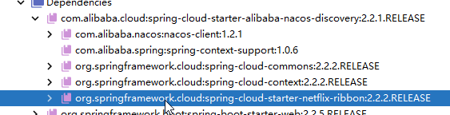

# Spring Cloud Alibaba Nacos 服务注册和配置中心

## Nacos 简介

### 名称由来

前四个字母分别为 Naming 和 Configuration 的前两个字母，最后的 s 为 Service

### 是什么

见官网介绍：https://nacos.io/zh-cn/docs/what-is-nacos.html

一个更易于构建云原生应用的动态服务发现、配置管理和服务管理平台。

### 功能

- 服务发现和服务健康监测
- 动态配置服务
- 动态 DNS 服务
- 服务及其元数据管理
- ......

Nacos = Eureka + Config + Bus

## 各注册中心比较

| 服务注册与发现框架 | CAP模型 | 控制台管理 | 社区活跃度        |
| ------------------ | ------- | ---------- | ----------------- |
| Eureka             | AP      | 支持       | 低（2.x版本闭源） |
| Zookeeper          | CP      | 不支持     | 中                |
| Consul             | CP      | 支持       | 高                |
| Nacos              | AP      | 支持       | 高                |

> Nacos 可以切换 AP 或 CP

|                 | Nacos                          | Eureka      | Consul               | CoreDNS | Zookeeper   |
| --------------- | ------------------------------ | ----------- | -------------------- | ------- | ----------- |
| 一致性协议      | CP+AP                          | AP          | CP                   | /       | CP          |
| 健康检查        | TCP/HTTP<br/>MySQL/Client Beat | Client Beat | TCP/HTTP<br>gRPC/Cmd | /       | Client Beat |
| 负载均衡        | 权重/DSL<br/>metadata/CMDB     | Ribbon      | Fabio                | RR      | /           |
| 雪崩保护        | 支持                           | 支持        | 不支持               | 不支持  | 不支持      |
| 自动注销实例    | 支持                           | 支持        | 不支持               | 不支持  | 支持        |
| 访问协议        | HTTP/DNS/UDP                   | HTTP        | HTTP/DNS             | DNS     | TCP         |
| 监听支持        | 支持                           | 支持        | 支持                 | 不支持  | 支持        |
| 多数据中心      | 支持                           | 支持        | 支持                 | 不支持  | 不支持      |
| 跨注册中心      | 支持                           | 不支持      | 支持                 | 不支持  | 不支持      |
| SpringCloud集成 | 支持                           | 支持        | 支持                 | 不支持  | 不支持      |
| Dubbo           | 支持                           | 不支持      | 不支持               | 不支持  | 支持        |
| k8s             | 支持                           | 不支持      | 支持                 | 支持    | 不支持      |



## 安装并运行 Nacos

官方文档：https://nacos.io/zh-cn/docs/quick-start.html

下载地址：https://github.com/alibaba/nacos/releases

运行 nacos-server，以下均不包含 prometheus/grafana 等监控组件，内嵌 Derby 数据库

1. 方式一：解压安装包，直接运行 bin 目录下的 startup.cmd

2. 方式二：Docker 方式

   ```shell
   docker run --name nacos-standalone -e MODE=standalone -p 8848:8848 -d nacos/nacos-server:latest
   ```
   
   

运行成功后直接访问：http://localhost:8848/nacos，默认账号密码都是  nacos 

## Nacos 作为服务注册中心

### 官方中文文档

https://github.com/alibaba/spring-cloud-alibaba/wiki/Nacos-discovery

### 基于 Nacos  的服务提供者

新建 cloud-alibaba-provider-payment-9001

#### 父 POM

父 pom 即项目 pom

```xml
<!--统一管理jar包版本-->
<properties>
    <spring.cloud.alibaba.version>2.2.1.RELEASE</spring.cloud.alibaba.version>
</properties>

<!--子模块继承后,提供作用:锁定版本+子module不用groupId和version-->
<dependencyManagement>
    <dependencies>
        <!--Spring cloud alibaba 2.2.1.RELEASE-->
        <dependency>
            <groupId>com.alibaba.cloud</groupId>
            <artifactId>spring-cloud-alibaba-dependencies</artifactId>
            <version>${spring.cloud.alibaba.version}</version>
            <type>pom</type>
            <scope>import</scope>
        </dependency>
    </dependencies>
</dependencyManagement>
```

#### 本模块 POM

```xml
<dependencies>
    <!-- nacos-discovery -->
    <dependency>
        <groupId>com.alibaba.cloud</groupId>
        <artifactId>spring-cloud-starter-alibaba-nacos-discovery</artifactId>
    </dependency>

    <dependency>
        <groupId>org.springframework.boot</groupId>
        <artifactId>spring-boot-starter-web</artifactId>
    </dependency>
    <dependency>
        <groupId>org.springframework.boot</groupId>
        <artifactId>spring-boot-starter-actuator</artifactId>
    </dependency>
    <dependency>
        <groupId>org.springframework.boot</groupId>
        <artifactId>spring-boot-devtools</artifactId>
        <scope>runtime</scope>
        <optional>true</optional>
    </dependency>
    <dependency>
        <groupId>org.projectlombok</groupId>
        <artifactId>lombok</artifactId>
        <optional>true</optional>
    </dependency>
    <dependency>
        <groupId>org.springframework.boot</groupId>
        <artifactId>spring-boot-starter-test</artifactId>
        <scope>test</scope>
    </dependency>

    <dependency>
        <groupId>com.alibaba</groupId>
        <artifactId>fastjson</artifactId>
        <version>1.2.62</version>
    </dependency>
</dependencies>
```

#### YML

```yaml
server:
  port: 9001

spring:
  application:
    name: nacos-payment-provider
  cloud:
    nacos:
      discovery:
        # 配置Nacos地址
        server-addr: localhost:8848

management:
  endpoints:
    web:
      exposure:
        include: '*'
```

#### 主启动类

```java
@SpringBootApplication
@EnableDiscoveryClient
public class NacosPaymentProviderApp9001 {
    public static void main(String[] args) {
        SpringApplication.run(NacosPaymentProviderApp9001.class, args);
    }
}
```

#### PaymentController

```java
@RestController
public class PaymentController {
    @Value("${server.port}")
    private String serverPort;

    @GetMapping(value = "/payment/nacos/{id}")
    public String getPayment(@PathVariable("id") Integer id) {
        return "nacos registry, serverPort: " + serverPort + "\t id" + id;
    }
}
```

#### 测试

nacos-server 启动是前提，启动 9001

访问：http://localhost:9001/payment/nacos/1



查看 nacos 管理界面



#### 新建 9002，9003

为了下面的 Nacos，新建 9002，9003 两个模块

这里取个巧，直接在 idea 中拷贝 9001 的启动配置文件，在启动参数中指定端口号

以新建 9002 为例







9003 同理

### 基于 Nacos 的服务消费者

新建 cloud-alibaba-consumer-nacos-83

#### POM

```xml
<dependencies>
    <!--nacos-discovery -->
    <dependency>
        <groupId>com.alibaba.cloud</groupId>
        <artifactId>spring-cloud-starter-alibaba-nacos-discovery</artifactId>
    </dependency>
    <dependency>
        <groupId>com.lcp.springcloud</groupId>
        <artifactId>cloud-api-commons</artifactId>
        <version>${project.version}</version>
    </dependency>
    <dependency>
        <groupId>org.springframework.boot</groupId>
        <artifactId>spring-boot-starter-web</artifactId>
    </dependency>
    <dependency>
        <groupId>org.springframework.boot</groupId>
        <artifactId>spring-boot-starter-actuator</artifactId>
    </dependency>
    <dependency>
        <groupId>org.springframework.boot</groupId>
        <artifactId>spring-boot-devtools</artifactId>
        <scope>runtime</scope>
        <optional>true</optional>
    </dependency>
    <dependency>
        <groupId>org.projectlombok</groupId>
        <artifactId>lombok</artifactId>
        <optional>true</optional>
    </dependency>
    <dependency>
        <groupId>org.springframework.boot</groupId>
        <artifactId>spring-boot-starter-test</artifactId>
        <scope>test</scope>
    </dependency>
</dependencies>
```

##### nacos 支持负载均衡的原因

spring-cloud-starter-alibaba-nacos-discovery 引入了 ribbon 的依赖



#### YML

```yaml
server:
  port: 83

spring:
  application:
    name: nacos-order-consumer
  cloud:
    nacos:
      discovery:
        server-addr: localhost:8848
        
#消费者将要去访问的微服务名称(注册成功进nacos的微服务提供者)
service-url:
  nacos-user-service: http://nacos-payment-provider

management:
  endpoints:
    web:
      exposure:
        include: '*'
```

#### 主启动类

```java
@SpringBootApplication
@EnableDiscoveryClient
public class NacosConsumerApp83 {
    public static void main(String[] args) {
        SpringApplication.run(NacosConsumerApp83.class, args);
    }
}
```

#### OrderNacosController

```java
@RestController
public class OrderNacosController {
    @Resource
    private RestTemplate restTemplate;

    @Value("${service-url.nacos-user-service}")
    private String serverURL;

    @GetMapping(value = "/consumer/payment/nacos/{id}")
    public String paymentInfo(@PathVariable("id") Long id)
    {
        return restTemplate.getForObject(serverURL+"/payment/nacos/"+id,String.class);
    }
}
```

#### ApplicationContextConfig

@LoadBalanced 启用负载均衡，此处必须启用，因为 controller 中不是靠 ip 直接请求 9001

```java
@Configuration
public class ApplicationContextConfig {
    @Bean
    @LoadBalanced
    public RestTemplate getRestTemplate() {
        return new RestTemplate();
    }
}
```

#### 测试

前提：nacos server，9001，9002，9003 已经启动

启动 83

访问：http://localhost:83/consumer/payment/nacos/1

多次刷新，会发现以轮询的方式进行了负载均衡

## Nacos 作为服务配置中心


## Nacos AP和CP切换

`C`：所有节点在同一时间看到的数据是一致的

`A`：所有的请求都会收到响应

### 如何选择使用何种模式

不需要存储服务级别的信息且服务实例是通过 nacos-client 注册，并且能够保持心跳上报，那么就可以选择 AP 模式。当前主流的服务如 Spring Cloud 和 Dubbo 服务，都适用于 AP，而 AP 为了服务的可能性而减弱了一致性，因此 AP 模式下只支持注册临时实例。

如果需要需要在服务级别编辑或者配置存储信息，那么 CP 是必须的，K8S 服务和 DNS 服务 则适用于 CP 模式。

CP 模式下支持注册持久化实例，此时则是以 Raft 协议为集群模式，该模式下，注册实例之前必须先注册服务，如果服务不存在，就会返回错误。

```shell
curl -X PUT '$NACOS_SERVER:8848/nacos/v1/ns/operator/switches?entry=serverMode&value=CP'
```

