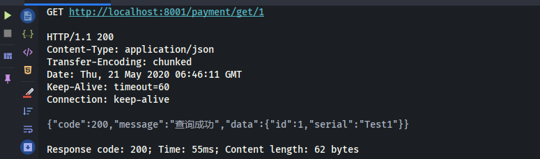
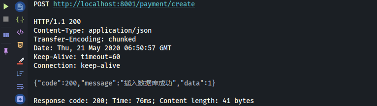
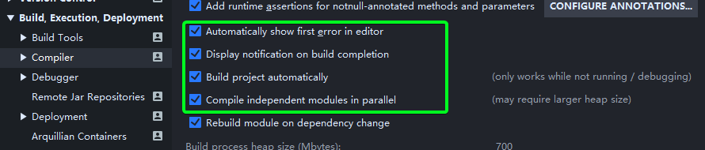
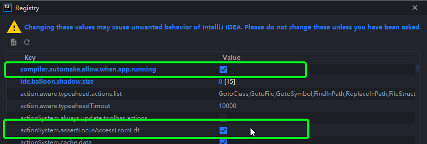
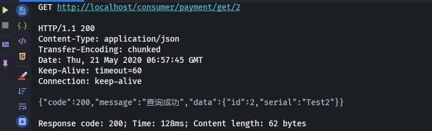
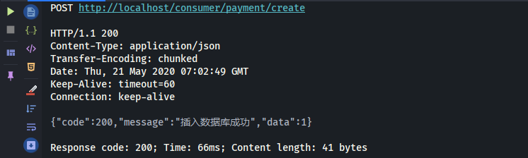

# Spring Cloud 学习笔记

`Spring Cloud Hoxton SR4`

`Spring Boot 2.2.5.RELEASE`

`Spring Cloud Alibaba 2.2.1.RELEASE`

`约定 > 配置 > 编码`

IDEA ：2020.1

MySQL：8.0.19

Maven：3.6.3

JDK：1.8

## 一、工程环境搭建

### 1、spring-cloud-study-v2

新建父工程 spring-cloud-study-v2

#### pom.xml

```xml
<?xml version="1.0" encoding="UTF-8"?>
<project xmlns="http://maven.apache.org/POM/4.0.0"
         xmlns:xsi="http://www.w3.org/2001/XMLSchema-instance"
         xsi:schemaLocation="http://maven.apache.org/POM/4.0.0 http://maven.apache.org/xsd/maven-4.0.0.xsd">
    <modelVersion>4.0.0</modelVersion>

    <groupId>com.lcp.springcloud</groupId>
    <artifactId>spring-cloud-study-v2</artifactId>
    <version>1.0-SNAPSHOT</version>
    <modules>
        <module>cloud-provider-payment-8001</module>
    </modules>
    <packaging>pom</packaging>

    <!--统一管理jar包版本-->
    <properties>
        <project.build.sourceEncoding>UTF-8</project.build.sourceEncoding>
        <maven.compiler.source>1.8</maven.compiler.source>
        <maven.compiler.target>1.8</maven.compiler.target>
        <junit.version>4.12</junit.version>
        <log4j.version>1.2.17</log4j.version>
        <lombok.version>1.16.18</lombok.version>
        <mysql.version>8.0.19</mysql.version>
        <druid.version>1.1.16</druid.version>
        <spring.boot.version>2.2.5.RELEASE</spring.boot.version>
        <spring.cloud.version>Hoxton.SR4</spring.cloud.version>
        <spring.cloud.alibaba.version>2.2.1.RELEASE</spring.cloud.alibaba.version>
        <mybatis.spring.boot.version>1.3.0</mybatis.spring.boot.version>
    </properties>

    <!--子模块继承后,提供作用:锁定版本+子module不用groupId和version-->
    <dependencyManagement>
        <dependencies>
            <!--springboot 2.2.5.RELEASE-->
            <dependency>
                <groupId>org.springframework.boot</groupId>
                <artifactId>spring-boot-dependencies</artifactId>
                <version>${spring.boot.version}</version>
                <type>pom</type>
                <scope>import</scope>
            </dependency>
            <!--Spring cloud Hoxton.SR4-->
            <dependency>
                <groupId>org.springframework.cloud</groupId>
                <artifactId>spring-cloud-dependencies</artifactId>
                <version>${spring.cloud.version}</version>
                <type>pom</type>
                <scope>import</scope>
            </dependency>
            <!--Spring cloud alibaba 2.2.1.RELEASE-->
            <dependency>
                <groupId>com.alibaba.cloud</groupId>
                <artifactId>spring-cloud-alibaba-dependencies</artifactId>
                <version>${spring.cloud.alibaba.version}</version>
                <type>pom</type>
                <scope>import</scope>
            </dependency>
            
            <dependency>
                <groupId>mysql</groupId>
                <artifactId>mysql-connector-java</artifactId>
                <version>${mysql.version}</version>
            </dependency>
            <dependency>
                <groupId>com.alibaba</groupId>
                <artifactId>druid</artifactId>
                <version>${druid.version}</version>
            </dependency>
            <dependency>
                <groupId>org.mybatis.spring.boot</groupId>
                <artifactId>mybatis-spring-boot-starter</artifactId>
                <version>${mybatis.spring.boot.version}</version>
            </dependency>
            
            <dependency>
                <groupId>org.projectlombok</groupId>
                <artifactId>lombok</artifactId>
                <version>${lombok.version}</version>
                <optional>true</optional>
            </dependency>
        </dependencies>
    </dependencyManagement>

    <build>
        <plugins>
            <plugin>
                <groupId>org.springframework.boot</groupId>
                <artifactId>spring-boot-maven-plugin</artifactId>
                <!-- 不要忘记写版本号 -->
                <version>2.3.0.RELEASE</version>
                <configuration>
                    <fork>true</fork>
                    <addResources>true</addResources>
                </configuration>
            </plugin>
        </plugins>
    </build>

</project>
```

> 父工程创建完执行 mvn:install 将父工程发布到仓库方便子工程继承

#### Maven 中的 dependencyManagement

Maven 中的 dependencyManagement 元素提供了一种管理依赖版本号的方式。在 dependencyManagement 元素中声明所依赖的 jar 包的版本号等信息，那么所有子项目再次引入此依赖 jar 包时则无需显式的列出版本号。Maven 会沿着父子层级向上寻找拥有 dependencyManagement 元素的项目，然后使用它指定的版本号。

举例

在父项目的 pom.xml 中配置：

```xml
<dependencyManagement>
    <dependencies>
        <dependency>
            <groupId>org.springframework.boot</groupId>
            <artifactId>spring-boot-starter-web</artifactId>
            <version>1.2.3.RELEASE</version>
        </dependency>
    </dependencies>
</dependencyManagement>
```

此配置即声明了 spring-boot 的版本信息。

子项目则无需指定版本信息：

```xml
<dependency>
    <groupId>org.springframework.boot</groupId>
    <artifactId>spring-boot-starter-web</artifactId>
</dependency>
```

使用优点
如果有多个子项目都引用同一样依赖，则可以避免在每个使用的子项目里都声明一个版本号。当想升级或切换到另一个版本时，只需要在顶层父容器里更新，而不需要逐个修改子项目；另外如果某个子项目需要另外的一个版本，只需要声明 version 即可。

注意事项
dependencyManagement 中定义的只是依赖的声明，并不实现引入，因此子项目需要显式的声明需要用的依赖。

### 2、REST 微服务工程搭建

####  1、cloud-provider-payment-8001

新建微服务提供者模块 cloud-provider-payment-8001

##### pom.xml

```xml
<dependencies>

    <dependency>
        <groupId>org.springframework.boot</groupId>
        <artifactId>spring-boot-starter-web</artifactId>
    </dependency>
    <dependency>
        <groupId>org.springframework.boot</groupId>
        <artifactId>spring-boot-starter-actuator</artifactId>
    </dependency>
    <dependency>
        <groupId>org.mybatis.spring.boot</groupId>
        <artifactId>mybatis-spring-boot-starter</artifactId>
    </dependency>
    <dependency>
        <groupId>com.alibaba</groupId>
        <artifactId>druid-spring-boot-starter</artifactId>
        <version>1.1.10</version>
    </dependency>
    <!--mysql-connector-java-->
    <dependency>
        <groupId>mysql</groupId>
        <artifactId>mysql-connector-java</artifactId>
    </dependency>
    <!--jdbc-->
    <dependency>
        <groupId>org.springframework.boot</groupId>
        <artifactId>spring-boot-starter-jdbc</artifactId>
    </dependency>
    <dependency>
        <groupId>org.springframework.boot</groupId>
        <artifactId>spring-boot-devtools</artifactId>
        <scope>runtime</scope>
        <optional>true</optional>
    </dependency>
    <dependency>
        <groupId>org.projectlombok</groupId>
        <artifactId>lombok</artifactId>
        <optional>true</optional>
    </dependency>
    <dependency>
        <groupId>org.springframework.boot</groupId>
        <artifactId>spring-boot-starter-test</artifactId>
        <scope>test</scope>
    </dependency>

</dependencies>
```

##### application.yaml

```yaml
server:
  port: 8001

spring:
  application:
    name: cloud-provider-payment
  datasource:
    # 当前数据源操作类型
    type: com.alibaba.druid.pool.DruidDataSource
    # mysql驱动包
    driver-class-name: com.mysql.cj.jdbc.Driver
    url: jdbc:mysql://localhost:3306/cloud2020
    username: root
    password: 123456

mybatis:
  mapperLocations: classpath:mapper/*.xml
  # 所有Entity别名类所在包
  type-aliases-package: com.lcp.springcloud.entities
```

##### PaymentProviderApp8001 主启动类

```java
@SpringBootApplication
public class PaymentProviderApp8001 {
    public static void main(String[] args) {
        SpringApplication.run(PaymentProviderApp8001.class, args);
    }
}
```

##### 建表 SQL

```sql
CREATE TABLE `payment`  (
  `id` bigint AUTO_INCREMENT PRIMARY KEY COMMENT '主键',
  `serial` varchar(255) NOT NULL COMMENT '支付流水号'
) COMMENT = '支付表';
```

备注：由于 mysql8 默认编码 utf8mb4，所以这里建表不指定编码。

##### Payment 主实体

```java
@Data
@AllArgsConstructor
@NoArgsConstructor
public class Payment implements Serializable {
    private Long id;
    private String serial;
}
```

JSON 封装体 CommonResult

```java
@Data
@AllArgsConstructor
@NoArgsConstructor
public class CommonResult<T> {
    private Integer code;
    private String message;
    private T data;

    public CommonResult(Integer code, String message) {
        this(code, message, null);
    }
}
```

##### PaymentDao

```java
@Mapper
public interface PaymentDao {
    int create(Payment payment);

    Payment getPaymentById(@Param("id") long id);
}
```

##### PaymentMapper

```xml
<?xml version="1.0" encoding="UTF-8" ?>
<!DOCTYPE mapper PUBLIC "-//mybatis.org//DTD Mapper 3.0//EN"
        "http://mybatis.org/dtd/mybatis-3-mapper.dtd">
<mapper namespace="com.lcp.springcloud.dao.PaymentDao">

    <insert id="create" parameterType="Payment" useGeneratedKeys="true" keyProperty="id">
        INSERT INTO `payment` (serial) VALUES (#{serial});
    </insert>

    <resultMap id="BaseResultMap" type="Payment">
        <id column="id" property="id" jdbcType="BIGINT"/>
        <result column="serial" property="serial" jdbcType="VARCHAR"/>
    </resultMap>

    <select id="getPaymentById" parameterType="Long" resultMap="BaseResultMap">
        SELECT id, serial FROM payment WHERE id = #{id};
    </select>
</mapper>
```

##### PaymentService

```java
public interface PaymentService {
    int create(Payment payment);

    Payment getPaymentById(long id);
}
```

##### PaymentServiceImpl

```java
@Service
public class PaymentServiceImpl implements PaymentService {
    @Resource
    private PaymentDao paymentDao;

    @Override
    public int create(Payment payment) {
        return paymentDao.create(payment);
    }

    @Override
    public Payment getPaymentById(long id) {
        return paymentDao.getPaymentById(id);
    }
}
```

##### PaymentController

```java
@RestController
@RequestMapping("/payment")
@Slf4j
public class PaymentController {
    @Resource
    private PaymentService paymentService;

    @PostMapping(value = "/create")
    public CommonResult<Integer> create(@RequestBody Payment payment) {
        int result = paymentService.create(payment);
        log.info("插入结果：" + result);

        if (result > 0) {
            return new CommonResult<>(200, "插入数据库成功", result);
        } else {
            return new CommonResult<>(444, "插入数据库失败", result);
        }
    }

    @GetMapping(value = "/get/{id}")
    public CommonResult<Payment> getPaymentById(@PathVariable Long id) {
        Payment result = paymentService.getPaymentById(id);
        log.info("查询结果：" + result);

        if (result != null) {
            return new CommonResult<>(200, "查询成功", result);
        } else {
            return new CommonResult<>(444, "没有对应记录，查询失败");
        }
    }
}
```

##### 测试

在 `spring-cloud-study-v2/rest-api-test` 下新建 test-8001.http 进行测试（这种简单的 POST/GET 用不着再切换到 Postman 中进行，IDEA中就可以完成），测试结果会自动保存为 JSON 文件，位于 .idea/httpRequests/ 下

test-8001.http

```http
POST http://localhost:8001/payment/create
Content-Type: application/json

{
  "serial": "Test2"
}

###

GET http://localhost:8001/payment/get/1
Accept: application/json
```

结果如下






#### 2、热部署 Devtools

1. Adding devtools to your project

   ```xml
   <dependency>
       <groupId>org.springframework.boot</groupId>
       <artifactId>spring-boot-devtools</artifactId>
       <scope>runtime</scope>
       <optional>true</optional>
   </dependency>
   ```

2. Adding plugin to your pom.xml

   ```xml
   下面配置我们粘贴进聚合父类总工程的pom.xml里
   <build>
       <!-- fileName 不是必需 -->
       <fileName>你自己的工程名字</fileName>
       <plugins>
           <plugin>
               <groupId>org.springframework.boot</groupId>
               <artifactId>spring-boot-maven-plugin</artifactId>
               <configuration>
                   <fork>true</fork>
                   <addResources>true</addResources>
               </configuration>
           </plugin>
       </plugins>
   </build>
   ```

3. Enabling automatic build

   File → Settings → Build, Execution, Deployment → Compiler

   

4. Update the value of

   IDEA 中使用快捷键 <kbd>Ctrl</kbd> + <kbd>Shift</kbd> + <kbd>Alt</kbd> + <kbd>/</kbd> 打开 `Registry`

   

5. 重启 IDEA

#### 3、cloud-consumer-order-80

微服务消费者订单模块 cloud-consumer-order-80

##### pom.xml

```xml
<dependencies>
    <dependency>
        <groupId>org.springframework.boot</groupId>
        <artifactId>spring-boot-starter-web</artifactId>
    </dependency>
    <dependency>
        <groupId>org.springframework.boot</groupId>
        <artifactId>spring-boot-starter-actuator</artifactId>
    </dependency>

    <dependency>
        <groupId>org.projectlombok</groupId>
        <artifactId>lombok</artifactId>
        <optional>true</optional>
    </dependency>
    <dependency>
        <groupId>org.springframework.boot</groupId>
        <artifactId>spring-boot-starter-test</artifactId>
        <scope>test</scope>
    </dependency>

    <!-- 热部署 -->
    <dependency>
        <groupId>org.springframework.boot</groupId>
        <artifactId>spring-boot-devtools</artifactId>
        <scope>runtime</scope>
        <optional>true</optional>
    </dependency>
</dependencies>
```

##### application.yaml

```yaml
server:
  port: 80

spring:
  application:
    name: cloud-consumer-order
```

##### ConsumerOrderApp80 主启动类

```java
@SpringBootApplication
public class ConsumerOrderApp80 {
    public static void main(String[] args) {
        SpringApplication.run(ConsumerOrderApp80.class, args);
    }
}
```

##### entities 包

把上个模块的 entities 复制一份即可

##### ApplicationContextConfig 配置类

```java
@Configuration
public class ApplicationContextConfig {

    @Bean
    public RestTemplate getRestTemplate() {
        return new RestTemplate();
    }
}
```

##### OrderController

```java
@RestController
@Slf4j
@RequestMapping(value = "/consumer")
public class OrderController {
    public static final String PAYMENT_URL = "http://localhost:8001";

    @Resource
    private RestTemplate restTemplate;

    @PostMapping("/create")
    public CommonResult<Payment> create(@RequestBody Payment payment) {
        return restTemplate.postForObject(PAYMENT_URL + "/payment/create", payment, CommonResult.class);
    }

    @GetMapping(value = "/get/{id}")
    public CommonResult<Payment> getPayment(@PathVariable Long id) {
        return restTemplate.getForObject(PAYMENT_URL + "/payment/get/" + id, CommonResult.class);
    }
}
```

`@RequestBody` 不要忘记，不然

##### 测试

test-80.http

```http
GET http://localhost/consumer/payment/get/2
Accept: application/json

###

POST http://localhost/consumer/payment/create
Content-Type: application/json

{
  "serial": "Test5"
}
```

结果如下





#### 4、工程重构

##### 观察问题

上面两个微服务都有一个内容和结构完全一样的包 `entities`，所以系统中有部分重复，进行重构。

##### cloud-api-commons

新建模块 cloud-api-commons 用来存放各种公共类

##### pom.xml

```xml
<dependencies>
    <dependency>
        <groupId>org.projectlombok</groupId>
        <artifactId>lombok</artifactId>
        <optional>true</optional>
    </dependency>
    <!-- Java 工具类库 -->
    <dependency>
        <groupId>cn.hutool</groupId>
        <artifactId>hutool-all</artifactId>
        <version>5.3.5</version>
    </dependency>

    <dependency>
        <groupId>org.springframework.boot</groupId>
        <artifactId>spring-boot-devtools</artifactId>
        <scope>runtime</scope>
        <optional>true</optional>
    </dependency>
</dependencies>
```

##### maven clean/install

##### 改造 80，8001 工程

各自删除原先的 `entities` 包，分别在 pom 中加入以下依赖

```xml
<dependency>
    <groupId>com.lcp.springcloud</groupId>
    <artifactId>cloud-api-commons</artifactId>
    <version>${project.version}</version>
</dependency>
```


### 3、总结：

1. 建 Module
2. 改 POM
3. 写 YAML
4. 主启动类
5. 业务类

