# Spring Cloud 学习笔记_v2（第一部分）

`Spring Cloud Hoxton SR4`

`Spring Boot 2.2.5.RELEASE`

`Spring Cloud Alibaba 2.2.1.RELEASE`

`约定 > 配置 > 编码`

IDEA ：2020.1

MySQL：8.0.19

Maven：3.6.3

JDK：1.8

## 一、工程环境搭建

### 1、spring-cloud-study-v2

新建父工程 spring-cloud-study-v2

#### pom.xml

```xml
<?xml version="1.0" encoding="UTF-8"?>
<project xmlns="http://maven.apache.org/POM/4.0.0"
         xmlns:xsi="http://www.w3.org/2001/XMLSchema-instance"
         xsi:schemaLocation="http://maven.apache.org/POM/4.0.0 http://maven.apache.org/xsd/maven-4.0.0.xsd">
    <modelVersion>4.0.0</modelVersion>

    <groupId>com.lcp.springcloud</groupId>
    <artifactId>spring-cloud-study-v2</artifactId>
    <version>1.0-SNAPSHOT</version>
    <modules>
        <module>cloud-provider-payment-8001</module>
    </modules>
    <packaging>pom</packaging>

    <!--统一管理jar包版本-->
    <properties>
        <project.build.sourceEncoding>UTF-8</project.build.sourceEncoding>
        <maven.compiler.source>1.8</maven.compiler.source>
        <maven.compiler.target>1.8</maven.compiler.target>
        <junit.version>4.12</junit.version>
        <log4j.version>1.2.17</log4j.version>
        <lombok.version>1.16.18</lombok.version>
        <mysql.version>8.0.19</mysql.version>
        <druid.version>1.1.16</druid.version>
        <spring.boot.version>2.2.5.RELEASE</spring.boot.version>
        <spring.cloud.version>Hoxton.SR4</spring.cloud.version>
        <spring.cloud.alibaba.version>2.2.1.RELEASE</spring.cloud.alibaba.version>
        <mybatis.spring.boot.version>1.3.0</mybatis.spring.boot.version>
    </properties>

    <!--子模块继承后,提供作用:锁定版本+子module不用groupId和version-->
    <dependencyManagement>
        <dependencies>
            <!--springboot 2.2.5.RELEASE-->
            <dependency>
                <groupId>org.springframework.boot</groupId>
                <artifactId>spring-boot-dependencies</artifactId>
                <version>${spring.boot.version}</version>
                <type>pom</type>
                <scope>import</scope>
            </dependency>
            <!--Spring cloud Hoxton.SR4-->
            <dependency>
                <groupId>org.springframework.cloud</groupId>
                <artifactId>spring-cloud-dependencies</artifactId>
                <version>${spring.cloud.version}</version>
                <type>pom</type>
                <scope>import</scope>
            </dependency>
            <!--Spring cloud alibaba 2.2.1.RELEASE-->
            <dependency>
                <groupId>com.alibaba.cloud</groupId>
                <artifactId>spring-cloud-alibaba-dependencies</artifactId>
                <version>${spring.cloud.alibaba.version}</version>
                <type>pom</type>
                <scope>import</scope>
            </dependency>
            
            <dependency>
                <groupId>mysql</groupId>
                <artifactId>mysql-connector-java</artifactId>
                <version>${mysql.version}</version>
            </dependency>
            <dependency>
                <groupId>com.alibaba</groupId>
                <artifactId>druid</artifactId>
                <version>${druid.version}</version>
            </dependency>
            <dependency>
                <groupId>org.mybatis.spring.boot</groupId>
                <artifactId>mybatis-spring-boot-starter</artifactId>
                <version>${mybatis.spring.boot.version}</version>
            </dependency>
            
            <dependency>
                <groupId>org.projectlombok</groupId>
                <artifactId>lombok</artifactId>
                <version>${lombok.version}</version>
                <optional>true</optional>
            </dependency>
        </dependencies>
    </dependencyManagement>

    <build>
        <plugins>
            <plugin>
                <groupId>org.springframework.boot</groupId>
                <artifactId>spring-boot-maven-plugin</artifactId>
                <!-- 不要忘记写版本号 -->
                <version>2.3.0.RELEASE</version>
                <configuration>
                    <fork>true</fork>
                    <addResources>true</addResources>
                </configuration>
            </plugin>
        </plugins>
    </build>

</project>
```

> 父工程创建完执行 mvn:install 将父工程发布到仓库方便子工程继承

#### Maven 中的 dependencyManagement

Maven 中的 dependencyManagement 元素提供了一种管理依赖版本号的方式。在 dependencyManagement 元素中声明所依赖的 jar 包的版本号等信息，那么所有子项目再次引入此依赖 jar 包时则无需显式的列出版本号。Maven 会沿着父子层级向上寻找拥有 dependencyManagement 元素的项目，然后使用它指定的版本号。

举例

在父项目的 pom.xml 中配置：

```xml
<dependencyManagement>
    <dependencies>
        <dependency>
            <groupId>org.springframework.boot</groupId>
            <artifactId>spring-boot-starter-web</artifactId>
            <version>1.2.3.RELEASE</version>
        </dependency>
    </dependencies>
</dependencyManagement>
```

此配置即声明了 spring-boot 的版本信息。

子项目则无需指定版本信息：

```xml
<dependency>
    <groupId>org.springframework.boot</groupId>
    <artifactId>spring-boot-starter-web</artifactId>
</dependency>
```

使用优点
如果有多个子项目都引用同一样依赖，则可以避免在每个使用的子项目里都声明一个版本号。当想升级或切换到另一个版本时，只需要在顶层父容器里更新，而不需要逐个修改子项目；另外如果某个子项目需要另外的一个版本，只需要声明 version 即可。

注意事项
dependencyManagement 中定义的只是依赖的声明，并不实现引入，因此子项目需要显式的声明需要用的依赖。

### 2、REST 微服务工程搭建

####  1、cloud-provider-payment-8001

新建微服务提供者模块 cloud-provider-payment-8001

##### pom.xml

```xml
<dependencies>

    <!-- 以下两项应该是标配 -->
    <dependency>
        <groupId>org.springframework.boot</groupId>
        <artifactId>spring-boot-starter-web</artifactId>
    </dependency>
    <dependency>
        <groupId>org.springframework.boot</groupId>
        <artifactId>spring-boot-starter-actuator</artifactId>
    </dependency>
    
    <dependency>
        <groupId>org.mybatis.spring.boot</groupId>
        <artifactId>mybatis-spring-boot-starter</artifactId>
    </dependency>
    <dependency>
        <groupId>com.alibaba</groupId>
        <artifactId>druid-spring-boot-starter</artifactId>
        <version>1.1.10</version>
    </dependency>
    <!--mysql-connector-java-->
    <dependency>
        <groupId>mysql</groupId>
        <artifactId>mysql-connector-java</artifactId>
    </dependency>
    <!--jdbc-->
    <dependency>
        <groupId>org.springframework.boot</groupId>
        <artifactId>spring-boot-starter-jdbc</artifactId>
    </dependency>
    <dependency>
        <groupId>org.springframework.boot</groupId>
        <artifactId>spring-boot-devtools</artifactId>
        <scope>runtime</scope>
        <optional>true</optional>
    </dependency>
    <dependency>
        <groupId>org.projectlombok</groupId>
        <artifactId>lombok</artifactId>
        <optional>true</optional>
    </dependency>
    <dependency>
        <groupId>org.springframework.boot</groupId>
        <artifactId>spring-boot-starter-test</artifactId>
        <scope>test</scope>
    </dependency>

</dependencies>
```

##### application.yaml

```yaml
server:
  port: 8001

spring:
  application:
    name: cloud-provider-payment
  datasource:
    # 当前数据源操作类型
    type: com.alibaba.druid.pool.DruidDataSource
    # mysql驱动包
    driver-class-name: com.mysql.cj.jdbc.Driver
    url: jdbc:mysql://localhost:3306/cloud2020
    username: root
    password: 123456

mybatis:
  mapperLocations: classpath:mapper/*.xml
  # 所有Entity别名类所在包
  type-aliases-package: com.lcp.springcloud.entities
```

##### PaymentProviderApp8001 主启动类

```java
@SpringBootApplication
public class PaymentProviderApp8001 {
    public static void main(String[] args) {
        SpringApplication.run(PaymentProviderApp8001.class, args);
    }
}
```

##### 建表 SQL

```sql
CREATE TABLE `payment`  (
  `id` bigint AUTO_INCREMENT PRIMARY KEY COMMENT '主键',
  `serial` varchar(255) NOT NULL COMMENT '支付流水号'
) COMMENT = '支付表';
```

备注：由于 mysql8 默认编码 utf8mb4，所以这里建表不指定编码。

##### Payment 主实体

```java
@Data
@AllArgsConstructor
@NoArgsConstructor
public class Payment implements Serializable {
    private Long id;
    private String serial;
}
```

JSON 封装体 CommonResult

```java
@Data
@AllArgsConstructor
@NoArgsConstructor
public class CommonResult<T> {
    private Integer code;
    private String message;
    private T data;

    public CommonResult(Integer code, String message) {
        this(code, message, null);
    }
}
```

##### PaymentDao

```java
@Mapper
public interface PaymentDao {
    int create(Payment payment);

    Payment getPaymentById(@Param("id") long id);
}
```

##### PaymentMapper

```xml
<?xml version="1.0" encoding="UTF-8" ?>
<!DOCTYPE mapper PUBLIC "-//mybatis.org//DTD Mapper 3.0//EN"
        "http://mybatis.org/dtd/mybatis-3-mapper.dtd">
<mapper namespace="com.lcp.springcloud.dao.PaymentDao">

    <insert id="create" parameterType="Payment" useGeneratedKeys="true" keyProperty="id">
        INSERT INTO `payment` (serial) VALUES (#{serial});
    </insert>

    <resultMap id="BaseResultMap" type="Payment">
        <id column="id" property="id" jdbcType="BIGINT"/>
        <result column="serial" property="serial" jdbcType="VARCHAR"/>
    </resultMap>

    <select id="getPaymentById" parameterType="Long" resultMap="BaseResultMap">
        SELECT id, serial FROM payment WHERE id = #{id};
    </select>
</mapper>
```

##### PaymentService

```java
public interface PaymentService {
    int create(Payment payment);

    Payment getPaymentById(long id);
}
```

##### PaymentServiceImpl

```java
@Service
public class PaymentServiceImpl implements PaymentService {
    @Resource
    private PaymentDao paymentDao;

    @Override
    public int create(Payment payment) {
        return paymentDao.create(payment);
    }

    @Override
    public Payment getPaymentById(long id) {
        return paymentDao.getPaymentById(id);
    }
}
```

##### PaymentController

```java
@RestController
@RequestMapping("/payment")
@Slf4j
public class PaymentController {
    @Resource
    private PaymentService paymentService;

    @PostMapping(value = "/create")
    public CommonResult<Integer> create(@RequestBody Payment payment) {
        int result = paymentService.create(payment);
        log.info("插入结果：" + result);

        if (result > 0) {
            return new CommonResult<>(200, "插入数据库成功", result);
        } else {
            return new CommonResult<>(444, "插入数据库失败", result);
        }
    }

    @GetMapping(value = "/get/{id}")
    public CommonResult<Payment> getPaymentById(@PathVariable Long id) {
        Payment result = paymentService.getPaymentById(id);
        log.info("查询结果：" + result);

        if (result != null) {
            return new CommonResult<>(200, "查询成功", result);
        } else {
            return new CommonResult<>(444, "没有对应记录，查询失败");
        }
    }
}
```

##### 测试

在 `spring-cloud-study-v2/rest-api-test` 下新建 test-8001.http 进行测试（这种简单的 POST/GET 用不着再切换到 Postman 中进行，IDEA中就可以完成），测试结果会自动保存为 JSON 文件，位于 .idea/httpRequests/ 下

test-8001.http

```http
POST http://localhost:8001/payment/create
Content-Type: application/json

{
  "serial": "Test2"
}

###

GET http://localhost:8001/payment/get/1
Accept: application/json
```

结果如下


#### 2、热部署 Devtools

1. Adding devtools to your project

   ```xml
   <dependency>
       <groupId>org.springframework.boot</groupId>
       <artifactId>spring-boot-devtools</artifactId>
       <scope>runtime</scope>
       <optional>true</optional>
   </dependency>
   ```

2. Adding plugin to your pom.xml

   ```xml
   下面配置我们粘贴进聚合父类总工程的pom.xml里
   <build>
       <!-- fileName 不是必需 -->
       <fileName>你自己的工程名字</fileName>
       <plugins>
           <plugin>
               <groupId>org.springframework.boot</groupId>
               <artifactId>spring-boot-maven-plugin</artifactId>
               <configuration>
                   <fork>true</fork>
                   <addResources>true</addResources>
               </configuration>
           </plugin>
       </plugins>
   </build>
   ```

3. Enabling automatic build

   File → Settings → Build, Execution, Deployment → Compiler

   

4. Update the value of

   IDEA 中使用快捷键 <kbd>Ctrl</kbd> + <kbd>Shift</kbd> + <kbd>Alt</kbd> + <kbd>/</kbd> 打开 `Registry`

   

5. 重启 IDEA

#### 3、cloud-consumer-order-80

微服务消费者订单模块 cloud-consumer-order-80

##### pom.xml

```xml
<dependencies>
    <dependency>
        <groupId>org.springframework.boot</groupId>
        <artifactId>spring-boot-starter-web</artifactId>
    </dependency>
    <dependency>
        <groupId>org.springframework.boot</groupId>
        <artifactId>spring-boot-starter-actuator</artifactId>
    </dependency>

    <dependency>
        <groupId>org.projectlombok</groupId>
        <artifactId>lombok</artifactId>
        <optional>true</optional>
    </dependency>
    <dependency>
        <groupId>org.springframework.boot</groupId>
        <artifactId>spring-boot-starter-test</artifactId>
        <scope>test</scope>
    </dependency>

    <!-- 热部署 -->
    <dependency>
        <groupId>org.springframework.boot</groupId>
        <artifactId>spring-boot-devtools</artifactId>
        <scope>runtime</scope>
        <optional>true</optional>
    </dependency>
</dependencies>
```

##### application.yaml

```yaml
server:
  port: 80

spring:
  application:
    name: cloud-consumer-order
```

##### ConsumerOrderApp80 主启动类

```java
@SpringBootApplication
public class ConsumerOrderApp80 {
    public static void main(String[] args) {
        SpringApplication.run(ConsumerOrderApp80.class, args);
    }
}
```

##### entities 包

把上个模块的 entities 复制一份即可

##### ApplicationContextConfig 配置类

```java
@Configuration
public class ApplicationContextConfig {

    @Bean
    public RestTemplate getRestTemplate() {
        return new RestTemplate();
    }
}
```

##### OrderController

```java
@RestController
@Slf4j
@RequestMapping(value = "/consumer")
public class OrderController {
    public static final String PAYMENT_URL = "http://localhost:8001";

    @Resource
    private RestTemplate restTemplate;

    @PostMapping("/create")
    public CommonResult<Payment> create(@RequestBody Payment payment) {
        return restTemplate.postForObject(PAYMENT_URL + "/payment/create", payment, CommonResult.class);
    }

    @GetMapping(value = "/get/{id}")
    public CommonResult<Payment> getPayment(@PathVariable Long id) {
        return restTemplate.getForObject(PAYMENT_URL + "/payment/get/" + id, CommonResult.class);
    }
}
```

`@RequestBody` 不要忘记，不然

##### 测试

test-80.http

```http
GET http://localhost/consumer/payment/get/2
Accept: application/json

###

POST http://localhost/consumer/payment/create
Content-Type: application/json

{
  "serial": "Test5"
}
```

结果如下


#### 4、工程重构

##### 观察问题

上面两个微服务都有一个内容和结构完全一样的包 `entities`，所以系统中有部分重复，进行重构。

##### cloud-api-commons

新建模块 cloud-api-commons 用来存放各种公共类

##### pom.xml

```xml
<dependencies>
    <dependency>
        <groupId>org.projectlombok</groupId>
        <artifactId>lombok</artifactId>
        <optional>true</optional>
    </dependency>
    <!-- Java 工具类库 -->
    <dependency>
        <groupId>cn.hutool</groupId>
        <artifactId>hutool-all</artifactId>
        <version>5.3.5</version>
    </dependency>

    <dependency>
        <groupId>org.springframework.boot</groupId>
        <artifactId>spring-boot-devtools</artifactId>
        <scope>runtime</scope>
        <optional>true</optional>
    </dependency>
</dependencies>
```

##### maven clean/install

##### 改造 80，8001 工程

各自删除原先的 `entities` 包，分别在 pom 中加入以下依赖

```xml
<dependency>
    <groupId>com.lcp.springcloud</groupId>
    <artifactId>cloud-api-commons</artifactId>
    <version>${project.version}</version>
</dependency>
```

##### 测试

步骤同上，不再赘述

### 3、模块开发过程总结：

1. 建 Module
2. 改 POM
3. 写 YAML
4. 主启动类
5. 业务类

## 二、Eureka 服务注册与发现

### 1、Eureka 基础知识

#### 服务治理

在传统的 rpc 远程调用框架中，管理每个服务与服务之间依赖关系比较复杂，所以需要服务治理来管理服务与服务之间的依赖关系，可以实现服务调用、负载均衡、容错、实现服务发现与注册。

参考：https://segmentfault.com/a/1190000010224335

#### 服务注册与发现

在服务注册与发现中，有一个注册中心。当服务器启动的是时候，会把当前自己服务器的信息比如 ip:port 以别名的方式注册到注册中心上，另一方通过别名从注册中心获取到实际的服务器通讯地址。


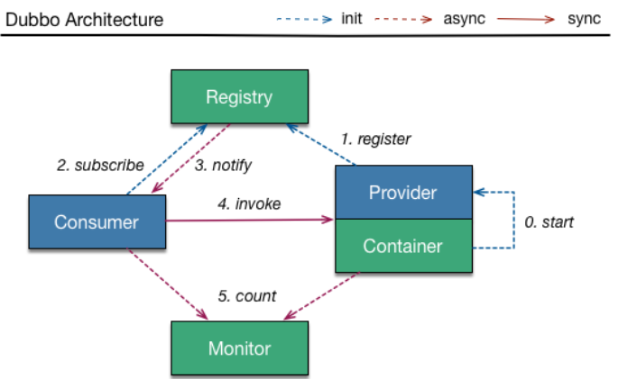

#### Eureka 两大组件

Eureka 包含两大组件：Eureka Server 和 Eureka Client

- Eureka Server 提供服务注册服务

  各个微服务节点通过配置启动后，会在 Eureka Server 中进行注册，这样 Eureka Server 中的服务注册表中将会存储所有可用服务节点的信息，服务节点的信息可以在 Eureka Server 的 web 界面中直观的看到。

- Eureka Client 通过注册中心进行访问

  EurekaClient 是一个 Java 客户端，用于简化 Eureka Server 的交互，客户端同时也具备一个内置的、使用轮询(round-robin) 负载算法的负载均衡器。在应用启动后，将会向 Eureka Server 发送心跳（默认周期为30秒）。如果Eureka Server 在多个心跳周期内没有接收到某个节点的心跳，Eureka Server 将会从服务注册表中把这个服务节点移除（默认90秒）。

#### Eureka 自我保护机制

现象

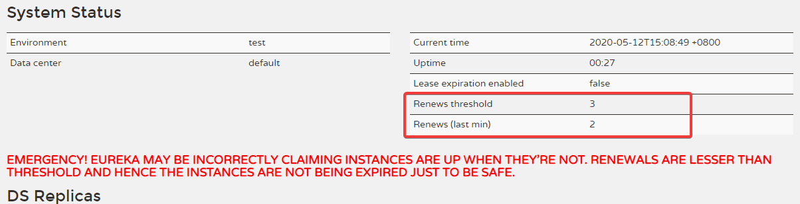

什么是自我保护机制

默认情况下，如果 Eureka Server 在一定时间内没有接收到某个微服务实例的心跳，Eureka Server 将会注销该实例（默认90秒）。但是当网络分区故障发生时，微服务与 Eureka Server 之间无法正常通信，以上行为可能变得非常危险了——因为微服务本身其实是健康的，此时本不应该注销这个微服务。Eureka 通过“自我保护模式”来解决这个问题——当 Eureka Server 节点在短时间内丢失过多客户端时（可能发生了网络分区故障），那么这个节点就会进入自我保护模式。一旦进入该模式，Eureka Server 就会保护服务注册表中的信息，不再删除服务注册表中的数据（也就是不会注销任何微服务）。当网络故障恢复后，该 Eureka Server节点会自动退出自我保护模式。

在自我保护模式中，Eureka Server 会保护服务注册表中的信息，不再注销任何服务实例。当它收到的心跳数重新恢复到阈值以上时，该 Eureka Server 节点就会自动退出自我保护模式。它的设计哲学就是宁可保留错误的服务注册信息，也不盲目注销任何可能健康的服务实例。一句话讲解：好死不如赖活着

综上，自我保护模式是一种应对网络异常的安全保护措施。它的架构哲学是宁可同时保留所有微服务（健康的微服务和不健康的微服务都会保留），也不盲目注销任何健康的微服务。使用自我保护模式，可以让 Eureka 集群更加的健壮、稳定。

在Spring Cloud中，可以使用 `eureka.server.enable-self-preservation = false` 禁用自我保护模式。

> 总结：某时刻一个微服务不可用了 eureka 不会立即清理，依旧会对该微服务的信息进行保存。
>
> 属于 CAP 里的 AP

### 2、单机 Eureka Server 构建

#### cloud-eureka-server-7001

新建 cloud-eureka-server-7001 模块

#### pom.xml

```xml
<dependencies>
    <dependency>
        <groupId>com.lcp.springcloud</groupId>
        <artifactId>cloud-api-commons</artifactId>
        <version>${project.version}</version>
    </dependency>
    <!--eureka-server-->
    <dependency>
        <groupId>org.springframework.cloud</groupId>
        <artifactId>spring-cloud-starter-netflix-eureka-server</artifactId>
    </dependency>
    <dependency>
        <groupId>org.springframework.boot</groupId>
        <artifactId>spring-boot-starter-web</artifactId>
    </dependency>
    <dependency>
        <groupId>org.springframework.boot</groupId>
        <artifactId>spring-boot-starter-actuator</artifactId>
    </dependency>
    <!--一般为通用配置-->
    <dependency>
        <groupId>org.springframework.boot</groupId>
        <artifactId>spring-boot-devtools</artifactId>
        <scope>runtime</scope>
        <optional>true</optional>
    </dependency>
    <dependency>
        <groupId>org.projectlombok</groupId>
        <artifactId>lombok</artifactId>
        <optional>true</optional>
    </dependency>
    <dependency>
        <groupId>org.springframework.boot</groupId>
        <artifactId>spring-boot-starter-test</artifactId>
        <scope>test</scope>
    </dependency>
</dependencies>
```

##### Eureka 1.x 与 2.x 对比

以前，2018

```xml
<dependency>
    <groupId>org.springframework.cloud</groupId>
    <artifactId>spring-cloud-starter-eureka</artifactId>
</dependency>
```

现在，2020

```xml
<!-- Eureka Server -->
<dependency>
    <groupId>org.springframework.cloud</groupId>
    <artifactId>spring-cloud-starter-netflix-eureka-server</artifactId>
</dependency>

<!-- Eureka Client -->
<dependency>
    <groupId>org.springframework.cloud</groupId>
    <artifactId>spring-cloud-starter-netflix-eureka-client</artifactId>
</dependency>
```

#### 修改映射配置

编辑 hosts 文件

```
127.0.0.1 eureka7001.com
127.0.0.1 eureka7002.com
```

#### application.yaml

```yaml
server:
  port: 7001

eureka:
  instance:
    # eureka服务端的实例名称
    hostname: eureka7001.com
  client:
  	#以下两项默认值 true 即可，没必要非得是 false
    # false表示不向注册中心注册自己。
    #register-with-eureka: false
    # false表示自己端就是注册中心，我的职责就是维护服务实例，并不需要去检索服务。
    #fetch-registry: false
    service-url:
      defaultZone: http://${eureka.instance.hostname}:${server.port}/eureka/

spring:
  application:
    name: eureka-server
```

#### EurekaServerApp7001 主启动类

```java
@SpringBootApplication
@EnableEurekaServer
public class EurekaServerApp7001 {
    public static void main(String[] args) {
        SpringApplication.run(EurekaServerApp7001.class, args);
    }
}
```

#### 测试

访问：http://localhost:7001/

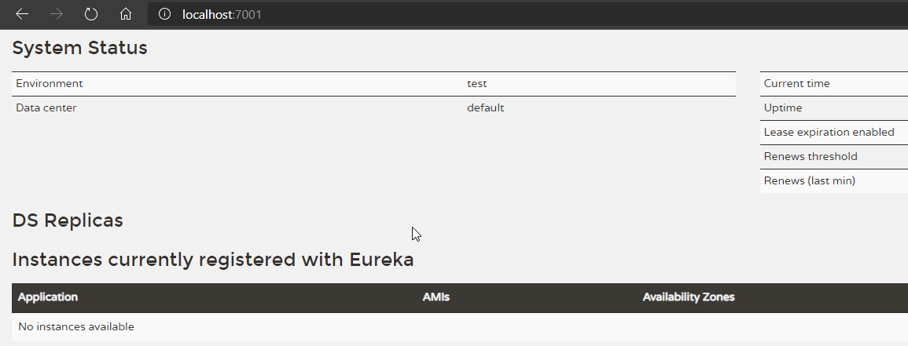

No instances available：没有可用的实例。因为目前也没有服务注册进来，当然就没有可用的实例。

#### 改造 80，8001 模块为 Eureka Client

##### pom.xml

修改 pom.xml，添加对 Eureka Client 的支持

```xml
<!-- Eureka Client -->
<dependency>
    <groupId>org.springframework.cloud</groupId>
    <artifactId>spring-cloud-starter-netflix-eureka-client</artifactId>
</dependency>
```

##### application.yaml

```yaml
eureka:
  client:
    service-url:
      defaultZone: http://eureka7001.com:7001/eureka
    #以下默认就是true，不填也行  
    #fetch-registry: true
    #register-with-eureka: true
```

##### 主启动类

主启动类上添加注解 `@EnableEurekaClient`

##### 测试

访问：http://localhost:7001/

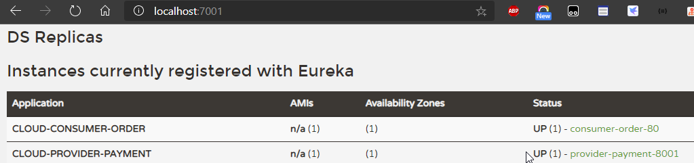

### 3、集群 Eureka Server 构建

#### cloud-eureka-server-7002

参考 cloud-eureka-server-7001 新建 cloud-eureka-server-7002

##### pom.xml

修改 7001，7002 的 yaml

7001

```yaml
server:
  port: 7001

eureka:
  instance:
    # eureka服务端的实例名称
    hostname: eureka7001.com
    instance-id: eureka-server-7001
  client:
    #以下两项默认值 true 即可，没必要非得是 false
    # false表示不向注册中心注册自己。
    #    register-with-eureka: false
    # false表示自己端就是注册中心，我的职责就是维护服务实例，并不需要去检索服务。
    #    fetch-registry: false
    service-url:
      #defaultZone: http://${eureka.instance.hostname}:${server.port}/eureka/
      defaultZone: http://eureka7002.com:7002/eureka/
      
  server:
    # 测试时关闭自我保护机制，保证不可用服务及时剔除
    enable-self-preservation: false
    # 缩短 eureka server 清理无效节点的时间间隔，默认60000毫秒，即60秒，现在调整为间隔2秒
    eviction-interval-timer-in-ms: 2000
    
spring:
  application:
    name: eureka-server
```

7002

```yaml
server:
  port: 7002

eureka:
  instance:
    hostname: eureka7002.com
    instance-id: eureka-server-7002
  client:
    service-url:
      defaultZone: http://eureka7001.com:7001/eureka/
  server:
    enable-self-preservation: false
    eviction-interval-timer-in-ms: 2000

spring:
  application:
    name: eureka-server
```

##### 测试

访问：http://localhost:7001/

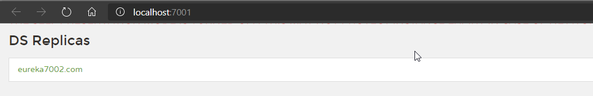

注意下图

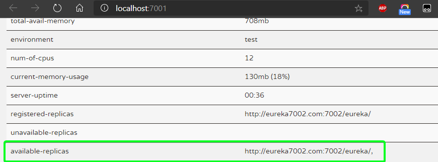

当 7001，7002 都正常运行时，7001，7002 应出现在对方的 available-replicas 中

#### 80、8001 注册进集群

##### 修改 YAML

修改 defaultZone，添加 instance 下的两项

```yaml
eureka:
  client:
    service-url:
      #defaultZone: http://eureka7001.com:7001/eureka
      defaultZone: http://eureka7001.com:7001/eureka,http://eureka7002.com:7002/eureka
  instance:
    # 心跳时间，即服务续约间隔时间（缺省为30s）
    lease-renewal-interval-in-seconds: 1
    # 发呆时间，即服务续约到期时间（缺省为90s）
    lease-expiration-duration-in-seconds: 2
```

##### 测试

```http
GET http://localhost:8001/payment/get/1
Accept: application/json

###

GET http://localhost/consumer/payment/get/2
Accept: application/json
```

#### cloud-provider-payment 集群

参考 cloud-provider-payment-8001 搭建 `cloud-provider-payment-8002`

##### pom.xml

直接复制 8001 的 dependencies

##### application.yaml

直接复制 8001 的 yaml，修改以下两项即可

```yaml
server:
  port: 8002

eureka:
  instance:
    instance-id: provider-payment-8002
```

##### 主启动类和业务类

直接复制 8001 的， 主启动类改名为 `PaymentProviderApp8002`

##### 修改 8001/8002 的 Controller

在返回的信息中加入端口信息

```java
// 新增，读取配置文件的中的端口信息
@Value("${server.port}")
private String serverPort;

// return new CommonResult<>(200, "插入数据库成功", result);
return new CommonResult<>(200, "插入数据库成功。serverPort：" + serverPort, result);
```

##### 测试

同上

#### 负载均衡 @LoadBalanced

使用 @LoadBalanced 可以赋予 RestTemplate 负载均衡的能力

修改 cloud-consumer-order-80 

##### ApplicationContextConfig

```java
@Bean
@LoadBalanced
public RestTemplate getRestTemplate() {
    return new RestTemplate();
}
```

##### OrderController

```java
// public static final String PAYMENT_URL = "http://localhost:8001";
public static final String PAYMENT_URL = "http://CLOUD-PROVIDER-PAYMENT";
```

`CLOUD-PROVIDER-PAYMENT` 的来源

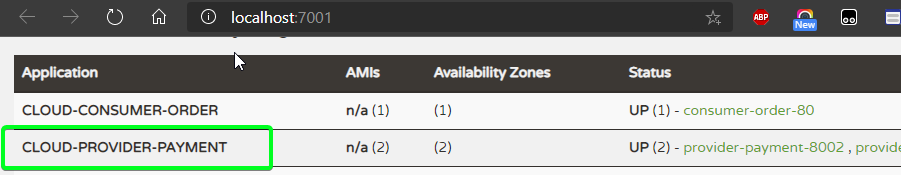

##### 测试

反复访问：GET http://localhost/consumer/payment/get/2，观察返回数据中的端口号，会发现 8001、8002 端口交替出现。

### 4、微服务信息完善

以下均以 cloud-consumer-order-80 的为例

#### 访问信息显示IP

目前 Eureka Server 的 Web 页面 Status 下的链接鼠标放上去的提示路径只有主机名，没有 IP地址

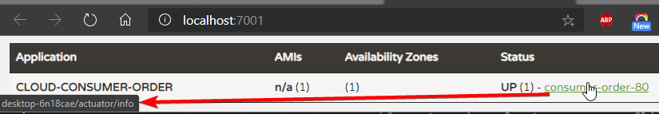

修改 YAML，将 `prefer-ip-address` 设为 true

```yaml
eureka:
  instance:
    prefer-ip-address: true
```

> 如果 Eureka Server 集群是同一 IP，不要将这项设为 true，会导致 Eureka Server 永远处于 unavailable-replicas，而且默认配置就是 false

#### Status 中链接名称修改

默认情况下如果不配置 `instance-id（唯一id）` Status 中的链接名称含有主机名（默认由 主机名 + spring.application.name + 端口 组成），如下图所示

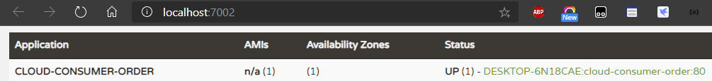

修改 YAML，设置 `instance-id`

```yaml
eureka:
  instance:
    instance-id: consumer-order-80
```

#### 微服务的 info 页面为 404 ErrorPage

修改 pom.xml 添加以下依赖

```xml
<dependency>
    <groupId>org.springframework.boot</groupId>
    <artifactId>spring-boot-starter-actuator</artifactId>
</dependency>
```

修改 YAML

```yaml
info:
  app.name: spring-cloud-study-v2
  company.name: www.lichangping.top
  build.artifactId: $project.artifactId$
  build.version: $project.version$
```

访问：http://192.168.1.10/actuator/info

#### 补充：查看微服务状态

访问：http://192.168.1.10/actuator/health

### 5、服务发现 Discovery

对于注册进 Eureka Server 里的微服务，可以通过服务发现来获得该服务的信息。

下面修改 cloud-provider-payment-8001

##### PaymentController

添加以下内容

```java
/**
 * 服务发现 获取服务信息
 */
@Resource
private DiscoveryClient discoveryClient;

@GetMapping(value = "/discovery")
public Object discovery() {
    List<String> services = discoveryClient.getServices();
    for (String service : services) {
        log.info("---- service:" + service);
    }

    // 一个微服务下的全部实例（集群状态多个微服务名称相同，算一个微服务，一个节点算一个实例）
    List<ServiceInstance> instances = discoveryClient.getInstances("CLOUD-PROVIDER-PAYMENT");
    for (ServiceInstance instance : instances) {
        log.info(instance.getServiceId() + "\t" + instance.getHost() + "\t" + instance.getPort() + "\t" + instance.getUri());
    }
    return discoveryClient;
}
```

##### 测试

访问：http://localhost:8001/payment/discovery

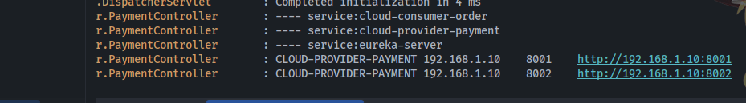

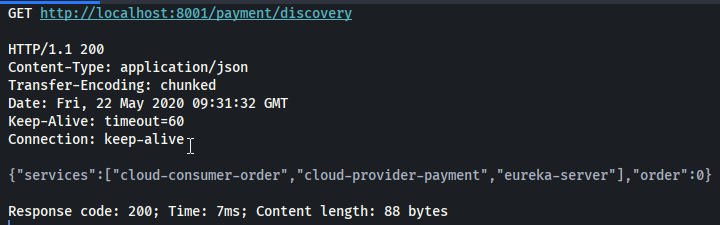

> 补充
>
> 主启动类不需要加 `@EnableDiscoveryClient` ，因为这里已经有 `@EnableEurekaClient` 了
>
> 参考：
>
> https://blog.csdn.net/zheng199172/article/details/82466139
>
> https://blog.csdn.net/Ezreal_King/article/details/72594535

### 6、Eureka 停更相关

https://github.com/Netflix/eureka/wiki

Eureka 结束开源，转为闭源

## 三、Zookeeper 服务注册与发现

### 1、Zookeeper 基础知识

官方文档上这么解释zookeeper，它是一个分布式服务框架，是Apache Hadoop 的一个子项目，它主要是用来解决分布式应用中经常遇到的一些数据管理问题，如：统一命名服务、状态同步服务、集群管理、分布式应用配置项的管理等。

参考：https://blog.csdn.net/java_66666/article/details/81015302

使用 Zookeeper 服务器取代 Eureka 服务器作为服务注册中心。

### 2、启动 Zookeeper

#### Docker

```shell
docker run --name cloud_zk_1 -p 2181:2181 --restart=always -d zookeeper:3.6.1
```

Linux

```shell
./zkServer.sh
```

Windows

双击 `zkServer.cmd`

### 3、cloud-provider-payment-zk-8004

新建服务提供者模块 cloud-provider-payment-zk-8004

#### pom.xml

```xml
<dependencies>
    <dependency>
        <groupId>com.lcp.springcloud</groupId>
        <artifactId>cloud-api-commons</artifactId>
        <version>${project.version}</version>
    </dependency>

    <dependency>
        <groupId>org.springframework.boot</groupId>
        <artifactId>spring-boot-starter-web</artifactId>
    </dependency>
    <dependency>
        <groupId>org.springframework.boot</groupId>
        <artifactId>spring-boot-starter-actuator</artifactId>
    </dependency>

    <!--SpringBoot整合Zookeeper客户端-->
    <dependency>
        <groupId>org.springframework.cloud</groupId>
        <artifactId>spring-cloud-starter-zookeeper-discovery</artifactId>
    </dependency>

    <dependency>
        <groupId>org.springframework.boot</groupId>
        <artifactId>spring-boot-devtools</artifactId>
        <scope>runtime</scope>
        <optional>true</optional>
    </dependency>
    <dependency>
        <groupId>org.projectlombok</groupId>
        <artifactId>lombok</artifactId>
        <optional>true</optional>
    </dependency>
    <dependency>
        <groupId>org.springframework.boot</groupId>
        <artifactId>spring-boot-starter-test</artifactId>
        <scope>test</scope>
    </dependency>
</dependencies>
```

#### application.yaml

```yaml
server:
  # 8004表示注册到zookeeper服务器的支付服务提供者端口号
  port: 8004
  
spring:
  application:
    # 服务别名---注册zookeeper到注册中心的名称
    name: cloud-provider-payment
  cloud:
    zookeeper:
      # 默认localhost:2181
      connect-string: localhost:2181
```

#### PaymentProviderZkApp8004 主启动类

注意注解 `@EnableDiscoveryClient` ，该注解用于向 consul 或者 zookeeper 注册服务

```java
@SpringBootApplication
@EnableDiscoveryClient
public class PaymentProviderZkApp8004 {
    public static void main(String[] args) {
        SpringApplication.run(PaymentProviderZkApp8004.class, args);
    }
}
```

#### PaymentController

```java
@RestController
@Slf4j
public class PaymentController {
    @Value("${server.port}")
    private String serverPort;

    @RequestMapping(value = "payment/zk")
    public String paymentZk() {
        return "SpringCloud with zookeeper:" + serverPort + "\t" + UUID.randomUUID().toString();
    }
}
```

#### 测试

启动 8004

##### 验证测试一

test-8004.http

```http
GET http://localhost:8004/payment/zk
```

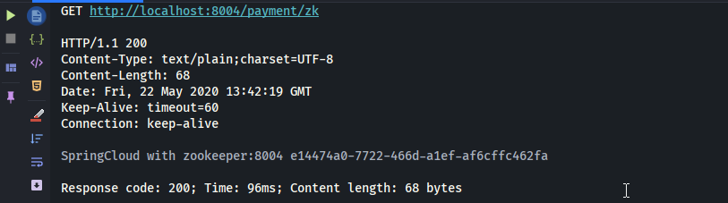

注册成功

##### 验证测试二

使用命令 `./zkCli.sh`，连接 Zookeeper

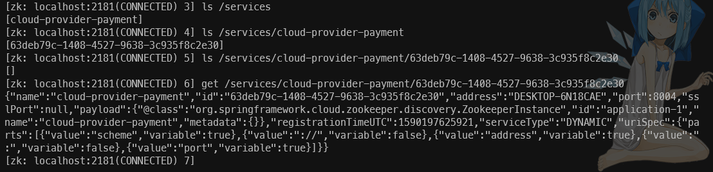

##### 可能遇到的问题

如果 maven 自动导入的 zookeeper jar 包版本高于启动的 zookeeper 版本，会导致 8004启动报错，自动导入的 jar 包版本如下

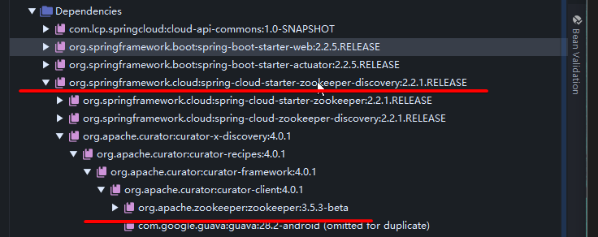

jar 包冲突排除 

```xml
<dependency>
    <groupId>org.springframework.cloud</groupId>
    <artifactId>spring-cloud-starter-zookeeper-discovery</artifactId>
    <exclusions>
        <!--先排除自带的zookeeper3.5.3-->
        <exclusion>
            <groupId>org.apache.zookeeper</groupId>
            <artifactId>zookeeper</artifactId>
        </exclusion>
    </exclusions>
</dependency>
<!--添加zookeeper3.4.9版本-->
<dependency>
    <groupId>org.apache.zookeeper</groupId>
    <artifactId>zookeeper</artifactId>
    <version>3.4.9</version>
</dependency>

```

### 4、cloud-consumer-order-zk-84

将服务消费者注册进 Zookeeper

#### pom.xml

```xml
<dependencies>
    <dependency>
        <groupId>com.lcp.springcloud</groupId>
        <artifactId>cloud-api-commons</artifactId>
        <version>${project.version}</version>
    </dependency>

    <dependency>
        <groupId>org.springframework.boot</groupId>
        <artifactId>spring-boot-starter-web</artifactId>
    </dependency>
    <dependency>
        <groupId>org.springframework.boot</groupId>
        <artifactId>spring-boot-starter-actuator</artifactId>
    </dependency>

    <!--SpringBoot整合Zookeeper客户端-->
    <dependency>
        <groupId>org.springframework.cloud</groupId>
        <artifactId>spring-cloud-starter-zookeeper-discovery</artifactId>
    </dependency>

    <dependency>
        <groupId>org.springframework.boot</groupId>
        <artifactId>spring-boot-devtools</artifactId>
        <scope>runtime</scope>
        <optional>true</optional>
    </dependency>
    <dependency>
        <groupId>org.projectlombok</groupId>
        <artifactId>lombok</artifactId>
        <optional>true</optional>
    </dependency>
    <dependency>
        <groupId>org.springframework.boot</groupId>
        <artifactId>spring-boot-starter-test</artifactId>
        <scope>test</scope>
    </dependency>
</dependencies>
```

#### application.yaml

```yaml
server:
  port: 84
spring:
  application:
    # 服务别名
    name: cloud-consumer-order
  cloud:
    zookeeper:
      # 注册到zookeeper地址
      connect-string: localhost:2181
```

#### ApplicationContextConfig

```java
@Configuration
public class ApplicationContextConfig {

    @Bean
    @LoadBalanced
    public RestTemplate getRestTemplate() {
        return new RestTemplate();
    }
}
```

#### OrderController

```java
@RestController
@Slf4j
@RequestMapping(value = "/consumer/payment")
public class OrderController {
    public static final String PAYMENT_URL = "http://cloud-provider-payment";

    @Resource
    private RestTemplate restTemplate;

    @GetMapping(value = "/zk")
    public String paymentInfo() {
        return restTemplate.getForObject(PAYMENT_URL + "/payment/zk", String.class);
    }
}
```

注意 PAYMENT_URL，此处为小写，因为 zookeeper 中是小写，这和 Eureka 不同

#### ConsumerOrderZkApp84

```java
@SpringBootApplication
@EnableDiscoveryClient
public class ConsumerOrderZkApp84 {
    public static void main(String[] args) {
        SpringApplication.run(ConsumerOrderZkApp84.class, args);
    }
}
```

#### 测试

启动 cloud-consumer-order-zk-84

Zookeeper 中查看


服务已注册

访问测试，test-84.http

```http
GET http://localhost:84/consumer/payment/zk
```

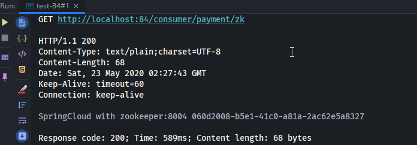

## 四、Consul 服务注册与发现

读音：[Consul](https://fanyi.baidu.com/translate#en/zh/Consul) 美 [ˈkɑːnsl] 

### 1、简介

官网：https://www.consul.io/

Consul 是一套开源的分布式服务发现和配置管理系统，由 HashiCrop 公司用 Go 语言开发。

提供了微服务系统中的服务治理，配置中心，控制总线等功能。这些功能中的每一个都可以根据需要单独使用，也可以一起使用构建全方位的服务网格，Consul 提供了一种完整的服务网格解决方案。

它具有很多优点，包括：基于 raft 协议，比较简洁，支持健康检查，同时支持 HTTP 和 DNS 协议，支持跨数据中心的 WAN 集群，提供图形界面，跨平台支持（Linux，Windows，Mac）

#### 1、拥有的功能

##### 1、服务发现

提供 HTTP 和 DNS 两种发现方式

##### 2、健康检查

支持多种方式，HTTP、TCP、Docker、shell 脚本定制化

##### 3、KV 存储

Key、Value 的存储方式

##### 4、多数据中心

Consul 支持多数据中心

##### 5、可视化界面

#### 2、下载地址

https://www.consul.io/downloads

#### 3、学习文档

https://cloud.spring.io/spring-cloud-static/spring-cloud-consul/2.2.2.RELEASE/reference/html/

### 2、启动 Consul

这里以 Docker 的方式启动

```shell
docker run -d --name cloud_consul_1 -p 8500:8500 consul:1.7.3
```

浏览器访问：http://localhost:8500/

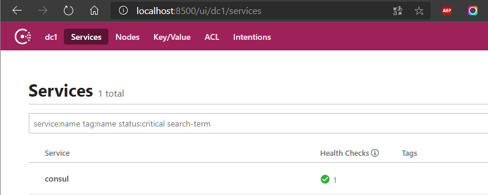

### 3、cloud-provider-payment-consul-8006

#### pom.xml

```xml
<dependencies>
    <!--SpringCloud consul-server-->
    <dependency>
        <groupId>org.springframework.cloud</groupId>
        <artifactId>spring-cloud-starter-consul-discovery</artifactId>
    </dependency>

    <dependency>
        <groupId>com.lcp.springcloud</groupId>
        <artifactId>cloud-api-commons</artifactId>
        <version>${project.version}</version>
    </dependency>
    <dependency>
        <groupId>org.springframework.boot</groupId>
        <artifactId>spring-boot-starter-web</artifactId>
    </dependency>
    <dependency>
        <groupId>org.springframework.boot</groupId>
        <artifactId>spring-boot-starter-actuator</artifactId>
    </dependency>
    <dependency>
        <groupId>org.springframework.boot</groupId>
        <artifactId>spring-boot-devtools</artifactId>
        <scope>runtime</scope>
        <optional>true</optional>
    </dependency>
    <dependency>
        <groupId>org.projectlombok</groupId>
        <artifactId>lombok</artifactId>
        <optional>true</optional>
    </dependency>
    <dependency>
        <groupId>org.springframework.boot</groupId>
        <artifactId>spring-boot-starter-test</artifactId>
        <scope>test</scope>
    </dependency>
</dependencies>
```

#### application.yaml

```yaml
server:
  # consul服务端口
  port: 8006
spring:
  application:
    name: cloud-provider-payment
  cloud:
    consul:
      # consul注册中心地址
      host: localhost
      port: 8500
      discovery:
        #因为consul部署在docker中，网络模式是默认的 bridge 模式
        #consul会访问 http://hostname:8006/actuator/health 来获取节点的实际状态
        #如果 hostname 为 127.0.0.1，consul 访问的就是内部地址了，结果只能是 404
        hostname: 192.168.1.10
        #hostname: 127.0.0.1
        service-name: ${spring.application.name}
```

#### PaymentProviderConsulApp8006

```java
@SpringBootApplication
@EnableDiscoveryClient
public class PaymentProviderConsulApp8006 {
    public static void main(String[] args) {
        SpringApplication.run(PaymentProviderConsulApp8006.class, args);
    }
}
```

#### PaymentController 

```java
@RestController
@Slf4j
@RequestMapping(value = "/payment")
public class PaymentController {

    @Value("${server.port}")
    private String serverPort;

    @RequestMapping(value = "/consul")
    public String paymentConsul() {
        return "Spring Cloud with consul：" + serverPort + "\t" + UUID.randomUUID().toString();
    }
}
```

#### 测试

访问 Consul 的 web 页面

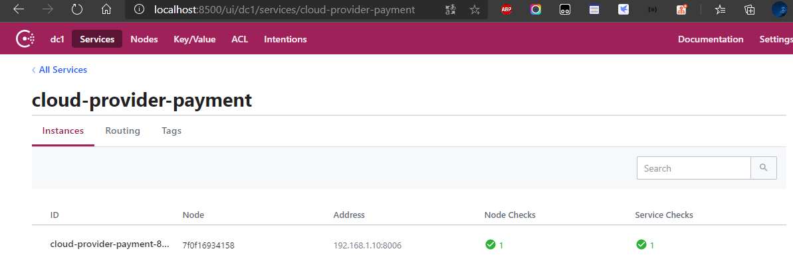

访问测试，test-8006.http

```http
GET http://localhost:8006/payment/consul
```

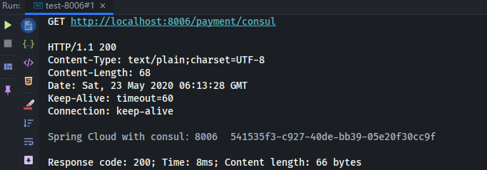

### 4、cloud-consumer-order-consul-86

#### pom.xml

```xml
<dependencies>
    <!--SpringCloud consul-server-->
    <dependency>
        <groupId>org.springframework.cloud</groupId>
        <artifactId>spring-cloud-starter-consul-discovery</artifactId>
    </dependency>

    <dependency>
        <groupId>com.lcp.springcloud</groupId>
        <artifactId>cloud-api-commons</artifactId>
        <version>${project.version}</version>
    </dependency>

    <dependency>
        <groupId>org.springframework.boot</groupId>
        <artifactId>spring-boot-starter-web</artifactId>
    </dependency>
    <dependency>
        <groupId>org.springframework.boot</groupId>
        <artifactId>spring-boot-starter-actuator</artifactId>
    </dependency>

    <dependency>
        <groupId>org.springframework.boot</groupId>
        <artifactId>spring-boot-devtools</artifactId>
        <scope>runtime</scope>
        <optional>true</optional>
    </dependency>
    <dependency>
        <groupId>org.projectlombok</groupId>
        <artifactId>lombok</artifactId>
        <optional>true</optional>
    </dependency>
    <dependency>
        <groupId>org.springframework.boot</groupId>
        <artifactId>spring-boot-starter-test</artifactId>
        <scope>test</scope>
    </dependency>
</dependencies>
```

#### application.yaml

```yaml
server:
  port: 86
spring:
  application:
    name: cloud-consumer-order
  cloud:
    consul:
      # host，port 默认值就是 localhost，8500
      host: localhost
      port: 8500
      discovery:
        hostname: 192.168.1.10
        service-name: ${spring.application.name}
```

#### ConsumerOrderConsulApp86

```java
@SpringBootApplication
public class ConsumerOrderConsulApp86 {
    public static void main(String[] args) {
        SpringApplication.run(ConsumerOrderConsulApp86.class, args);
    }
}
```

#### config 包

直接复制 80 模块的

#### OrderController

```java
@RestController
@Slf4j
@RequestMapping(value = "/consumer/payment")
public class OrderController {
    public static final String PAYMENT_URL = "http://cloud-provider-payment";

    @Resource
    private RestTemplate restTemplate;

    @GetMapping(value = "/consul")
    public String paymentInfo() {
        return restTemplate.getForObject(PAYMENT_URL + "/payment/consul", String.class);
    }
}
```

#### 测试

访问 Consul 的 web 页面

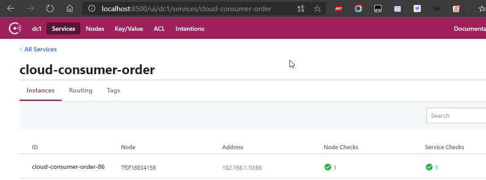

访问测试，test-86.http

```http
GET http://localhost:86/consumer/payment/consul
```

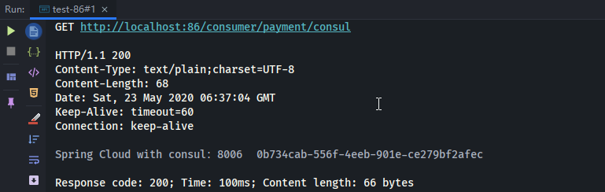

## 五、三个注册中心的异同点

| 组件名    | 语言 | CAP  | 服务健康检查 | 对外暴露接口 | Spring Cloud 集成 |
| --------- | ---- | ---- | ------------ | ------------ | ----------------- |
| Eureka    | Java | AP   | 可配支持     | HTTP         | 已集成            |
| Consul    | Go   | CP   | 支持         | HTTP/DNS     | 已集成            |
| Zookeeper | Java | CP   | 支持         | 客户端       | 已集成            |

CAP

- C：Consistency（强一致性）
- A：Availability（可用性）
- P：Partition Tolerance（分区容错性）

最多只能同时满足两个

在分布式系统中，P 必须要保证，所以只有 CP，AP。

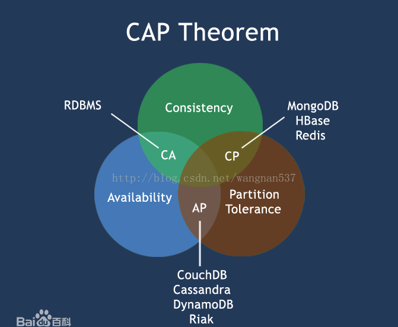

### Eureka（AP）

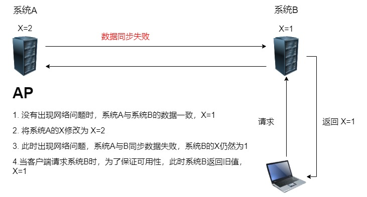

### Zookeeper/Consul（CP）

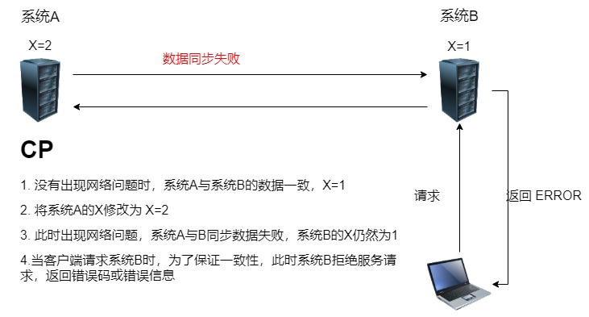

## 六、Ribbon 负载均衡调用

### 1、概述

#### 1、是什么

读音：[ribbon](https://fanyi.baidu.com/#en/zh/ribbon) 美 [ˈrɪbən] 

Spring Cloud Ribbon 是基于 Netflix Ribbon 实现的一套 **客户端负载均衡** 的工具。

简单的说，Ribbon 是 Netflix 发布的开源项目，主要功能是提供客户端的软件负载均衡算法，将 Netflix 的中间层服务连接在一起。Ribbon 客户端组件提供一系列完善的配置项如连接超时，重试等。简单的说，就是在配置文件中列出 Load Balancer（简称LB）后面所有的机器，Ribbon 会自动的帮助你基于某种规则（如简单轮询，随机连接等）去连接这些机器。我们也很容易使用 Ribbon 实现自定义的负载均衡算法。

#### 2、作用 LB（负载均衡）

LB，即负载均衡（Load Balance），在微服务或分布式集群中经常用的一种应用。

负载均衡简单的说就是将用户的请求平摊的分配到多个服务上，从而达到系统的 HA（High Available）。常见的负载均衡有软件Nginx，LVS，硬件 F5等。相应的在中间件，例如：dubbo 和 SpringCloud 中均给我们提供了负载均衡，SpringCloud 的负载均衡算法可以自定义。 

##### 集中式 LB

即在服务的消费方和提供方之间使用独立的 LB 设施（可以是硬件，如 F5, 也可以是软件，如 nginx）, 由该设施负责把访问请求通过某种策略转发至服务的提供方。

##### 进程内 LB

将 LB 逻辑集成到消费方，消费方从服务注册中心获知有哪些地址可用，然后自己再从这些地址中选择出一个合适的服务器。

Ribbon 就属于进程内 LB，它只是一个类库，集成于消费方进程，消费方通过它来获取到服务提供方的地址。

##### Ribbon 本地负载均衡与服务端负载均衡的区别

Nginx 是服务端负载均衡，客户端的所有请求都会交给 nginx，然后由 nginx 实现转发请求，负载均衡由服务端实现。

Ribbon 本地负载均衡，在调用微服务接口时，会在注册中心上获取注册信息服务列表后缓存到本地从而在本地实现RPC远程服务调用。

`负载均衡 + RestTemplate`

#### 3、官网

https://github.com/Netflix/ribbon/wiki/Getting-Started

> 目前 Ribbon 也进入了维护模式，未来的替换组件是 `Spring Cloud LoadBalancer`

### 2、Ribbon 负载均衡说明

#### 架构说明

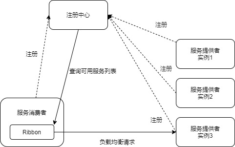

Ribbon 在工作时分成两步

1. 第一步先选择 Eureka Server，优先选择同一区域内负载较少的 Server。
2. 第二步再根据用户指定的策略，在从 Server 中获取到的服务注册列表中选择一个地址。

Ribbon 其实就是一个软负载均衡的客户端组件，它可以和其它注册中心结合使用，和 Eureka 结合只是其中一个实例。

#### pom.xml

之前的 80 模块没有引入 `spring-cloud-starter-ribbon` 也可以使用 ribbon，是因为 `spring-cloud-starter-netflix-eureka-client` 自带 `spring-cloud-starter-ribbon` 的引用

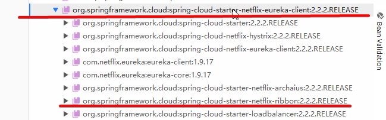

### 3、RestTemplate

官方文档：https://docs.spring.io/spring/docs/5.3.0-SNAPSHOT/javadoc-api/org/springframework/web/client/RestTemplate.html

#### getForObject 与 getForEntity

getForObject：返回对象为响应体中的数据转化成的对象，基本上可以理解为 JSON。

getForEntity：返回对象为 ResponseEntity，包含了响应中的一些重要信息，比如响应头，响应状态码，响应体。

可以理解为 getForObject 只获取响应体，getForEntity 获取整个响应。

postForObject 与 postForEntity 同上。

### 4、Ribbon 负载均衡核心组件 IRule

#### IRule

根据特定算法从服务列表选取一个要访问的服务

##### 1、RoundRobinRule

轮询

##### 2、RandomRule

随机

##### 3、AvailabilityFilteringRule

先过滤掉由于多次访问故障而处于熔断器熔断状态的服务以及并发的连接数量超过阈值的服务，然后对剩余的服务列表按照轮询策略进行访问

##### 4、WeightedResponseTimeRule

根据平均响应时间计算所有服务的权重，响应时间越短的服务权重越大，被选中的概率越高。

刚启动时如果统计信息不足，则使用 RoundRobinRule 策略，等到统计信息足够，会切换到 WeightedResponseTimeRule。

##### 5、RetryRule

先按照 RoundRobinRule 的策略获取服务，如果获取服务失败则会在指定的时间内重试，以获取可用的服务。

##### 6、BestAvailabeRule

会先过滤掉由于多次访问故障而处于熔断器熔断状态的服务，然后选择一个并发量最小的服务

##### 7、ZoneAvoidanceRule

默认规则，复合判断 Server 所在区域的性能和 Server 的可用性来选择服务器。

#### 快速全局切换 Ribbon 内置的负载均衡算法

修改 80 模块的 `ApplicationContextConfig`，添加 myRule 方法

```java
@Bean
public IRule myRule() {
    // 切换为随机
    return new RandomRule();
}
```

> 注意，由于 `ApplicationContextConfig` 在主启动类的扫描范围内，所以该切换对模块下所有的 Ribbon 客户端都有效，是全局配置。不需要 @RibbonClient 或者 @RibbonClients。

### 5、RibbonClient

80 模块中，调用了服务 `CLOUD-PROVIDER-PAYMENT`，这就是一个 RibbonClient，假设 80 模块还调用了另一个服务 `CLOUD-PROVIDER-TEST`，这就是另一个 RibbonClient，通过注解 `@RibbonClient` 与 `@RibbonClients` 我们可以为每一个 RibbonClient 指定不同的负载均衡算法或者所有 RibbonClient 统一指定负载均衡算法。

### 6、@RibbonClient/@RibbonClients 自定义RibbonClient

Ribbon 有不止 IRule 一个组件，以下均以配置 IRule 为例。

#### 自定义 RibbonClient

官方推荐的写法是

创建一个配置类（添加 @Configuration），但这个配置类 `不应该在启动类所在包或者其子包下`，再创建一个空类（添加 @Configuration 和 @RibbonClient/@RibbonClients），这个类 `在启动类所在包或者其子包下`，例如如下写法

配置类：MySelfRule1.java

```java
package com.lcp.myrule;

import com.netflix.loadbalancer.IRule;
import com.netflix.loadbalancer.RandomRule;
import org.springframework.context.annotation.Bean;
import org.springframework.context.annotation.Configuration;

@Configuration
public class MySelfRule1 {
    @Bean
    public IRule myRule() {
        // 定义为随机
        return new RandomRule();
    }
}
```

空类：ConfigRibbonClient.java

```java
package com.lcp.springcloud.config;

import com.lcp.myrule.MySelfRule1;
import org.springframework.cloud.netflix.ribbon.RibbonClients;
import org.springframework.context.annotation.Configuration;

@Configuration
@RibbonClient(name = "CLOUD-PROVIDER-PAYMENT", configuration = MySelfRule1.class)
public class ConfigRibbonClient {
}
```

PS：启动类在 springcloud 包下

测试

访问：http://localhost/consumer/payment/getForEntity/2，观察返回数据中的端口是否是随机出现。

官方说明如下所示

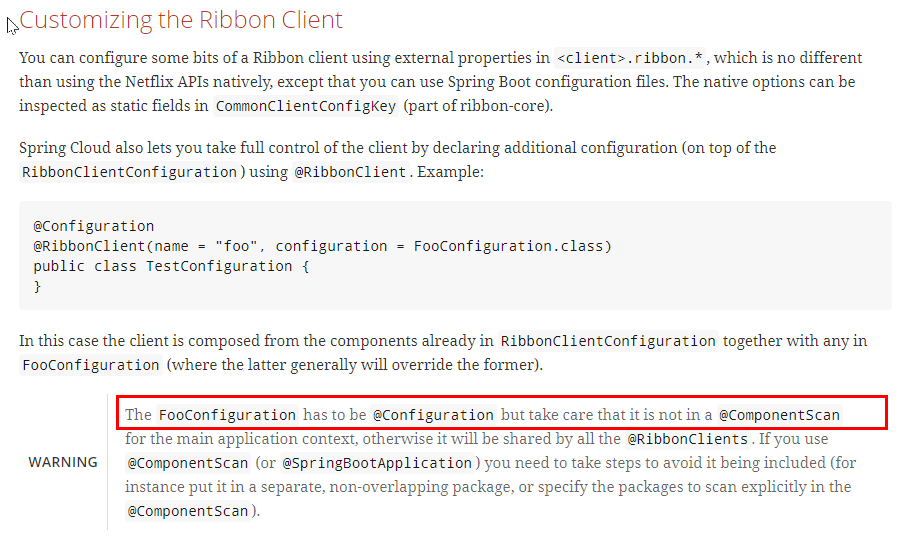

#### @RibbonClient

为一个 RibbonClient 指定配置

部分源码如下所示

```java
public @interface RibbonClient {
    String value() default "";
    String name() default "";
    Class<?>[] configuration() default {};
}
```

name 和 value 的作用是一样的，写一个即可，用来指定 RibbonClient 的名字，configuration 指定自定义配置类。

例

```java
@Configuration
@RibbonClient(name = "CLOUD-PROVIDER-PAYMENT", configuration = MySelfRule1.class)
@RibbonClient(name = "CLOUD-PROVIDER-test", configuration = MySelfRule2.class)
public class ConfigRibbonClient {
}
```

#### @RibbonClients

为一个或多个 RibbonClient 或所有 RibbonClient 指定配置

部分源码如下所示

```java
/**
 * Convenience annotation that allows user to combine multiple <code>@RibbonClient</code>
 * annotations on a single class (including in Java 7).
 */
public @interface RibbonClients {
    RibbonClient[] value() default {};
    Class<?>[] defaultConfiguration() default {};
}
```

value 不填默认为所有 RibbonClient 指定配置

例

```java
// 全局配置
@Configuration
@RibbonClients(defaultConfiguration = MySelfRule.class)
public class ConfigRibbonClient {
}

// 为多个 RibbonClient 单独指定配置，并指定默认的配置
@Configuration
@RibbonClients(value = {@RibbonClient(name = "CLOUD-PROVIDER-PAYMENT",configuration = MySelfRule1.class),
        @RibbonClient(name = "CLOUD-PROVIDER-Test",configuration = MySelfRule2.class)},
        defaultConfiguration = MySelfRule3.class)
public class ConfigRibbonClient {
}
```

### 7、配置 Ribbon 的两种方式：Java代码方式 & YAML 配置方式

参考：

1. https://blog.csdn.net/lzxlfly/article/details/87895630
2. https://blog.csdn.net/m0_37592952/article/details/89975057

### 8、手写负载均衡算法并应用

见 `SpringCloud学习笔记_V1`

## 七、OpenFeign 服务接口调用

官方文档：https://cloud.spring.io/spring-cloud-static/spring-cloud-openfeign/3.0.0.M1/reference/html

GitHub：https://github.com/spring-cloud/spring-cloud-openfeign

### 1、概述

#### 是什么

[Feign](https://github.com/OpenFeign/feign)是声明性Web服务客户端。它使编写Web服务客户端更加容易。要使用Feign，请创建一个接口并对其进行注释。它具有可插入的注释支持，包括Feign注释和JAX-RS注释。Feign还支持可插拔编码器和解码器。Spring Cloud添加了对Spring MVC注释的支持，并支持使用`HttpMessageConverters`Spring Web中默认使用的注释。Spring Cloud集成了Eureka和Spring Cloud LoadBalancer，以在使用Feign时提供负载平衡的http客户端。

#### Feign 能干什么

Feign 旨在使 Java Http 客户端变得更容易。

前面使用 Ribbon + RestTemplate 对 http 请求的封装处理，形成了一套模版化的调用方法。但是在实际开发中，由于对服务依赖的调用可能不止一处，往往一个接口会被多处调用，所以通常都会针对每个微服务自行封装一些客户端类来包装这些依赖服务的调用。

Feign 在此基础上做了进一步的封装，由它来帮助我们定义和实现依赖服务接口的定义。在 Feign 的实现下，我们只需创建一个接口并使用注解的方就来配置它（以前是 Dao 接口上面标注 Mapper 注解，现在是一个微服务接口上面标注一个 Feign 注解），即可完成对服务提供方的接口绑定，简化了使用 Spring Cloud Ribbon 时，手动封装服务调用客户端的开发量。

Feign 集成了 Ribbon，利用 Ribbon 维护了服务列表信息，并目通过内置算法实现了客户端的负载均衡。而与 Ribbon 不同的是，通过 Feign 只需要定义服务绑定接口且以声明式的方法，优雅而简单的实现了服务调用。

#### OpenFeign 与 Feign 的区别

OpenFeign是 Spring Cloud 在 Feign 的基础上支持了 Spring MVC 的注解，如 @RequesMapping 等等。

OpenFeign的 @FeignClient 可以解析 SpringMVC 的 @RequestMapping 注解下的接口，并通过动态代理的方式产生实现类，实现类中做负载均衡并调用其他服务。

> Feign 在消费端使用 !!!

### 2、OpenFeign 使用步骤

#### 接口 + 注解

微服务调用接口 + @FeignClient

#### cloud-consumer-order-feign-88

##### pom.xml

```xml
<dependencies>
    <!--openfeign-->
    <dependency>
        <groupId>org.springframework.cloud</groupId>
        <artifactId>spring-cloud-starter-openfeign</artifactId>
    </dependency>
    <!--eureka client-->
    <dependency>
        <groupId>org.springframework.cloud</groupId>
        <artifactId>spring-cloud-starter-netflix-eureka-client</artifactId>
    </dependency>
    <dependency>
        <groupId>com.lcp.springcloud</groupId>
        <artifactId>cloud-api-commons</artifactId>
        <version>${project.version}</version>
    </dependency>
    <dependency>
        <groupId>org.springframework.boot</groupId>
        <artifactId>spring-boot-starter-web</artifactId>
    </dependency>
    <!--监控-->
    <dependency>
        <groupId>org.springframework.boot</groupId>
        <artifactId>spring-boot-starter-actuator</artifactId>
    </dependency>
    <!--热部署-->
    <dependency>
        <groupId>org.springframework.boot</groupId>
        <artifactId>spring-boot-devtools</artifactId>
        <scope>runtime</scope>
        <optional>true</optional>
    </dependency>
    <dependency>
        <groupId>org.projectlombok</groupId>
        <artifactId>lombok</artifactId>
        <optional>true</optional>
    </dependency>
    <dependency>
        <groupId>org.springframework.boot</groupId>
        <artifactId>spring-boot-starter-test</artifactId>
        <scope>test</scope>
    </dependency>
</dependencies>
```

##### application.yaml

```yaml
server:
  port: 88

spring:
  application:
    name: cloud-consumer-order

eureka:
  client:
    service-url:
      #defaultZone: http://eureka7001.com:7001/eureka
      defaultZone: http://eureka7001.com:7001/eureka,http://eureka7002.com:7002/eureka
  instance:
    # 自定义服务名称信息
    instance-id: consumer-order-88

    # 心跳时间，即服务续约间隔时间（缺省为30s）
    lease-renewal-interval-in-seconds: 1
    # 发呆时间，即服务续约到期时间（缺省为90s）
    lease-expiration-duration-in-seconds: 2
    prefer-ip-address: true

info:
  app.name: spring-cloud-study-v2
  company.name: www.lichangping.top
  build.artifactId: $project.artifactId$
  build.version: $project.version$

```

##### ConsumerOrderFeignApp88

```java
@SpringBootApplication
@EnableFeignClients
public class ConsumerOrderFeignApp88 {
    public static void main(String[] args) {
        SpringApplication.run(ConsumerOrderFeignApp88.class, args);
    }
}
```

##### 业务类

业务逻辑接口 + @FeignClient 配置调用 provider 服务

新建 PaymentFeignService 接口并新增注解 @FeignClient

```java
@Service
@FeignClient(value = "CLOUD-PROVIDER-PAYMENT")
public interface PaymentFeignService {
    /**
     * 调用服务内的地址
     * 注意 @PathVariable("id") 中的 id
     */
    @GetMapping(value = "/payment/get/{id}")
    CommonResult<Payment> getPaymentById(@PathVariable("id") Long id);
}
```

##### OrderFeignController

```java
@RestController
@Slf4j
@RequestMapping(value = "/consumer/payment")
public class OrderFeignController {
    @Resource
    private PaymentFeignService paymentFeignService;

    @GetMapping(value = "/get/{id}")
    CommonResult<Payment> getPaymentById(@PathVariable("id") Long id){
        CommonResult<Payment> paymentById = paymentFeignService.getPaymentById(id);
        log.info(paymentById.toString());
        return paymentById;
    }
}
```

#### 测试

启动 7001、7002、8001、8002，88

```http
GET http://localhost:86/consumer/payment/consul
```

由于 Feign 自带了负载均衡配置项，所以反复访问 8001、8002 是交替出现

### 3、Feign 超时控制

#### 案例演示

8001 模块 OrderFeignController 增加以下方法，故意增加执行时间

```java
    @GetMapping(value = "/feign/timeout")
    public String paymentFeignTimeout() {
        // 暂停几秒钟
        try { TimeUnit.SECONDS.sleep(3); } catch (InterruptedException e) { e.printStackTrace(); }
        return serverPort;
    }
```

88 模块 PaymentFeignService 增加以下方法

```java
@GetMapping(value = "/payment/feign/timeout")
String paymentFeignTimeout();
```

88 模块 OrderFeignController 增加以下方法

```java
@GetMapping(value = "/payment/feign/timeout")
public String paymentFeignTimeout() {
    // openfeign-ribbon，客户端一般默认等待1秒钟
    return paymentFeignService.paymentFeignTimeout();
}
```

启动 7001，7002，8001，88

访问：http://localhost:8001/payment/feign/timeout，3秒后出现数据

访问：http://localhost:88/consumer/payment/feign/timeout，页面返回 connect timed out 超时错误

#### 配置

Feign 客户端默认只等待一秒钟，但是服务端处理需要超过一秒钟，导致 Feign 客户端不想等待了，直接返回报错。为了避免这样的情况，需要设置 Feign 客户端的超时控制。

yaml 中配置

```yaml
# 设置feign客户端超时时间(OpenFeign默认支持ribbon)
ribbon:
  # 指的是建立连接所用的时间,适用于网络状态正常的情况下,两端连接所用的时间
  ReadTimeout: 5000
  # 指的是建立连接后从服务器读取到可用资源所用的时间
  ConnectTimeout: 5000
```

### 4、Feign 日志打印功能

Feign 提供了日志打印功能，我们可以通过配置来调整日志级别，从而了解 Feign 中 Http 请求的细节。说白了就是对 Feign 接口的调用情况进行监控和输出。

#### 日志级别

NONE：默认的，不显示任何日志

BASIC：仅记录请求方法、URL、响应状态码及执行时间

HEADERS：除了 BASIC 中定义的信息之外，还有请求和响应的头信息

FULL：除了 HEADERS 中定义的信息之外，还有请求和响应的正文及元数据。

#### 配置日志

##### 编写配置 Bean

FeignConfig.java

```java
@Configuration
public class FeignConfig {

    /**
     * feignClient配置日志级别
     */
    @Bean
    public Logger.Level feignLoggerLevel() {
        // 请求和响应的头信息,请求和响应的正文及元数据
        return Logger.Level.FULL;
    }
}
```

##### YAML 中指定需要开启日志的 Feign 客户端

```yaml
logging:
  level:
    # feign日志以什么级别监控哪个接口
    com.lcp.springcloud.service.PaymentFeignService: debug
```

##### 后台查看日志

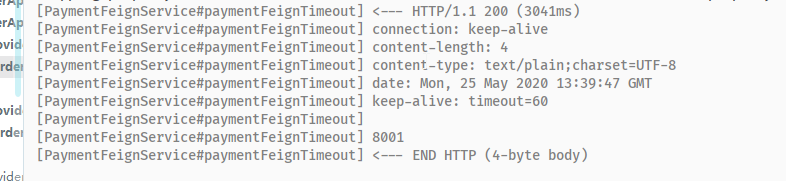

## 八、Hystrix 熔断器

### 1、概述

#### 1、分布式系统面临的问题


服务雪崩
多个微服务之间调用的时候，假设微服务A调用微服务B和微服务C，微服务B和微服务C又调用其它的微服务，这就是所谓的“扇出”。如果扇出的链路上某个微服务的调用响应时间过长或者不可用，对微服务A的调用就会占用越来越多的系统资源，进而引起系统崩溃，所谓的“雪崩效应”.

对于高流量的应用来说，单一的后端依赖可能会导致所有服务器上的所有资源都在几秒钟内饱和。比失败更糟糕的是，这些应用程序还可能导致服务之间的延迟增加，备份队列，线程和其他系统资源紧张，导致整个系统发生更多的级联故障。这些都表示需要对故障和延迟进行隔离和管理，以便单个依赖关系的失败，不能取消整个应用程序或系统。

**一般情况对于服务依赖的保护主要有3种解决方案：**

1. 熔断模式：这种模式主要是参考电路熔断，如果一条线路电压过高，保险丝会熔断，防止火灾。放到我们的系统中，如果某个目标服务调用慢或者有大量超时，此时，熔断该服务的调用，对于后续调用请求，不在继续调用目标服务，直接返回，快速释放资源。如果目标服务情况好转则恢复调用。

2. 隔离模式：这种模式就像对系统请求按类型划分成一个个小岛的一样，当某个小岛被火少光了，不会影响到其他的小岛。例如可以对不同类型的请求使用线程池来资源隔离，每种类型的请求互不影响，如果一种类型的请求线程资源耗尽，则对后续的该类型请求直接返回，不再调用后续资源。这种模式使用场景非常多，例如将一个服务拆开，对于重要的服务使用单独服务器来部署，再或者公司最近推广的多中心。

3. 限流模式：上述的熔断模式和隔离模式都属于出错后的容错处理机制，而限流模式则可以称为预防模式。限流模式主要是提前对各个类型的请求设置最高的QPS阈值，若高于设置的阈值则对该请求直接返回，不再调用后续资源。这种模式不能解决服务依赖的问题，只能解决系统整体资源分配问题，因为没有被限流的请求依然有可能造成雪崩效应。

#### 2、是什么

读音：[hystrix](https://fanyi.baidu.com/#en/zh/hystrix)

Hystrix是一个用于处理分布式系统的延迟和容错的开源库，在分布式系统里，许多依赖不可避免的会调用失败，比如超时、异常等，Hystrix能够保证在一个依赖出问题的情况下，不会导致整体服务失败，避免级联故障，以提高分布式系统的弹性。

“断路器”本身是一种开关装置，当某个服务单元发生故障之后，通过断路器的故障监控（类似熔断保险丝），向调用方返回一个符合预期的、可处理的备选响应（FallBack），而不是长时间的等待或者抛出调用方无法处理的异常，这样就保证了服务调用方的线程不会被长时间、不必要地占用，从而避免了故障在分布式系统中的蔓延，乃至雪崩。

#### 3、能干什么

1. 服务降级

   服务降级，其实就是线程池中单个线程障处理，防止单个线程请求时间太长，导致资源长期被占有而得不到释放，从而导致线程池被快速占用完，导致服务崩溃。

   Hystrix 能解决如下问题：

   1. 请求超时降级，线程资源不足降级，降级之后可以返回自定义数据
   2. 线程池隔离降级，分布式服务可以针对不同的服务使用不同的线程池，从而互不影响
   3. 自动触发降级与恢复
   4. 实现请求缓存和请求合并

2. 服务熔断

   熔断模式，这种模式主要是参考电路熔断，如果一条线路电压过高，保险丝会熔断，防止火灾。放到我们的系统中，如果某个目标服务调用慢或者有大量超时，此时，熔断该服务的调用，对于后续调用请求，不在继续调用目标服务，直接返回，快速释放资源。如果目标服务情况好转则恢复调用。

3. 服务限流

   限流模式主要是提前对各个类型的请求设置最高的 QPS 阈值，若高于设置的阈值则对该请求直接返回，不再调用后续资源。这种模式不能解决服务依赖的问题，只能解决系统整体资源分配问题，因为没有被限流的请求依然有可能造成雪崩效应。

4. 接近实时的监控

   ........

参考：

1. https://www.cnblogs.com/cjsblog/p/9391819.html
2. https://my.oschina.net/7001/blog/1619842

#### 4、官网资料

https://github.com/Netflix/Hystrix/wiki/How-To-Use

#### 5、Hystrix 官宣，停更进维

被动修复 BUG，不再接受合并请求，不再发布新版本


### 2、Hystrix 重要概念

#### 服务降级

服务器忙，请稍后再试，不让客户端一直等待，并立即返回一个友好提示（fallback）。

哪些情况会发出降级

- 程序运行异常
- 超时
- 服务熔断触发服务降级
- 线程池/信号量也会导致服务降级

#### 服务熔断

达到最大服务访问后，直接拒绝访问，调用服务降级方法，返回友好提示（好比保险丝）

服务的降级 --> 进而熔断 --> 恢复调用链路

#### 服务限流

秒杀等高并发场景，防止一窝蜂涌入，限制单位时间进入的请求

### 3、Hystrix 案例

#### 构建

新建 cloud-provider-payment-hystrix-8008

##### pom.xml

```xml
<dependencies>
    <!--hystrix-->
    <dependency>
        <groupId>org.springframework.cloud</groupId>
        <artifactId>spring-cloud-starter-netflix-hystrix</artifactId>
    </dependency>
    <!--eureka client-->
    <dependency>
        <groupId>org.springframework.cloud</groupId>
        <artifactId>spring-cloud-starter-netflix-eureka-server</artifactId>
    </dependency>
    <dependency>
        <groupId>com.lcp.springcloud</groupId>
        <artifactId>cloud-api-commons</artifactId>
        <version>${project.version}</version>
    </dependency>
    <dependency>
        <groupId>org.springframework.boot</groupId>
        <artifactId>spring-boot-starter-web</artifactId>
    </dependency>
    <!--监控-->
    <dependency>
        <groupId>org.springframework.boot</groupId>
        <artifactId>spring-boot-starter-actuator</artifactId>
    </dependency>
    <!--热部署-->
    <dependency>
        <groupId>org.springframework.boot</groupId>
        <artifactId>spring-boot-devtools</artifactId>
        <scope>runtime</scope>
        <optional>true</optional>
    </dependency>
    <dependency>
        <groupId>org.projectlombok</groupId>
        <artifactId>lombok</artifactId>
        <optional>true</optional>
    </dependency>
    <dependency>
        <groupId>org.springframework.boot</groupId>
        <artifactId>spring-boot-starter-test</artifactId>
        <scope>test</scope>
    </dependency>
</dependencies>
```

##### applicatin.yaml

```yaml
server:
  port: 8008
spring:
  application:
    name: cloud-provider-payment-hystrix
eureka:
  client:
    service-url:
      defaultZone: http://eureka7001.com:7001/eureka,http://eureka7002.com:7002/eureka
  instance:
    instance-id: provider-payment-8008
    lease-renewal-interval-in-seconds: 1
    lease-expiration-duration-in-seconds: 2
    prefer-ip-address: true
```

##### PaymentProviderHystrixApp8008 主启动类

```java
@SpringBootApplication
@EnableEurekaClient
public class PaymentProviderHystrixApp8008 {
    public static void main(String[] args) {
        SpringApplication.run(PaymentProviderHystrixApp8008.class, args);
    }
}
```

##### PaymentService

```java
@Service
public class PaymentService {
    /**
     * 正常访问
     */
    public String paymentInfoOk(Integer id) {
        return "线程池:" + Thread.currentThread().getName() + " paymentInfo_OK,id:" + id + "\t" + "O(∩_∩)O哈哈~";
    }

    /**
     * 超时访问
     */
    public String paymentInfoTimeOut(Integer id) {
        int timeNumber = 3;
        try {
            // 暂停3秒钟
            TimeUnit.SECONDS.sleep(timeNumber);
        } catch (InterruptedException e) {
            e.printStackTrace();
        }
        return "线程池:" + Thread.currentThread().getName() + " paymentInfo_TimeOut,id:" + id + "\t" +
                "O(∩_∩)O哈哈~  耗时(秒)" + timeNumber;
    }
}
```

##### PaymentController

```java
@RestController
@Slf4j
public class PaymentController {
    @Resource
    private PaymentService paymentService;

    @Value("${server.port}")
    private String servicePort;

    /**
     * 正常访问
     */
    @GetMapping("/payment/hystrix/ok/{id}")
    public String paymentInfoOk(@PathVariable("id") Integer id) {
        String result = paymentService.paymentInfoOk(id);
        log.info("*****result:" + result);
        return result;
    }

    /**
     * 超时访问
     */
    @GetMapping("/payment/hystrix/timeout/{id}")
    public String paymentInfoTimeOut(@PathVariable("id") Integer id) {
        String result = paymentService.paymentInfoTimeOut(id);
        log.info("*****result:" + result);
        return result;

    }
}
```

##### 测试

启动 7001，7002，8008

test-8008.http

```http
GET http://localhost:8008/payment/hystrix/ok/1

###

GET http://localhost:8008/payment/hystrix/timeout/1
```

访问均为成功

以此为基础，从正确 --> 错误 --> 降级熔断 --> 恢复

#### 高并发测试

##### Jmeter 压测测试

开启 Jmeter，来 20000 个并发压死 8008，20000 个请求都去访问 paymentInfoTimeOut

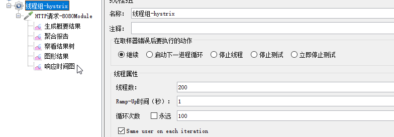

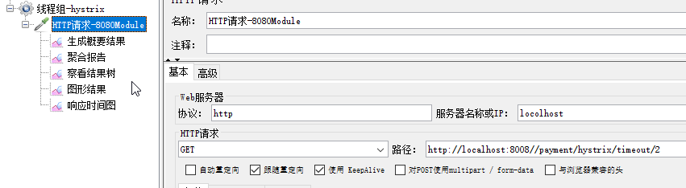

此时再去访问：http://localhost:8008//payment/hystrix/ok/2，会发现，原本不需要等待的接口，现在也需要等待了

##### Jmeter 压测结论

上面只是服务提供者 8008 自己测试，如果此时外部的消费者也来访问，那消费者只能干等，最终导致消费端响应也变慢，服务端 8008 被拖死。

##### cloud-consumer-order-feign-88 加入

添加 PaymentHystrixService，OrderHystrixController

PaymentHystrixService

```java
@Service
@FeignClient(value = "CLOUD-PROVIDER-PAYMENT-HYSTRIX")
public interface PaymentHystrixService {

    @GetMapping("/payment/hystrix/ok/{id}")
    String paymentInfoOk(@PathVariable("id") Integer id);

    @GetMapping("/payment/hystrix/timeout/{id}")
    String paymentInfoTimeOut(@PathVariable("id") Integer id);
}
```

OrderHystrixController

```java
@RestController
@Slf4j
public class OrderHystrixController {
    @Resource
    private PaymentHystrixService paymentHystrixService;

    @GetMapping("/consumer/payment/hystrix/ok/{id}")
    public String paymentInfoOk(@PathVariable("id") Integer id) {
        return paymentHystrixService.paymentInfoOk(id);
    }

    @GetMapping("/consumer/payment/hystrix/timeout/{id}")
    public String paymentInfoTimeOut(@PathVariable("id") Integer id) {
        return paymentHystrixService.paymentInfoTimeOut(id);
    }
}
```

正常测试

启动 88 模块

访问：http://localhost:88/consumer/payment/hystrix/ok/1，几乎没有延迟

高并发测试

开 2W 线程压测 8008

再访问：http://localhost:88/consumer/payment/hystrix/ok/1，开始出现 2~3 秒的延迟（由于上面将 feign 的超时延长到了5秒，这里并没有报超时，当线程开到 3W 直接报超时）

#### 故障现象和导致的原因

8008 同一层次的其它接口被困死，因为 tomcat 线程池里面的工作线程已经被挤占完毕

88 此时调用 8008，客户端访问响应缓慢，转圈甚至超时

#### 上述结论

正因为有上述故障或不佳表现，所以需要降级、容错、限流

#### 如何解决？解决的要求

超时导致服务变慢（转圈）

- 超时不再等待

出错（宕机或程序运行出错）

- 出错要有兜底

解决

- 对方服务（8008）超时了，调用者（88）不能一直卡死等待，必须要有服务降级
- 对方服务（8008）宕机了，调用者（88）不能一直卡死等待，必须要有服务降级
- 对方服务（8008）OK，调用者（88）自己出故障或有自我要求（自己的等待时间小于服务提供者），自己处理降级

#### 服务降级

> 一般放在客户端（此客户端非彼客户端）

##### 降级配置

@HystrixCommand

##### 8008 先从自身找问题

设置自身调用超时时间的峰值，峰值内可以正常运行，超过了需要有兜底的方法处理，作为服务降级的 fallback

##### 8008 fallback

修改 PaymentService

```java
// 接受的超时时间为3秒
@HystrixCommand(fallbackMethod = "paymentInfoTimeOutHandler", commandProperties = {
            @HystrixProperty(name = "execution.isolation.thread.timeoutInMilliseconds", value = "3000")
    })
public String paymentInfoTimeOut(Integer id) {
    // 计算异常
    int age = 10 / 0;
    // 由3秒改为5秒
    int timeNumber = 5;
    try {
        TimeUnit.SECONDS.sleep(timeNumber);
    } catch (InterruptedException e) {
        e.printStackTrace();
    }
    return "线程池:" + Thread.currentThread().getName() + " paymentInfo_TimeOut,id:" + id + "\t" +
        "O(∩_∩)O哈哈~  耗时(秒)" + timeNumber;
}

public String paymentInfoTimeOutHandler(Integer id) {
    return "线程池:" + Thread.currentThread().getName() + " paymentInfoTimeOutHandler,id:" + id + "\t" +
        "u╥﹏╥...";
}
```

上面故意制造了2个异常

1. int age = 10 / 0;	// 计算异常
2. 设置超时为3秒，实际需要运行5秒，超时异常

> @HystrixCommand 报异常后处理流程
>
> 一旦调用服务方法失败并抛出错误信息后，会自动调用 @HystrixCommand 标注好的 fallbackMethod 指定的方法

主启动类激活

@EnableCircuitBreaker

##### 88 fallback

88 订单微服务，也可以更好的保护自己，自己也依样画葫芦进行客户端降级保护。

题外话，切记：对 @HystrixCommand 内属性的修改建议重启微服务。

pom.xml

```xml
<!--hystrix-->
<dependency>
    <groupId>org.springframework.cloud</groupId>
    <artifactId>spring-cloud-starter-netflix-hystrix</artifactId>
</dependency>
```

application.yaml

```yaml
feign:
  hystrix:
    enabled: true
```

主启动添加 @EnableHystrix

修改 OrderHystrixController

```java
@GetMapping("/consumer/payment/hystrix/timeout/{id}")
@HystrixCommand(fallbackMethod = "paymentTimeOutFallbackMethod", commandProperties = {
    @HystrixProperty(name = "execution.isolation.thread.timeoutInMilliseconds", value = "1500")
})
public String paymentInfoTimeOut(@PathVariable("id") Integer id) {
    //int age = 10/0;
    return paymentHystrixService.paymentInfoTimeOut(id);
}

public String paymentTimeOutFallbackMethod(@PathVariable("id") Integer id) {
    return "我是消费者80,对方支付系统繁忙请10秒种后再试或者自己运行出错请检查自己,o(╥﹏╥)o";
}
```

##### 目前问题

每一个业务方法对应一个兜底的方法，代码膨胀

统一和自定义分开

##### 解决办法

1. feign 接口系列

   `@DefaultProperties((defaultFallback = "")`，每个方法配置一个服务降级方法，技术上可以，实际上智障，除了个别重要核心业务有专属，其它普通的可以通过 @DefaultProperties 统一处理。通用的和独享的各自分开，避免了代码膨胀，合理减少了代码量。

   修改 OrderHystrixController

   ```java
   @RestController
   @Slf4j
   @DefaultProperties(defaultFallback = "paymentGlobalFallbackMethod")
   public class OrderHystrixController {
       @Resource
       private PaymentHystrixService paymentHystrixService;
   
       @GetMapping("/consumer/payment/hystrix/ok/{id}")
       public String paymentInfoOk(@PathVariable("id") Integer id) {
           return paymentHystrixService.paymentInfoOk(id);
       }
   
       @GetMapping("/consumer/payment/hystrix/timeout/{id}")
       @HystrixCommand()
       // @HystrixCommand(fallbackMethod = "paymentTimeOutFallbackMethod", commandProperties = {
       //         @HystrixProperty(name = "execution.isolation.thread.timeoutInMilliseconds", value = "1500")
       // })
       public String paymentInfoTimeOut(@PathVariable("id") Integer id) {
           int age = 10 / 0;
           return paymentHystrixService.paymentInfoTimeOut(id);
       }
   
       public String paymentTimeOutFallbackMethod(@PathVariable("id") Integer id) {
           return "我是消费者80,对方支付系统繁忙请10秒种后再试或者自己运行出错请检查自己,o(╥﹏╥)o";
       }
   
       /**
        * 全局fallback
        */
       public String paymentGlobalFallbackMethod() {
           return "Global异常处理信息,请稍后重试.o(╥﹏╥)o";
       }
   }
   ```

2. 服务降级，客户端去调用服务端，碰上服务器宕机或关闭

   本次案例服务降级处理是在客户端 88 实现完成的，与服务端 8008 没有关系，只需要为 Feign 客户端定义的接口添加一个服务降级处理的实现类即可实现解耦。

   要面对的异常

   - 运行
   - 超时
   - 宕机

   上面的代码虽然避免了代码膨胀，但是降级处理方法仍然和业务代码耦合在一起。

   新建 PaymentFallbackService 类 实现 PaymentHystrixService 接口

   ```java
   @Component
   public class PaymentFallbackService implements PaymentHystrixService{
       @Override
       public String paymentInfoOk(Integer id) {
           return "----- PaymentFallbackService fall back -- paymentInfoOk，u（；´д｀）ゞ";
       }
   
       @Override
       public String paymentInfoTimeOut(Integer id) {
           return "----- PaymentFallbackService fall back -- paymentInfoTimeOut，u≡(▔﹏▔)≡";
       }
   }
   ```

   修改 PaymentHystrixService

   ```java
   @FeignClient(value = "CLOUD-PROVIDER-PAYMENT-HYSTRIX", fallback = PaymentFallbackService.class)
   ```

   测试

   启动 7001，7002，8008，88

   正常访问：http://localhost:88/consumer/payment/hystrix/ok/31

   故意关掉 8008

   再次访问：http://localhost:88/consumer/payment/hystrix/ok/31

   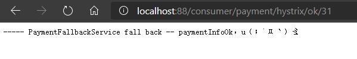

   客户端自己调用提示，此时服务端已经 down，但是我们做了服务降级处理，让客户端在服务端不可用时不会一直等待，空耗资源。

#### 服务熔断

##### 断路器

原理类似保险丝

##### 熔断是什么

熔断机制概述

熔断机制是应对雪崩效应的一种微服务链路保护机制，当扇出链路的某个微服务不可用或者响应时间太长时，会进行服务降级，进而熔断该节点的微服务调用，快速返回错误的响应信息，当检测到该节点微服务恢复正常后，恢复调用链路。`熔断在降级之后`

在 Spring Cloud 中，熔断机制通过 Hystrix 实现。Hystrix 会监控微服务间的调用情况，当失败达到一定阈值时（默认 5 秒内 20 次调用失败），就会启动熔断机制，熔断机制的注解是 `@HystrixCommand`

大神论文：https://martinfowler.com/bliki/CircuitBreaker.html

##### 实操

修改 cloud-provider-payment-hystrix-8008

PaymentService

```java
// ==== 服务熔断
@HystrixCommand(fallbackMethod = "paymentCircuitBreakerFallback", commandProperties = {
    @HystrixProperty(name = "circuitBreaker.enabled", value = "true"),// 是否开启断路器
    @HystrixProperty(name = "circuitBreaker.requestVolumeThreshold", value = "10"),// 请求次数
    @HystrixProperty(name = "circuitBreaker.sleepWindowInMilliseconds", value = "10000"), // 时间窗口期
    @HystrixProperty(name = "circuitBreaker.errorThresholdPercentage", value = "60"),// 失败率达到多少后跳闸
})
public String paymentCircuitBreaker(@PathVariable("id") Integer id) {
    if (id < 0) {
        throw new RuntimeException("******id 不能负数");
    }
    // UUID.randomUUID().toString();
    String serialNumber = IdUtil.simpleUUID();

    return Thread.currentThread().getName() + "\t" + "调用成功，流水号: " + serialNumber;
}

public String paymentCircuitBreakerFallback(@PathVariable("id") Integer id) {
    return "id 不能负数，请稍后再试，/(ㄒoㄒ)/~~   id: " + id;
}
```

为什么要配置这些参数

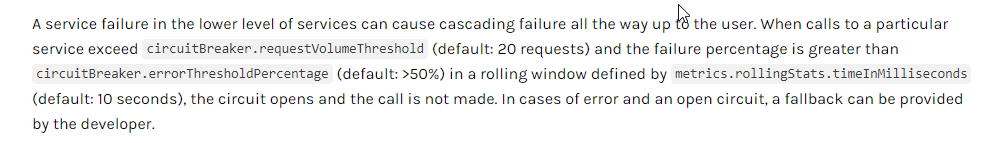

PaymentController

```java
@GetMapping("/payment/circuit/{id}")
public String paymentCircuitBreaker(@PathVariable("id") Integer id) {
    String result = paymentService.paymentCircuitBreaker(id);
    log.info("******result:" + result);
    return result;
}
```

测试

启动 7001，7002，8008

访问：

1. 先访问正确地址，http://localhost:8008/payment/circuit/431
2. 再错误地址：http://localhost:8008/payment/circuit/-431，连续点10次造成熔断
3. 再访问正确地址：http://localhost:8008/payment/circuit/111，发现返回的依然是错误，说明已经熔断，再访问几次，返回的又是正确结果，说明熔断关闭

##### 原理/小总结

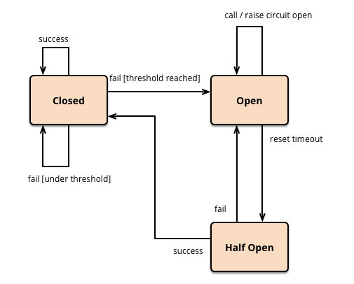

熔断类型

1. 熔断打开

   请求不再调用当前服务，内部设置时钟一般为 MTTR（平均故障处理时间），当打开时长达到所设时钟则进入半熔断状态

2. 熔断关闭

   熔断关闭不会对服务进行熔断

3. 熔断半开

   部分请求根据规则调用当前服务，如果请求成功且符合规则，则认为当前服务恢复正常，关闭熔断

断路器在什么条件下开始起作用，涉及到断路器的三个重要的参数

1. 快照时间窗

   断路器确定是否打开需要统计一些请求和错误数据，而统计的时间范围就是快照时间窗，默认为最近的10秒

2. 请求总数阈值

   在快照时间窗内，必需满足请求总数阈值才有资格熔断，默认为20，这意味着在10秒内，如果被调用次数不满20次，即使所有的请求都超时或其它原因失败，断路器都不会打开。

3. 错误百分比阈值

   当请求总数在快照时间窗内超过了阈值，比如发生了30次调用，如果在这30次调用中，有15次发生了异常，也就是超过了50%的错误百分比，在默认设定50%阈值的情况下，这时断路器就会打开。

断路器开启或关闭的条件

1. 当满足一定的阈值的时候（默认10秒20个请求）
2. 当失败率达到一定的时候（默认10秒50%的请求次数）
3. 达到以上阈值，断路器将会开启
4. 当开启的时候，所有请求都不会进行转发
5. 一段时间之后（默认5秒），这个时候断路器是半开状态。会让其中一个请求进行转发，如果成功，断路器会关闭，若失败，继续开启，重复4和5

断路器打开之后

1. 再有请求调用的时候，将不会调用主逻辑，而是直接调用降级 fallback，通过断路器，实现了自动的发现错误并将降级逻辑切换为主逻辑，减少响应延迟效果

2. 原来的主逻辑如何恢复？

   Hystrix 实现了自动恢复功能

   当断路器打开，对主逻辑进行熔断之后，Hystrix 会启动一个休眠时间窗，在这个时间窗内，降级逻辑临时成为主逻辑，当休眠时间窗到期，断路器进入半开状态，释放一次请求到原来的主逻辑上，如果这次请求正常返回，断路器关闭，主逻辑恢复，如果这次请求依然有问题，断路器继续进入打开状态，休眠时间窗重新计时。

>所有的配置
>
>```java
>@HystrixCommand(fallbackMethod = "strFallbackMethod",
>        groupKey = "strGroupCommand",
>        commandKey = "strCommand",
>        threadPoolKey = "strThreadPool",
>        commandProperties = {
>                // 是否启用断路器
>                @HystrixProperty(name = "circuitBreaker.enabled", value = "true"),
>                // 设置在滚动时间窗中。断路器熔断的最小请求数。例如，默认该值为 20 的时候，
>                // 如果滚动时间窗（默认10秒）内收到了 19 个请求，即使这 19 个请求都失败了，断路器也不会打开。
>                @HystrixProperty(name = "circuitBreaker.requestVolumeThreshold", value = "20"),
>                // 设置断路器打开之后的休眠时间窗，休眠时间窗结束之后，会将断路器设置为半开状态，释放一次请求到原来的主逻辑上，
>                // 如果依然失败，断路器继续进入打开状态，休眠时间窗重新计时，如果成功则关闭。
>                @HystrixProperty(name = "circuitBreaker.sleepWindowInMilliseconds", value = "5000"),
>                // 设置在滚动时间窗内，请求数超过 circuitBreaker.requestVolumeThreshold 的情况下，错误请求的百分比阈值（默认50），
>                // 超过就打开断路器，否则保持关闭
>                @HystrixProperty(name = "circuitBreaker.errorThresholdPercentage", value = "50"),
>                // 断路器强制打开
>                @HystrixProperty(name = "circuitBreaker.forceOpen", value = "false"),
>                // 断路器强制关闭
>                @HystrixProperty(name = "circuitBreaker.forceClosed", value = "false"),
>                // 要执行的隔离策略，THREAD 线程隔离，SEMAPHORE 信号量隔离
>                @HystrixProperty(name = "execution.isolation.strategy", value = "THREAD"),
>                // 执行隔离线程的超时时间（单位毫秒）
>                @HystrixProperty(name = "execution.isolation.thread.timeoutInMilliseconds", value = "10"),
>                // 是否启用超时时间
>                @HystrixProperty(name = "execution.timeout.enabled", value = "true"),
>                // 执行隔离线程超时是否中断
>                @HystrixProperty(name = "execution.isolation.thread.interruptOnTimeout", value = "true"),
>                // 执行隔离线程将来取消时是否中断
>                @HystrixProperty(name = "execution.isolation.thread.interruptOnFutureCancel", value = "true"),
>                // 当隔离策略选择信号量时，设置最大并发数
>                @HystrixProperty(name = "execution.isolation.semaphore.maxConcurrentRequests", value = "10"),
>                // 允许回调方法执行的最大并发数
>                @HystrixProperty(name = "fallback.isolation.semaphore.maxConcurrentRequests", value = "10"),
>                // 服务降级是否启用，是否执行回调函数
>                @HystrixProperty(name = "fallback.enabled", value = "true"),
>                // 滚动时间窗口设置，用于断路器判断健康度时需要收集信息的持续时间
>                @HystrixProperty(name = "metrics.rollingStats.timeInMilliseconds", value = "10000"),
>                // 该属性用来设置滚动时间窗统计指标信息时划分“桶”的数量，断路器在收集指标信息时会根据设置的时间长度拆分成多个“桶”来累计
>                // 各度量值，每个“桶”记录一段时间内的采集指标。
>                // 所以 timeInMilliseconds 必需能被 numBuckets 整除，否则会抛出异常
>                @HystrixProperty(name = "metrics.rollingStats.numBuckets", value = "10"),
>                // 该属性用来设置对命令执行的延迟是否使用百分位数来跟踪计算，如果设置为 false，那么所有的概要统计都将返回 -1
>                @HystrixProperty(name = "metrics.rollingPercentile.enabled", value = ""),
>                // 设置百分位统计滚动窗口的持续时间，单位为毫秒
>                @HystrixProperty(name = "metrics.rollingPercentile.timeInMilliseconds", value = "60000"),
>                // 百分位统计滚动窗口中使用“桶“的数量
>                @HystrixProperty(name = "metrics.rollingPercentile.numBuckets", value = "60000"),
>                // 该属性用来设置在执行过程中每个”桶“中保留的最大执行次数，如果在滚动时间窗内发生超过该设定值的执行次数
>                // 就从最初位置开始重写，例如将该值设为 100，滚动窗口为10秒，若在10秒内一个”桶“发生了500次执行
>                // 那么该”桶“中只保留最后的100次执行的统计，另外，增加该值的大小将会增加内存的消耗量，并增加排序百分位数所需的计算时间。
>                @HystrixProperty(name = "metrics.rollingPercentile.bucketSize", value = "100"),
>                // 设置采集影响断路器状态的健康快照（请求的成功，错误的百分比）的间隔等待时间
>                @HystrixProperty(name = "metrics.healthSnapshot.intervalInMilliseconds", value = "500"),
>                // 是否开启请求缓存
>                @HystrixProperty(name = "requestCache.enabled", value = "true"),
>                // HystrixCommand 的执行和事件是否打印日志到 HystrixRequestLog 中
>                @HystrixProperty(name = "requestLog.enabled", value = "true"),
>        },
>        threadPoolProperties = {
>                // 该参数用来设置执行命令线程池的核心线程数，该值也就是命令执行的最大并发量
>                @HystrixProperty(name = "coreSize", value = "10"),
>                // 设置线程池的最大队列大小，当设置为 -1 时，线程池将使用 SynchronousQueue 实现的队列
>                // 否则将使用 LinkedBlockingQueue 实现的队列
>                @HystrixProperty(name = "maxQueueSize", value = "-1"),
>                // 设置拒绝阈值，通过该参数，即使队列没有达到最大值也拒绝请求
>                // 该参数主要是对 LinkedBlockingQueue 队列的补充，因为 LinkedBlockingQueue 队列不能
>                // 动态修改它的对象大小，而通过，该属性就可以调整拒绝请求的队列大小了
>                @HystrixProperty(name = "queueSizeRejectionThreshold", value = "5")
>        }
>)
>public String strConsumer() {
>    return "hello";
>}
>```

#### 服务限流

后面高级篇讲解 alibaba 的 Sentinel 说明

### 4、Hystrix 工作流程


### 5、HystrixDashboard 服务监控


## 九、Zuul 路由网关


## 十、Gateway 新一代路由网关


## 十一、Spring Cloud Config 分布式配置中心


## 十二、Spring Cloud Bus 消息总线


## 十三、Spring Cloud Stream 消息驱动


## 十四、Spring Cloud Sleuth 分布式链路跟踪


## 十五、Spring Cloud Alibaba 入门简介


## 十六、Spring Cloud Alibaba Nacos 服务注册和配置中心


## 十七、Spring Cloud Alibaba Sentinel 实现熔断与限流


## 十八、Spring Cloud Alibaba Seata 处理分布式事务