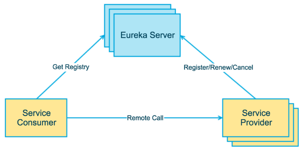

# Spring Cloud 学习笔记

`Spring Cloud Hoxton SR4`

`Spring Boot 2.2.5.RELEASE`

`Spring Cloud Alibaba 2.2.1.RELEASE`

`约定 > 配置 > 编码`

IDEA ：2020.1

MySQL：8.0.19

Maven：3.6.3

JDK：1.8

## 一、工程环境搭建

### 1、spring-cloud-study-v2

新建父工程 spring-cloud-study-v2

#### pom.xml

```xml
<?xml version="1.0" encoding="UTF-8"?>
<project xmlns="http://maven.apache.org/POM/4.0.0"
         xmlns:xsi="http://www.w3.org/2001/XMLSchema-instance"
         xsi:schemaLocation="http://maven.apache.org/POM/4.0.0 http://maven.apache.org/xsd/maven-4.0.0.xsd">
    <modelVersion>4.0.0</modelVersion>

    <groupId>com.lcp.springcloud</groupId>
    <artifactId>spring-cloud-study-v2</artifactId>
    <version>1.0-SNAPSHOT</version>
    <modules>
        <module>cloud-provider-payment-8001</module>
    </modules>
    <packaging>pom</packaging>

    <!--统一管理jar包版本-->
    <properties>
        <project.build.sourceEncoding>UTF-8</project.build.sourceEncoding>
        <maven.compiler.source>1.8</maven.compiler.source>
        <maven.compiler.target>1.8</maven.compiler.target>
        <junit.version>4.12</junit.version>
        <log4j.version>1.2.17</log4j.version>
        <lombok.version>1.16.18</lombok.version>
        <mysql.version>8.0.19</mysql.version>
        <druid.version>1.1.16</druid.version>
        <spring.boot.version>2.2.5.RELEASE</spring.boot.version>
        <spring.cloud.version>Hoxton.SR4</spring.cloud.version>
        <spring.cloud.alibaba.version>2.2.1.RELEASE</spring.cloud.alibaba.version>
        <mybatis.spring.boot.version>1.3.0</mybatis.spring.boot.version>
    </properties>

    <!--子模块继承后,提供作用:锁定版本+子module不用groupId和version-->
    <dependencyManagement>
        <dependencies>
            <!--springboot 2.2.5.RELEASE-->
            <dependency>
                <groupId>org.springframework.boot</groupId>
                <artifactId>spring-boot-dependencies</artifactId>
                <version>${spring.boot.version}</version>
                <type>pom</type>
                <scope>import</scope>
            </dependency>
            <!--Spring cloud Hoxton.SR4-->
            <dependency>
                <groupId>org.springframework.cloud</groupId>
                <artifactId>spring-cloud-dependencies</artifactId>
                <version>${spring.cloud.version}</version>
                <type>pom</type>
                <scope>import</scope>
            </dependency>
            <!--Spring cloud alibaba 2.2.1.RELEASE-->
            <dependency>
                <groupId>com.alibaba.cloud</groupId>
                <artifactId>spring-cloud-alibaba-dependencies</artifactId>
                <version>${spring.cloud.alibaba.version}</version>
                <type>pom</type>
                <scope>import</scope>
            </dependency>
            
            <dependency>
                <groupId>mysql</groupId>
                <artifactId>mysql-connector-java</artifactId>
                <version>${mysql.version}</version>
            </dependency>
            <dependency>
                <groupId>com.alibaba</groupId>
                <artifactId>druid</artifactId>
                <version>${druid.version}</version>
            </dependency>
            <dependency>
                <groupId>org.mybatis.spring.boot</groupId>
                <artifactId>mybatis-spring-boot-starter</artifactId>
                <version>${mybatis.spring.boot.version}</version>
            </dependency>
            
            <dependency>
                <groupId>org.projectlombok</groupId>
                <artifactId>lombok</artifactId>
                <version>${lombok.version}</version>
                <optional>true</optional>
            </dependency>
        </dependencies>
    </dependencyManagement>

    <build>
        <plugins>
            <plugin>
                <groupId>org.springframework.boot</groupId>
                <artifactId>spring-boot-maven-plugin</artifactId>
                <!-- 不要忘记写版本号 -->
                <version>2.3.0.RELEASE</version>
                <configuration>
                    <fork>true</fork>
                    <addResources>true</addResources>
                </configuration>
            </plugin>
        </plugins>
    </build>

</project>
```

> 父工程创建完执行 mvn:install 将父工程发布到仓库方便子工程继承

#### Maven 中的 dependencyManagement

Maven 中的 dependencyManagement 元素提供了一种管理依赖版本号的方式。在 dependencyManagement 元素中声明所依赖的 jar 包的版本号等信息，那么所有子项目再次引入此依赖 jar 包时则无需显式的列出版本号。Maven 会沿着父子层级向上寻找拥有 dependencyManagement 元素的项目，然后使用它指定的版本号。

举例

在父项目的 pom.xml 中配置：

```xml
<dependencyManagement>
    <dependencies>
        <dependency>
            <groupId>org.springframework.boot</groupId>
            <artifactId>spring-boot-starter-web</artifactId>
            <version>1.2.3.RELEASE</version>
        </dependency>
    </dependencies>
</dependencyManagement>
```

此配置即声明了 spring-boot 的版本信息。

子项目则无需指定版本信息：

```xml
<dependency>
    <groupId>org.springframework.boot</groupId>
    <artifactId>spring-boot-starter-web</artifactId>
</dependency>
```

使用优点
如果有多个子项目都引用同一样依赖，则可以避免在每个使用的子项目里都声明一个版本号。当想升级或切换到另一个版本时，只需要在顶层父容器里更新，而不需要逐个修改子项目；另外如果某个子项目需要另外的一个版本，只需要声明 version 即可。

注意事项
dependencyManagement 中定义的只是依赖的声明，并不实现引入，因此子项目需要显式的声明需要用的依赖。

### 2、REST 微服务工程搭建

####  1、cloud-provider-payment-8001

新建微服务提供者模块 cloud-provider-payment-8001

##### pom.xml

```xml
<dependencies>

    <!-- 以下两项应该是标配 -->
    <dependency>
        <groupId>org.springframework.boot</groupId>
        <artifactId>spring-boot-starter-web</artifactId>
    </dependency>
    <dependency>
        <groupId>org.springframework.boot</groupId>
        <artifactId>spring-boot-starter-actuator</artifactId>
    </dependency>
    
    <dependency>
        <groupId>org.mybatis.spring.boot</groupId>
        <artifactId>mybatis-spring-boot-starter</artifactId>
    </dependency>
    <dependency>
        <groupId>com.alibaba</groupId>
        <artifactId>druid-spring-boot-starter</artifactId>
        <version>1.1.10</version>
    </dependency>
    <!--mysql-connector-java-->
    <dependency>
        <groupId>mysql</groupId>
        <artifactId>mysql-connector-java</artifactId>
    </dependency>
    <!--jdbc-->
    <dependency>
        <groupId>org.springframework.boot</groupId>
        <artifactId>spring-boot-starter-jdbc</artifactId>
    </dependency>
    <dependency>
        <groupId>org.springframework.boot</groupId>
        <artifactId>spring-boot-devtools</artifactId>
        <scope>runtime</scope>
        <optional>true</optional>
    </dependency>
    <dependency>
        <groupId>org.projectlombok</groupId>
        <artifactId>lombok</artifactId>
        <optional>true</optional>
    </dependency>
    <dependency>
        <groupId>org.springframework.boot</groupId>
        <artifactId>spring-boot-starter-test</artifactId>
        <scope>test</scope>
    </dependency>

</dependencies>
```

##### application.yaml

```yaml
server:
  port: 8001

spring:
  application:
    name: cloud-provider-payment
  datasource:
    # 当前数据源操作类型
    type: com.alibaba.druid.pool.DruidDataSource
    # mysql驱动包
    driver-class-name: com.mysql.cj.jdbc.Driver
    url: jdbc:mysql://localhost:3306/cloud2020
    username: root
    password: 123456

mybatis:
  mapperLocations: classpath:mapper/*.xml
  # 所有Entity别名类所在包
  type-aliases-package: com.lcp.springcloud.entities
```

##### PaymentProviderApp8001 主启动类

```java
@SpringBootApplication
public class PaymentProviderApp8001 {
    public static void main(String[] args) {
        SpringApplication.run(PaymentProviderApp8001.class, args);
    }
}
```

##### 建表 SQL

```sql
CREATE TABLE `payment`  (
  `id` bigint AUTO_INCREMENT PRIMARY KEY COMMENT '主键',
  `serial` varchar(255) NOT NULL COMMENT '支付流水号'
) COMMENT = '支付表';
```

备注：由于 mysql8 默认编码 utf8mb4，所以这里建表不指定编码。

##### Payment 主实体

```java
@Data
@AllArgsConstructor
@NoArgsConstructor
public class Payment implements Serializable {
    private Long id;
    private String serial;
}
```

JSON 封装体 CommonResult

```java
@Data
@AllArgsConstructor
@NoArgsConstructor
public class CommonResult<T> {
    private Integer code;
    private String message;
    private T data;

    public CommonResult(Integer code, String message) {
        this(code, message, null);
    }
}
```

##### PaymentDao

```java
@Mapper
public interface PaymentDao {
    int create(Payment payment);

    Payment getPaymentById(@Param("id") long id);
}
```

##### PaymentMapper

```xml
<?xml version="1.0" encoding="UTF-8" ?>
<!DOCTYPE mapper PUBLIC "-//mybatis.org//DTD Mapper 3.0//EN"
        "http://mybatis.org/dtd/mybatis-3-mapper.dtd">
<mapper namespace="com.lcp.springcloud.dao.PaymentDao">

    <insert id="create" parameterType="Payment" useGeneratedKeys="true" keyProperty="id">
        INSERT INTO `payment` (serial) VALUES (#{serial});
    </insert>

    <resultMap id="BaseResultMap" type="Payment">
        <id column="id" property="id" jdbcType="BIGINT"/>
        <result column="serial" property="serial" jdbcType="VARCHAR"/>
    </resultMap>

    <select id="getPaymentById" parameterType="Long" resultMap="BaseResultMap">
        SELECT id, serial FROM payment WHERE id = #{id};
    </select>
</mapper>
```

##### PaymentService

```java
public interface PaymentService {
    int create(Payment payment);

    Payment getPaymentById(long id);
}
```

##### PaymentServiceImpl

```java
@Service
public class PaymentServiceImpl implements PaymentService {
    @Resource
    private PaymentDao paymentDao;

    @Override
    public int create(Payment payment) {
        return paymentDao.create(payment);
    }

    @Override
    public Payment getPaymentById(long id) {
        return paymentDao.getPaymentById(id);
    }
}
```

##### PaymentController

```java
@RestController
@RequestMapping("/payment")
@Slf4j
public class PaymentController {
    @Resource
    private PaymentService paymentService;

    @PostMapping(value = "/create")
    public CommonResult<Integer> create(@RequestBody Payment payment) {
        int result = paymentService.create(payment);
        log.info("插入结果：" + result);

        if (result > 0) {
            return new CommonResult<>(200, "插入数据库成功", result);
        } else {
            return new CommonResult<>(444, "插入数据库失败", result);
        }
    }

    @GetMapping(value = "/get/{id}")
    public CommonResult<Payment> getPaymentById(@PathVariable Long id) {
        Payment result = paymentService.getPaymentById(id);
        log.info("查询结果：" + result);

        if (result != null) {
            return new CommonResult<>(200, "查询成功", result);
        } else {
            return new CommonResult<>(444, "没有对应记录，查询失败");
        }
    }
}
```

##### 测试

在 `spring-cloud-study-v2/rest-api-test` 下新建 test-8001.http 进行测试（这种简单的 POST/GET 用不着再切换到 Postman 中进行，IDEA中就可以完成），测试结果会自动保存为 JSON 文件，位于 .idea/httpRequests/ 下

test-8001.http

```http
POST http://localhost:8001/payment/create
Content-Type: application/json

{
  "serial": "Test2"
}

###

GET http://localhost:8001/payment/get/1
Accept: application/json
```

结果如下


#### 2、热部署 Devtools

1. Adding devtools to your project

   ```xml
   <dependency>
       <groupId>org.springframework.boot</groupId>
       <artifactId>spring-boot-devtools</artifactId>
       <scope>runtime</scope>
       <optional>true</optional>
   </dependency>
   ```

2. Adding plugin to your pom.xml

   ```xml
   下面配置我们粘贴进聚合父类总工程的pom.xml里
   <build>
       <!-- fileName 不是必需 -->
       <fileName>你自己的工程名字</fileName>
       <plugins>
           <plugin>
               <groupId>org.springframework.boot</groupId>
               <artifactId>spring-boot-maven-plugin</artifactId>
               <configuration>
                   <fork>true</fork>
                   <addResources>true</addResources>
               </configuration>
           </plugin>
       </plugins>
   </build>
   ```

3. Enabling automatic build

   File → Settings → Build, Execution, Deployment → Compiler

   

4. Update the value of

   IDEA 中使用快捷键 <kbd>Ctrl</kbd> + <kbd>Shift</kbd> + <kbd>Alt</kbd> + <kbd>/</kbd> 打开 `Registry`

   

5. 重启 IDEA

#### 3、cloud-consumer-order-80

微服务消费者订单模块 cloud-consumer-order-80

##### pom.xml

```xml
<dependencies>
    <dependency>
        <groupId>org.springframework.boot</groupId>
        <artifactId>spring-boot-starter-web</artifactId>
    </dependency>
    <dependency>
        <groupId>org.springframework.boot</groupId>
        <artifactId>spring-boot-starter-actuator</artifactId>
    </dependency>

    <dependency>
        <groupId>org.projectlombok</groupId>
        <artifactId>lombok</artifactId>
        <optional>true</optional>
    </dependency>
    <dependency>
        <groupId>org.springframework.boot</groupId>
        <artifactId>spring-boot-starter-test</artifactId>
        <scope>test</scope>
    </dependency>

    <!-- 热部署 -->
    <dependency>
        <groupId>org.springframework.boot</groupId>
        <artifactId>spring-boot-devtools</artifactId>
        <scope>runtime</scope>
        <optional>true</optional>
    </dependency>
</dependencies>
```

##### application.yaml

```yaml
server:
  port: 80

spring:
  application:
    name: cloud-consumer-order
```

##### ConsumerOrderApp80 主启动类

```java
@SpringBootApplication
public class ConsumerOrderApp80 {
    public static void main(String[] args) {
        SpringApplication.run(ConsumerOrderApp80.class, args);
    }
}
```

##### entities 包

把上个模块的 entities 复制一份即可

##### ApplicationContextConfig 配置类

```java
@Configuration
public class ApplicationContextConfig {

    @Bean
    public RestTemplate getRestTemplate() {
        return new RestTemplate();
    }
}
```

##### OrderController

```java
@RestController
@Slf4j
@RequestMapping(value = "/consumer")
public class OrderController {
    public static final String PAYMENT_URL = "http://localhost:8001";

    @Resource
    private RestTemplate restTemplate;

    @PostMapping("/create")
    public CommonResult<Payment> create(@RequestBody Payment payment) {
        return restTemplate.postForObject(PAYMENT_URL + "/payment/create", payment, CommonResult.class);
    }

    @GetMapping(value = "/get/{id}")
    public CommonResult<Payment> getPayment(@PathVariable Long id) {
        return restTemplate.getForObject(PAYMENT_URL + "/payment/get/" + id, CommonResult.class);
    }
}
```

`@RequestBody` 不要忘记，不然

##### 测试

test-80.http

```http
GET http://localhost/consumer/payment/get/2
Accept: application/json

###

POST http://localhost/consumer/payment/create
Content-Type: application/json

{
  "serial": "Test5"
}
```

结果如下


#### 4、工程重构

##### 观察问题

上面两个微服务都有一个内容和结构完全一样的包 `entities`，所以系统中有部分重复，进行重构。

##### cloud-api-commons

新建模块 cloud-api-commons 用来存放各种公共类

##### pom.xml

```xml
<dependencies>
    <dependency>
        <groupId>org.projectlombok</groupId>
        <artifactId>lombok</artifactId>
        <optional>true</optional>
    </dependency>
    <!-- Java 工具类库 -->
    <dependency>
        <groupId>cn.hutool</groupId>
        <artifactId>hutool-all</artifactId>
        <version>5.3.5</version>
    </dependency>

    <dependency>
        <groupId>org.springframework.boot</groupId>
        <artifactId>spring-boot-devtools</artifactId>
        <scope>runtime</scope>
        <optional>true</optional>
    </dependency>
</dependencies>
```

##### maven clean/install

##### 改造 80，8001 工程

各自删除原先的 `entities` 包，分别在 pom 中加入以下依赖

```xml
<dependency>
    <groupId>com.lcp.springcloud</groupId>
    <artifactId>cloud-api-commons</artifactId>
    <version>${project.version}</version>
</dependency>
```

##### 测试

步骤同上，不再赘述

### 3、模块开发过程总结：

1. 建 Module
2. 改 POM
3. 写 YAML
4. 主启动类
5. 业务类

## 二、Eureka 服务注册与发现

### 1、Eureka 基础知识

#### 服务治理

在传统的 rpc 远程调用框架中，管理每个服务与服务之间依赖关系比较复杂，所以需要服务治理来管理服务与服务之间的依赖关系，可以实现服务调用、负载均衡、容错、实现服务发现与注册。

参考：https://segmentfault.com/a/1190000010224335

#### 服务注册与发现

在服务注册与发现中，有一个注册中心。当服务器启动的是时候，会把当前自己服务器的信息比如 ip:port 以别名的方式注册到注册中心上，另一方通过别名从注册中心获取到实际的服务器通讯地址。




#### Eureka 两大组件

Eureka 包含两大组件：Eureka Server 和 Eureka Client

- Eureka Server 提供服务注册服务

  各个微服务节点通过配置启动后，会在 Eureka Server 中进行注册，这样 Eureka Server 中的服务注册表中将会存储所有可用服务节点的信息，服务节点的信息可以在 Eureka Server 的 web 界面中直观的看到。

- Eureka Client 通过注册中心进行访问

  EurekaClient 是一个 Java 客户端，用于简化 Eureka Server 的交互，客户端同时也具备一个内置的、使用轮询(round-robin) 负载算法的负载均衡器。在应用启动后，将会向 Eureka Server 发送心跳（默认周期为30秒）。如果Eureka Server 在多个心跳周期内没有接收到某个节点的心跳，Eureka Server 将会从服务注册表中把这个服务节点移除（默认90秒）。

#### Eureka 自我保护机制

现象


什么是自我保护机制

默认情况下，如果 Eureka Server 在一定时间内没有接收到某个微服务实例的心跳，Eureka Server 将会注销该实例（默认90秒）。但是当网络分区故障发生时，微服务与 Eureka Server 之间无法正常通信，以上行为可能变得非常危险了——因为微服务本身其实是健康的，此时本不应该注销这个微服务。Eureka 通过“自我保护模式”来解决这个问题——当 Eureka Server 节点在短时间内丢失过多客户端时（可能发生了网络分区故障），那么这个节点就会进入自我保护模式。一旦进入该模式，Eureka Server 就会保护服务注册表中的信息，不再删除服务注册表中的数据（也就是不会注销任何微服务）。当网络故障恢复后，该 Eureka Server节点会自动退出自我保护模式。

在自我保护模式中，Eureka Server 会保护服务注册表中的信息，不再注销任何服务实例。当它收到的心跳数重新恢复到阈值以上时，该 Eureka Server 节点就会自动退出自我保护模式。它的设计哲学就是宁可保留错误的服务注册信息，也不盲目注销任何可能健康的服务实例。一句话讲解：好死不如赖活着

综上，自我保护模式是一种应对网络异常的安全保护措施。它的架构哲学是宁可同时保留所有微服务（健康的微服务和不健康的微服务都会保留），也不盲目注销任何健康的微服务。使用自我保护模式，可以让 Eureka 集群更加的健壮、稳定。

在Spring Cloud中，可以使用 `eureka.server.enable-self-preservation = false` 禁用自我保护模式。

> 总结：某时刻一个微服务不可用了 eureka 不会立即清理，依旧会对该微服务的信息进行保存。
>
> 属于 CAP 里的 AP

### 2、单机 Eureka Server 构建

#### cloud-eureka-server-7001

新建 cloud-eureka-server-7001 模块

#### pom.xml

```xml
<dependencies>
    <dependency>
        <groupId>com.lcp.springcloud</groupId>
        <artifactId>cloud-api-commons</artifactId>
        <version>${project.version}</version>
    </dependency>
    <!--eureka-server-->
    <dependency>
        <groupId>org.springframework.cloud</groupId>
        <artifactId>spring-cloud-starter-netflix-eureka-server</artifactId>
    </dependency>
    <dependency>
        <groupId>org.springframework.boot</groupId>
        <artifactId>spring-boot-starter-web</artifactId>
    </dependency>
    <dependency>
        <groupId>org.springframework.boot</groupId>
        <artifactId>spring-boot-starter-actuator</artifactId>
    </dependency>
    <!--一般为通用配置-->
    <dependency>
        <groupId>org.springframework.boot</groupId>
        <artifactId>spring-boot-devtools</artifactId>
        <scope>runtime</scope>
        <optional>true</optional>
    </dependency>
    <dependency>
        <groupId>org.projectlombok</groupId>
        <artifactId>lombok</artifactId>
        <optional>true</optional>
    </dependency>
    <dependency>
        <groupId>org.springframework.boot</groupId>
        <artifactId>spring-boot-starter-test</artifactId>
        <scope>test</scope>
    </dependency>
</dependencies>
```

##### Eureka 1.x 与 2.x 对比

以前，2018

```xml
<dependency>
    <groupId>org.springframework.cloud</groupId>
    <artifactId>spring-cloud-starter-eureka</artifactId>
</dependency>
```

现在，2020

```xml
<!-- Eureka Server -->
<dependency>
    <groupId>org.springframework.cloud</groupId>
    <artifactId>spring-cloud-starter-netflix-eureka-server</artifactId>
</dependency>

<!-- Eureka Client -->
<dependency>
    <groupId>org.springframework.cloud</groupId>
    <artifactId>spring-cloud-starter-netflix-eureka-client</artifactId>
</dependency>
```

#### 修改映射配置

编辑 hosts 文件

```
127.0.0.1 eureka7001.com
127.0.0.1 eureka7002.com
```

#### application.yaml

```yaml
server:
  port: 7001

eureka:
  instance:
    # eureka服务端的实例名称
    hostname: eureka7001.com
  client:
  	#以下两项默认值 true 即可，没必要非得是 false
    # false表示不向注册中心注册自己。
    #register-with-eureka: false
    # false表示自己端就是注册中心，我的职责就是维护服务实例，并不需要去检索服务。
    #fetch-registry: false
    service-url:
      defaultZone: http://${eureka.instance.hostname}:${server.port}/eureka/

spring:
  application:
    name: eureka-server
```

#### EurekaServerApp7001 主启动类

```java
@SpringBootApplication
@EnableEurekaServer
public class EurekaServerApp7001 {
    public static void main(String[] args) {
        SpringApplication.run(EurekaServerApp7001.class, args);
    }
}
```

#### 测试

访问：http://localhost:7001/


No instances available：没有可用的实例。因为目前也没有服务注册进来，当然就没有可用的实例。

#### 改造 80，8001 模块为 Eureka Client

##### pom.xml

修改 pom.xml，添加对 Eureka Client 的支持

```xml
<!-- Eureka Client -->
<dependency>
    <groupId>org.springframework.cloud</groupId>
    <artifactId>spring-cloud-starter-netflix-eureka-client</artifactId>
</dependency>
```

##### application.yaml

```yaml
eureka:
  client:
    service-url:
      defaultZone: http://eureka7001.com:7001/eureka
    #以下默认就是true，不填也行  
    #fetch-registry: true
    #register-with-eureka: true
```

##### 主启动类

主启动类上添加注解 `@EnableEurekaClient`

##### 测试

访问：http://localhost:7001/


### 3、集群 Eureka Server 构建

#### cloud-eureka-server-7002

参考 cloud-eureka-server-7001 新建 cloud-eureka-server-7002

##### pom.xml

修改 7001，7002 的 yaml

7001

```yaml
server:
  port: 7001

eureka:
  instance:
    # eureka服务端的实例名称
    hostname: eureka7001.com
    instance-id: eureka-server-7001
  client:
    #以下两项默认值 true 即可，没必要非得是 false
    # false表示不向注册中心注册自己。
    #    register-with-eureka: false
    # false表示自己端就是注册中心，我的职责就是维护服务实例，并不需要去检索服务。
    #    fetch-registry: false
    service-url:
      #defaultZone: http://${eureka.instance.hostname}:${server.port}/eureka/
      defaultZone: http://eureka7002.com:7002/eureka/
      
  server:
    # 测试时关闭自我保护机制，保证不可用服务及时剔除
    enable-self-preservation: false
    # 缩短 eureka server 清理无效节点的时间间隔，默认60000毫秒，即60秒，现在调整为间隔2秒
    eviction-interval-timer-in-ms: 2000
    
spring:
  application:
    name: eureka-server
```

7002

```yaml
server:
  port: 7002

eureka:
  instance:
    hostname: eureka7002.com
    instance-id: eureka-server-7002
  client:
    service-url:
      defaultZone: http://eureka7001.com:7001/eureka/
  server:
    enable-self-preservation: false
    eviction-interval-timer-in-ms: 2000

spring:
  application:
    name: eureka-server
```

##### 测试

访问：http://localhost:7001/


注意下图


当 7001，7002 都正常运行时，7001，7002 应出现在对方的 available-replicas 中

#### 80、8001 注册进集群

##### 修改 YAML

修改 defaultZone，添加 instance 下的两项

```yaml
eureka:
  client:
    service-url:
      #defaultZone: http://eureka7001.com:7001/eureka
      defaultZone: http://eureka7001.com:7001/eureka,http://eureka7002.com:7002/eureka
  instance:
    # 心跳时间，即服务续约间隔时间（缺省为30s）
    lease-renewal-interval-in-seconds: 1
    # 发呆时间，即服务续约到期时间（缺省为90s）
    lease-expiration-duration-in-seconds: 2
```

##### 测试

```http
GET http://localhost:8001/payment/get/1
Accept: application/json

###

GET http://localhost/consumer/payment/get/2
Accept: application/json
```

#### cloud-provider-payment 集群

参考 cloud-provider-payment-8001 搭建 `cloud-provider-payment-8002`

##### pom.xml

直接复制 8001 的 dependencies

##### application.yaml

直接复制 8001 的 yaml，修改以下两项即可

```yaml
server:
  port: 8002

eureka:
  instance:
    instance-id: provider-payment-8002
```

##### 主启动类和业务类

直接复制 8001 的， 主启动类改名为 `PaymentProviderApp8002`

##### 修改 8001/8002 的 Controller

在返回的信息中加入端口信息

```java
// 新增，读取配置文件的中的端口信息
@Value("${server.port}")
private String serverPort;

// return new CommonResult<>(200, "插入数据库成功", result);
return new CommonResult<>(200, "插入数据库成功。serverPort：" + serverPort, result);
```

##### 测试

同上

#### 负载均衡 @LoadBalanced

使用 @LoadBalanced 可以赋予 RestTemplate 负载均衡的能力

修改 cloud-consumer-order-80 

##### ApplicationContextConfig

```java
@Bean
@LoadBalanced
public RestTemplate getRestTemplate() {
    return new RestTemplate();
}
```

##### OrderController

```java
// public static final String PAYMENT_URL = "http://localhost:8001";
public static final String PAYMENT_URL = "http://CLOUD-PROVIDER-PAYMENT";
```

`CLOUD-PROVIDER-PAYMENT` 的来源


##### 测试

反复访问：GET http://localhost/consumer/payment/get/2，观察返回数据中的端口号，会发现 8001、8002 端口交替出现。

### 4、微服务信息完善

以下均以 cloud-consumer-order-80 的为例

#### 访问信息显示IP

目前 Eureka Server 的 Web 页面 Status 下的链接鼠标放上去的提示路径只有主机名，没有 IP地址


修改 YAML，将 `prefer-ip-address` 设为 true

```yaml
eureka:
  instance:
    prefer-ip-address: true
```

> 如果 Eureka Server 集群是同一 IP，不要将这项设为 true，会导致 Eureka Server 永远处于 unavailable-replicas，而且默认配置就是 false

#### Status 中链接名称修改

默认情况下如果不配置 `instance-id（唯一id）` Status 中的链接名称含有主机名（默认由 主机名 + spring.application.name + 端口 组成），如下图所示


修改 YAML，设置 `instance-id`

```yaml
eureka:
  instance:
    instance-id: consumer-order-80
```

#### 微服务的 info 页面为 404 ErrorPage

修改 pom.xml 添加以下依赖

```xml
<dependency>
    <groupId>org.springframework.boot</groupId>
    <artifactId>spring-boot-starter-actuator</artifactId>
</dependency>
```

修改 YAML

```yaml
info:
  app.name: spring-cloud-study-v2
  company.name: www.lichangping.top
  build.artifactId: $project.artifactId$
  build.version: $project.version$
```

访问：http://192.168.1.10/actuator/info

#### 补充：查看微服务状态

访问：http://192.168.1.10/actuator/health

### 5、服务发现 Discovery

对于注册进 Eureka Server 里的微服务，可以通过服务发现来获得该服务的信息。

下面修改 cloud-provider-payment-8001

##### PaymentController

添加以下内容

```java
/**
 * 服务发现 获取服务信息
 */
@Resource
private DiscoveryClient discoveryClient;

@GetMapping(value = "/discovery")
public Object discovery() {
    List<String> services = discoveryClient.getServices();
    for (String service : services) {
        log.info("---- service:" + service);
    }

    // 一个微服务下的全部实例（集群状态多个微服务名称相同，算一个微服务，一个节点算一个实例）
    List<ServiceInstance> instances = discoveryClient.getInstances("CLOUD-PROVIDER-PAYMENT");
    for (ServiceInstance instance : instances) {
        log.info(instance.getServiceId() + "\t" + instance.getHost() + "\t" + instance.getPort() + "\t" + instance.getUri());
    }
    return discoveryClient;
}
```

##### 测试

访问：http://localhost:8001/payment/discovery


> 补充
>
> 主启动类不需要加 `@EnableDiscoveryClient` ，因为这里已经有 `@EnableEurekaClient` 了
>
> 参考：
>
> https://blog.csdn.net/zheng199172/article/details/82466139
>
> https://blog.csdn.net/Ezreal_King/article/details/72594535

### 6、Eureka 停更相关

https://github.com/Netflix/eureka/wiki

Eureka 结束开源，转为闭源

## 三、Zookeeper 服务注册与发现

### 1、Zookeeper 基础知识

官方文档上这么解释zookeeper，它是一个分布式服务框架，是Apache Hadoop 的一个子项目，它主要是用来解决分布式应用中经常遇到的一些数据管理问题，如：统一命名服务、状态同步服务、集群管理、分布式应用配置项的管理等。

参考：https://blog.csdn.net/java_66666/article/details/81015302

使用 Zookeeper 服务器取代 Eureka 服务器作为服务注册中心。

### 2、启动 Zookeeper

#### Docker

```shell
docker run --name cloud_zk_1 -p 2181:2181 --restart=always -d zookeeper:3.6.1
```

Linux

```shell
./zkServer.sh
```

Windows

双击 `zkServer.cmd`

### 3、cloud-provider-payment-zk-8004

新建服务提供者模块 cloud-provider-payment-zk-8004

#### pom.xml

```xml
<dependencies>
    <dependency>
        <groupId>com.lcp.springcloud</groupId>
        <artifactId>cloud-api-commons</artifactId>
        <version>${project.version}</version>
    </dependency>

    <dependency>
        <groupId>org.springframework.boot</groupId>
        <artifactId>spring-boot-starter-web</artifactId>
    </dependency>
    <dependency>
        <groupId>org.springframework.boot</groupId>
        <artifactId>spring-boot-starter-actuator</artifactId>
    </dependency>

    <!--SpringBoot整合Zookeeper客户端-->
    <dependency>
        <groupId>org.springframework.cloud</groupId>
        <artifactId>spring-cloud-starter-zookeeper-discovery</artifactId>
    </dependency>

    <dependency>
        <groupId>org.springframework.boot</groupId>
        <artifactId>spring-boot-devtools</artifactId>
        <scope>runtime</scope>
        <optional>true</optional>
    </dependency>
    <dependency>
        <groupId>org.projectlombok</groupId>
        <artifactId>lombok</artifactId>
        <optional>true</optional>
    </dependency>
    <dependency>
        <groupId>org.springframework.boot</groupId>
        <artifactId>spring-boot-starter-test</artifactId>
        <scope>test</scope>
    </dependency>
</dependencies>
```

#### application.yaml

```yaml
server:
  # 8004表示注册到zookeeper服务器的支付服务提供者端口号
  port: 8004
  
spring:
  application:
    # 服务别名---注册zookeeper到注册中心的名称
    name: cloud-provider-payment
  cloud:
    zookeeper:
      # 默认localhost:2181
      connect-string: localhost:2181
```

#### PaymentProviderZkApp8004 主启动类

注意注解 `@EnableDiscoveryClient` ，该注解用于向 consul 或者 zookeeper 注册服务

```java
@SpringBootApplication
@EnableDiscoveryClient
public class PaymentProviderZkApp8004 {
    public static void main(String[] args) {
        SpringApplication.run(PaymentProviderZkApp8004.class, args);
    }
}
```

#### PaymentController

```java
@RestController
@Slf4j
public class PaymentController {
    @Value("${server.port}")
    private String serverPort;

    @RequestMapping(value = "payment/zk")
    public String paymentZk() {
        return "SpringCloud with zookeeper:" + serverPort + "\t" + UUID.randomUUID().toString();
    }
}
```

#### 测试

启动 8004

##### 验证测试一

test-8004.http

```http
GET http://localhost:8004/payment/zk
```


注册成功

##### 验证测试二

使用命令 `./zkCli.sh`，连接 Zookeeper


##### 可能遇到的问题

如果 maven 自动导入的 zookeeper jar 包版本高于启动的 zookeeper 版本，会导致 8004启动报错，自动导入的 jar 包版本如下


jar 包冲突排除 

```xml
<dependency>
    <groupId>org.springframework.cloud</groupId>
    <artifactId>spring-cloud-starter-zookeeper-discovery</artifactId>
    <exclusions>
        <!--先排除自带的zookeeper3.5.3-->
        <exclusion>
            <groupId>org.apache.zookeeper</groupId>
            <artifactId>zookeeper</artifactId>
        </exclusion>
    </exclusions>
</dependency>
<!--添加zookeeper3.4.9版本-->
<dependency>
    <groupId>org.apache.zookeeper</groupId>
    <artifactId>zookeeper</artifactId>
    <version>3.4.9</version>
</dependency>

```

### 4、cloud-consumer-order-zk-84

将服务消费者注册进 Zookeeper

#### pom.xml

```xml
<dependencies>
    <dependency>
        <groupId>com.lcp.springcloud</groupId>
        <artifactId>cloud-api-commons</artifactId>
        <version>${project.version}</version>
    </dependency>

    <dependency>
        <groupId>org.springframework.boot</groupId>
        <artifactId>spring-boot-starter-web</artifactId>
    </dependency>
    <dependency>
        <groupId>org.springframework.boot</groupId>
        <artifactId>spring-boot-starter-actuator</artifactId>
    </dependency>

    <!--SpringBoot整合Zookeeper客户端-->
    <dependency>
        <groupId>org.springframework.cloud</groupId>
        <artifactId>spring-cloud-starter-zookeeper-discovery</artifactId>
    </dependency>

    <dependency>
        <groupId>org.springframework.boot</groupId>
        <artifactId>spring-boot-devtools</artifactId>
        <scope>runtime</scope>
        <optional>true</optional>
    </dependency>
    <dependency>
        <groupId>org.projectlombok</groupId>
        <artifactId>lombok</artifactId>
        <optional>true</optional>
    </dependency>
    <dependency>
        <groupId>org.springframework.boot</groupId>
        <artifactId>spring-boot-starter-test</artifactId>
        <scope>test</scope>
    </dependency>
</dependencies>
```

#### application.yaml

```yaml
server:
  port: 84
spring:
  application:
    # 服务别名
    name: cloud-consumer-order
  cloud:
    zookeeper:
      # 注册到zookeeper地址
      connect-string: localhost:2181
```

#### ApplicationContextConfig

```java
@Configuration
public class ApplicationContextConfig {

    @Bean
    @LoadBalanced
    public RestTemplate getRestTemplate() {
        return new RestTemplate();
    }
}
```

#### OrderController

```java
@RestController
@Slf4j
@RequestMapping(value = "/consumer/payment")
public class OrderController {
    public static final String PAYMENT_URL = "http://cloud-provider-payment";

    @Resource
    private RestTemplate restTemplate;

    @GetMapping(value = "/zk")
    public String paymentInfo() {
        return restTemplate.getForObject(PAYMENT_URL + "/payment/zk", String.class);
    }
}
```

注意 PAYMENT_URL，此处为小写，因为 zookeeper 中是小写，这和 Eureka 不同

#### ConsumerOrderZkApp84

```java
@SpringBootApplication
@EnableDiscoveryClient
public class ConsumerOrderZkApp84 {
    public static void main(String[] args) {
        SpringApplication.run(ConsumerOrderZkApp84.class, args);
    }
}
```

#### 测试

启动 cloud-consumer-order-zk-84

Zookeeper 中查看


服务已注册

访问测试，test-84.http

```http
GET http://localhost:84/consumer/payment/zk
```


## 四、Consul 服务注册与发现

读音：[Consul](https://fanyi.baidu.com/translate#en/zh/Consul) 美 [ˈkɑːnsl] 

### 1、简介

官网：https://www.consul.io/

Consul 是一套开源的分布式服务发现和配置管理系统，由 HashiCrop 公司用 Go 语言开发。

提供了微服务系统中的服务治理，配置中心，控制总线等功能。这些功能中的每一个都可以根据需要单独使用，也可以一起使用构建全方位的服务网格，Consul 提供了一种完整的服务网格解决方案。

它具有很多优点，包括：基于 raft 协议，比较简洁，支持健康检查，同时支持 HTTP 和 DNS 协议，支持跨数据中心的 WAN 集群，提供图形界面，跨平台支持（Linux，Windows，Mac）

#### 1、拥有的功能

##### 1、服务发现

提供 HTTP 和 DNS 两种发现方式

##### 2、健康检查

支持多种方式，HTTP、TCP、Docker、shell 脚本定制化

##### 3、KV 存储

Key、Value 的存储方式

##### 4、多数据中心

Consul 支持多数据中心

##### 5、可视化界面

#### 2、下载地址

https://www.consul.io/downloads

#### 3、学习文档

https://cloud.spring.io/spring-cloud-static/spring-cloud-consul/2.2.2.RELEASE/reference/html/

### 2、启动 Consul

这里以 Docker 的方式启动

```shell
docker run -d --name cloud_consul_1 -p 8500:8500 consul:1.7.3
```

浏览器访问：http://localhost:8500/


### 3、cloud-provider-payment-consul-8006

#### pom.xml

```xml
<dependencies>
    <!--SpringCloud consul-server-->
    <dependency>
        <groupId>org.springframework.cloud</groupId>
        <artifactId>spring-cloud-starter-consul-discovery</artifactId>
    </dependency>

    <dependency>
        <groupId>com.lcp.springcloud</groupId>
        <artifactId>cloud-api-commons</artifactId>
        <version>${project.version}</version>
    </dependency>
    <dependency>
        <groupId>org.springframework.boot</groupId>
        <artifactId>spring-boot-starter-web</artifactId>
    </dependency>
    <dependency>
        <groupId>org.springframework.boot</groupId>
        <artifactId>spring-boot-starter-actuator</artifactId>
    </dependency>
    <dependency>
        <groupId>org.springframework.boot</groupId>
        <artifactId>spring-boot-devtools</artifactId>
        <scope>runtime</scope>
        <optional>true</optional>
    </dependency>
    <dependency>
        <groupId>org.projectlombok</groupId>
        <artifactId>lombok</artifactId>
        <optional>true</optional>
    </dependency>
    <dependency>
        <groupId>org.springframework.boot</groupId>
        <artifactId>spring-boot-starter-test</artifactId>
        <scope>test</scope>
    </dependency>
</dependencies>
```

#### application.yaml

```yaml
server:
  # consul服务端口
  port: 8006
spring:
  application:
    name: cloud-provider-payment
  cloud:
    consul:
      # consul注册中心地址
      host: localhost
      port: 8500
      discovery:
        #因为consul部署在docker中，网络模式是默认的 bridge 模式
        #consul会访问 http://hostname:8006/actuator/health 来获取节点的实际状态
        #如果 hostname 为 127.0.0.1，consul 访问的就是内部地址了，结果只能是 404
        hostname: 192.168.1.10
        #hostname: 127.0.0.1
        service-name: ${spring.application.name}
```

#### PaymentProviderConsulApp8006

```java
@SpringBootApplication
@EnableDiscoveryClient
public class PaymentProviderConsulApp8006 {
    public static void main(String[] args) {
        SpringApplication.run(PaymentProviderConsulApp8006.class, args);
    }
}
```

#### PaymentController 

```java
@RestController
@Slf4j
@RequestMapping(value = "/payment")
public class PaymentController {

    @Value("${server.port}")
    private String serverPort;

    @RequestMapping(value = "/consul")
    public String paymentConsul() {
        return "Spring Cloud with consul：" + serverPort + "\t" + UUID.randomUUID().toString();
    }
}
```

#### 测试

访问 Consul 的 web 页面


访问测试，test-8006.http

```http
GET http://localhost:8006/payment/consul
```


### 4、cloud-consumer-order-consul-86

#### pom.xml

```xml
<dependencies>
    <!--SpringCloud consul-server-->
    <dependency>
        <groupId>org.springframework.cloud</groupId>
        <artifactId>spring-cloud-starter-consul-discovery</artifactId>
    </dependency>

    <dependency>
        <groupId>com.lcp.springcloud</groupId>
        <artifactId>cloud-api-commons</artifactId>
        <version>${project.version}</version>
    </dependency>

    <dependency>
        <groupId>org.springframework.boot</groupId>
        <artifactId>spring-boot-starter-web</artifactId>
    </dependency>
    <dependency>
        <groupId>org.springframework.boot</groupId>
        <artifactId>spring-boot-starter-actuator</artifactId>
    </dependency>

    <dependency>
        <groupId>org.springframework.boot</groupId>
        <artifactId>spring-boot-devtools</artifactId>
        <scope>runtime</scope>
        <optional>true</optional>
    </dependency>
    <dependency>
        <groupId>org.projectlombok</groupId>
        <artifactId>lombok</artifactId>
        <optional>true</optional>
    </dependency>
    <dependency>
        <groupId>org.springframework.boot</groupId>
        <artifactId>spring-boot-starter-test</artifactId>
        <scope>test</scope>
    </dependency>
</dependencies>
```

#### application.yaml

```yaml
server:
  port: 86
spring:
  application:
    name: cloud-consumer-order
  cloud:
    consul:
      # host，port 默认值就是 localhost，8500
      host: localhost
      port: 8500
      discovery:
        hostname: 192.168.1.10
        service-name: ${spring.application.name}
```

#### ConsumerOrderConsulApp86

```java
@SpringBootApplication
public class ConsumerOrderConsulApp86 {
    public static void main(String[] args) {
        SpringApplication.run(ConsumerOrderConsulApp86.class, args);
    }
}
```

#### config 包

直接复制 80 模块的

#### OrderController

```java
@RestController
@Slf4j
@RequestMapping(value = "/consumer/payment")
public class OrderController {
    public static final String PAYMENT_URL = "http://cloud-provider-payment";

    @Resource
    private RestTemplate restTemplate;

    @GetMapping(value = "/consul")
    public String paymentInfo() {
        return restTemplate.getForObject(PAYMENT_URL + "/payment/consul", String.class);
    }
}
```

#### 测试

访问 Consul 的 web 页面


访问测试，test-86.http

```http
GET http://localhost:86/consumer/payment/consul
```

